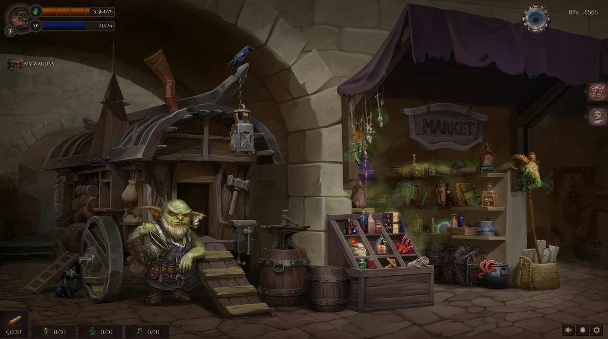
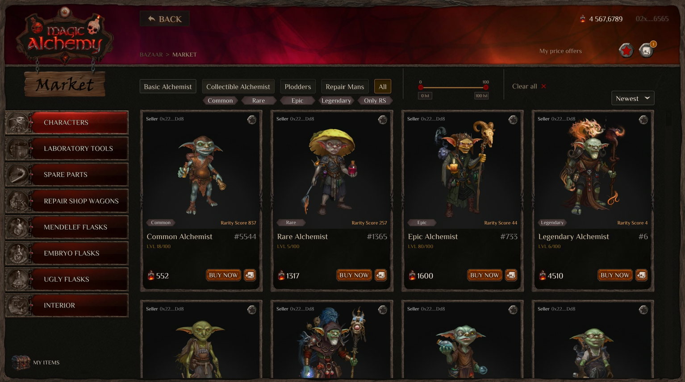

# Bazaar and Marketplace

*"The Bazaar is located in the eastern part of the capital of the Echoron Valley. It's a place where any alchemist can find anything for themselves. Everything you need for magic and alchemy, from alchemical ingredients to finished magic elixirs and potions, is sold here. You can also repair or order instruments and tools for any alchemical experiment from the darhans..."*

In addition to serving as the gateway to the Workshop, this location will soon host our very own Marketplace, where you will be able to buy and sell all of our NFT collections of characters and items.

*"The bazaar is an explosion of colors and scents from every corner of the world. It seems there’s nothing you can’t find here—Dudzhun silk, ornamental bone from the northern principality of Dornkun, rare Venturian wines, and the strange curiosities of Mithremar. On the narrow market streets and hidden alleyways, treasures beyond imagination await those who know where to look..."* 

