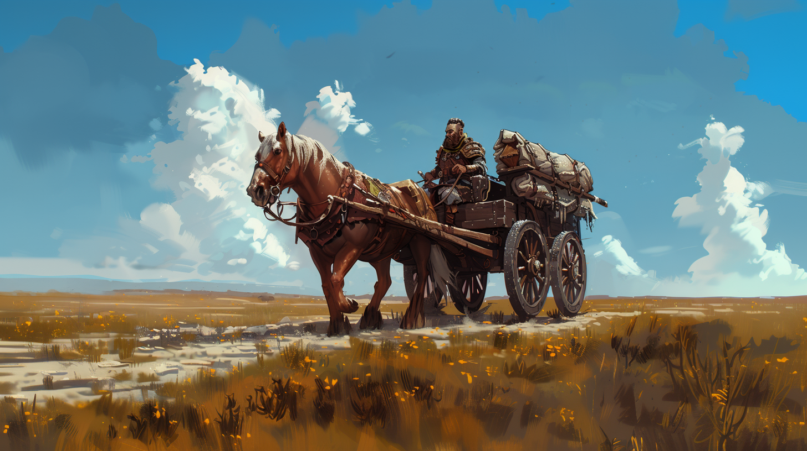

# История Багбира
## Часть 1. Наследник семейного дела

Багбир родился в семье потомственных пивоваров. Его предки уже в десятом поколении являлись непревзойденными мастерами в пивоварении, а многочисленная родня, наряду с несколькими другими семьями, входила в один из древнейших гномьих кланов. Клан Густобородов – один из шести, которые в темные времена на заре новой эпохи образовали в горах Колдании королевство Хада-Нор. 

С самого детства Багбир и три его младших брата помогали старшим в большой семейной пивоварне, которая находилась в западном квартале столицы Кормард. Он, как и все его братья, воспитывался в любви к родовому ремеслу и почитанию древнего и уважаемого для каждого гнома искусству пивоварения. Ни один гном не обходился без пинты-другой свежего холодного пива дольше суток. 

По гномьей традиции Багбиру, как самому старшему в семье, должна была достаться семейная пивоварня. Но чем старше становился Багбир, тем больше он тяготился осознанием этой мысли. 

Однажды он, будучи уже юным гномом, вместе с дядькой и еще несколькими родственниками в составе торговой миссии Железного Престола покинул подземное королевство Хада-Нор. Гномы направлялись в столицу королевства Эртеланд, Минас, для ежегодного обмена товаром с людьми. 

Багбир впервые увидел мир за пределами подземного королевства гномов. Тысячи новых запахов, красок, звуков потрясли юного гнома до глубины души, а первый в его жизни прекрасный рассвет на фоне прибрежного Минаса навечно отпечатался в памяти.

С тех пор у него в душе возникло неимоверное желание узнать о внешнем мире как можно больше. Им овладела безумная идея покинуть родной дом и начать путешествовать в мире, который находился на поверхности.

## Часть 2. Внешний мир

Багбир решил, что самый простой способ увидеть вновь мир на поверхности — это устроиться в торговую гильдию. Он отказался от наследования семейной пивоварни и полностью посвятил жизнь исполнению своей мечты. 

Несколько лет он трудился мелким служащим в торговой гильдии, пока не заслужил право стать полноценным ее членом. И вот, наконец, он получил шанс вновь увидеть мир за пределами подземного королевства. 

Гильдия снарядила торговую миссию в королевство Эртеланд. И Багбир, хоть и молодой, но хорошо себя проявивший член гильдии, был включен в ее состав. Гному удалось договориться с главой миссии о том, чтобы остаться на год в представительстве гильдии, которое располагалось в Старом Квартале города Минас, столицы Эртеланда. 

Весь этот год он изучал историю и нравы людей, которые его окружали. Багбир был впечатлен тем, насколько велик и безграничен мир на поверхности. Мысль о том, чтобы вернуться обратно, приводила его в уныние. В конце концов, гном принял решение покинуть Минас и отправиться путешествовать по миру. Он попрощался с другими гномами, которые трудились в представительстве, и попросил передать своим близким письмо, в котором объяснил причину такого решения. 

Несколько лет он путешествовал по всему континенту Кхела. Гном побывал и в волшебных лесах Митремара, и в жарких песках Восточной Балхии, и в великих равнинах империи Дуджун. Однако везде, где бы Багбир не находился, он интересовался рецептами и способами приготовления хмельных напитков — они стали его страстью.

## Часть 3. Жизнь среди людей

Путешествуя по Кхеле, Багбир посетил все возможные королевства и страны. Он мечтал отправиться путешествовать на восточный континент Фарнакс, но не мог туда попасть. Причина крылась в том, что вид безбрежных морских просторов внушал сильный трепет и страх в истинного представителя гномьего народа, родившегося в недрах гор. От одной только мысли, что придется плыть на корабле посреди моря несколько недель, Багбиру становилось дурно. 

Единственная возможность попасть на Фарнакс — это воспользоваться магическими порталами. Однако открывать их были способны лишь некоторые самые могущественные маги во всем мире. Поэтому мечту о путешествии на Фарнакс пришлось отбросить.

Багбир решил обосноваться в южной провинции Бангоа, в Империи Дуджун. Тамошний мягкий климат и живописные виды особенно понравились гному во время его прошлых путешествий. В городке Пунша он и открыл свою таверну. Там же он встретил свою любовь, женщину из народа линмей, которая стала его женой. 

Багбир прожил долгие пятьдесят лет со своей возлюбленной Мю Лин. Это были самые счастливые годы в его жизни, но, к сожалению, век людей намного короче гномьего. После похорон Мю Лин его ничего не держало на этих землях. Ему, наоборот, все вокруг лишь напоминало об их счастливой совместной жизни. Так что, недолго думая, Багбир решил снова отправиться в дорогу. 
 
Он задумал вернуться в Хада-Нор, проведать свою семью и поделиться с ними всеми теми новыми рецептами хмельных напитков, которые узнал, прожив столько лет среди людей. Багбир даже размышлял над тем, чтобы навсегда остаться в гномьем королевстве, когда неожиданно, на полпути к горам Колдании, он узнал, что в Замковых горах гоблины обрели свою Родину из легенд, и что на этой земле сокрыты сотни и сотни тайн и диковинок. 

Мимо такого Багбир пройти просто не мог, поэтому он направил повозку со всем своим скарбом по направлению к Замковым горам.

