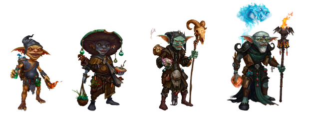
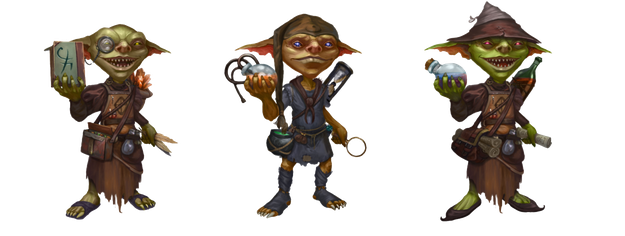
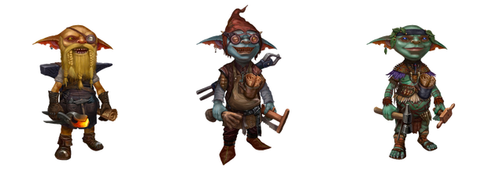
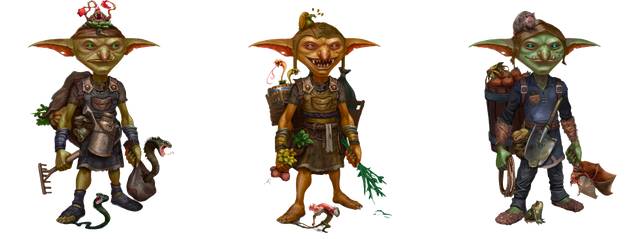

# Персонажи

## Генезис-Алхимик

- Главный персонаж основного геймплея (DeFi).
- Ограниченное количество.
- Выше параметр выносливости в сравнении с бейсик алхимиками

## Бейсик Алхимик

- Главный персонаж основного геймплея (DeFi).
- Неограниченное количество (зависит от новых игроков).
- Продаётся в ходе игры на аукционах.

## Ремонтник

- Главный персонаж F2P-геймплея.
- Genesis-Ремонтник имеет ограниченный тираж.
- Freemint Genesis-Ремонтник получает больше Серебряных Монет за победу в карточной игре (по-разному для обычного и редкого варианта).
- Бейсик Ремонтник имеет неограниченное количество.

## Садовник

- Вспомогательный персонаж основного геймплея.
- Неограниченное количество.
- Позволяет Алхимику реже входить в игру, выполняя действия за игрока.
