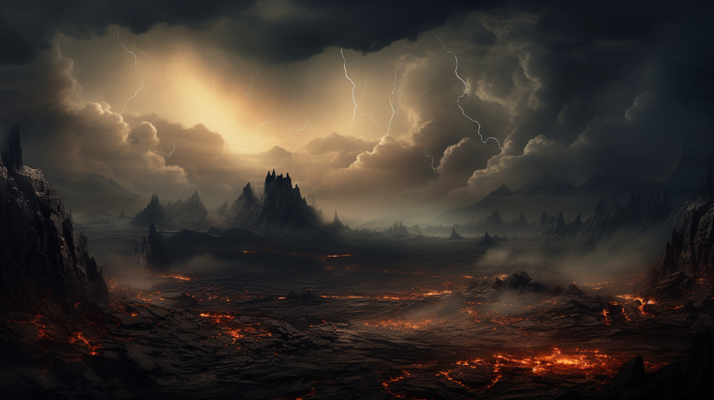
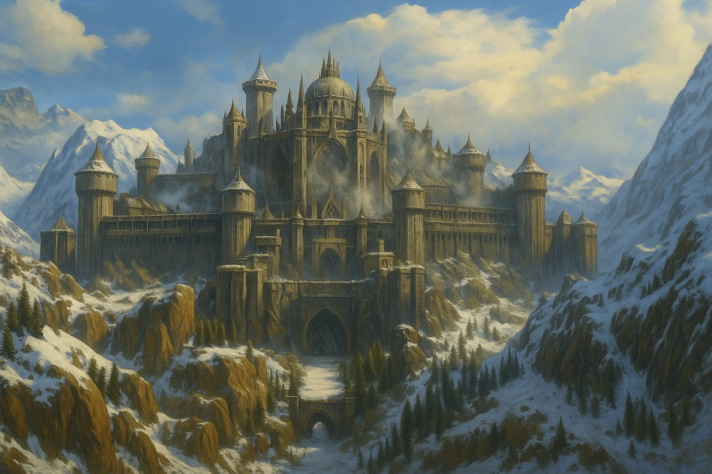

# Countries on the Farnax continent

## Twilight Wastes

It is an island located north of Farnax, bathed by the cold waters of the Inland Sea. The island gets its name from the ash and smoke from hundreds of erupting volcanoes that cover the sky.

A lifeless area where storms and thunderstorms rage constantly, and the air is poisoned with sulfur and poisonous gases. The island has a bad reputation and is considered a cursed place. Everyone who lands on its shores is eventually overcome by anxiety and panic attacks. And if one has a magic talent, they are tormented by a worsening headache.

Numerous attempts to investigate the phenomenon, like the island itself, have come to nothing. No one can answer as to who used to live on the island and what was once here. All we know is that the Twilight Wastes were formed by a massive magical cataclysm at the end of the Golden Age.

## Northern Horde
Orcs of the northern reaches. Mad and fierce children of the ancient god Mundo. Orcs regularly raid and campaign against their southern neighbors. The purpose of their entire life is war and enslavement of other nations as well as of their kind.

At the end of the Survivor Wars, the Orcs were pushed north to the Dreymain Peninsula by an alliance of the first human, dwarf, and elf states. By now, the border Sandhorn and Bayan`Gol states are the primary victims and opponents of the orcs.

Were it not for tribal feuding within the Horde, preventing the northern orcs from uniting forces under a single banner, the Farnax states would have faced significant problems. The last major orcish campaign illustrated this fact during the War of the Three Swords, in which most northern orcish tribes participated.

## Bayan`Gol
This is the Dwarven Kingdom. Together with the people of the Sandorn Kingdom, they have been the first to encounter and repel the Northern Horde onslaughts for centuries. They have strong fortresses in the gorges and ridges of the Northern Mountains. Skilled artisans in metal and gemstone work. Their innate talent for blacksmithing is unrivaled.

The kingdom’s capital, Uraal, is located in the Iron Mountains. It was besieged during the great orc invasion fifty years ago, but the orcish army, although outnumbering the defenders, could never take the dwarven capital.

The dwarf king, Darius the Iron-Haired, led the defense himself. To great grief, he died leading a heroic attack on a giant battering orcish ram that was about to breach the city’s main gates. Even more tragically, in the heat of battle, a treasure that dwarves had preserved since the Golden Age was lost — a crown with the gemstone Adamantium.

For the dwarves of the Mountain Throne, the loss of this relic was a worse blow than even the king’s death. Each relic was sacred to the dwarves, and only a few were saved.

The Bayan’Gol dwarves still remember that day in tears and dream of returning their heritage to the capital. All members of the Iron Dwarf Hird have burned an oath on their chests to reclaim the ancient treasure one day. Many attempts have been made to find and retrieve the crown, but they have all failed.

People live freely within the kingdom, renting land and paying taxes to the Mountain Kingdom.

## The Kingdom of Sandorn
A nation of people who have held back the raids of the Northern orcs for centuries. Brave and skilled warriors, descendants of an ancient Golden Age kingdom. Faithful allies of the dwarves of the Mountain Throne.

The Sandorn gentry prepares boys for military service from a young age. There is even talk of women serving on the northern frontiers of Sandorn on an equal footing with men. Sandorn is ruled by a king who governs from the capital city of Grashir. But like all his ancestors, he prefers the saddle to an audience, defending his country at the head of an army.

The relentless opposition to the Orcs of the Horde affects every aspect of Sandornian life. The dignity of life and acquired honor, rather than material possessions, are paramount to each of them. A sense of duty is the backbone of every Sandornian. Not fulfilling one’s duty is the worst crime imaginable. “Duty is heavier than a mountain, while death is lighter than a snowflake,” they say here.

## Dornkun
A principality located in the north of the Norvea Peninsula. A snowy and cold land where tough and hardy people live. In their veins runs the hot blood of travelers and fierce warriors.

They are experienced and skilled seafarers, fearlessly venturing into the waters of the North Sea and Inland Sea on drakkars to hunt whales and other sea beasts or stage a glorious campaign and rob their southern neighbors. There are many ballads about brave jarls, their warriors, and the rich rewards of sea raids.

The people of Dornkun are brave warriors and skilled traders. Time and again, merchant ships from all over the world return to the capital of Karrun for the valuable furs favored by the court ladies of Bizaria and Rado and for the precious bones highly prized in The Dudzhun Empire. The Principality of Dornkun is the only place where the rare bones of the sea leviathans that live off the coast of the Twilight Wastes are harvested.

## The Principality of Sidonia
The state of the people, which was formed from the association of small principalities on the Beishan plain more than four hundred years ago.

Harloon the Wrathful is the first member of the ruling dynasty of Nordar princes. For forty years he united all the lands of Sidonia under his rule. In this, he was aided by his natural cunning and ferocity and the gold of the Zayan Mountains, with which he hired mercenaries from across the sea. For they had not previously been seen in the northern expanses of Farnax.

Sidonia’s squads are skillful warriors who fought in the War of the Three Swords. Sidonia is on good terms with the Principality of Dornkun, as it is closely related to the current dynasty of Nordar Princes. The Principality of Sidonia is an eternal rival of the state of Venturia. There are constant border conflicts between them that escalate into local wars.

## Triumvirate of Venturia
A state of men governed by the Council of Heads of the three most powerful Houses of Venturia. The tradition dates back to the beginning of the tenth century of the new chronology, just after the end of the Hunger Wars. This event is described in more detail in: “The World Order of the New States’’. Vol. 4. By Ieromeus of Savales. A.D. 1336.

Venturia’s land is highly fertile, so the country is not short of food supplies.Most of the inhabitants are farming in the extensive fields of the feudal lords. On the shores of Lake Eschen, the largest lake on the continent, stretches the ancient capital of Bairer, famous for its architecture, grandiose white towers, and spires reaching up to the clouds.

The waterway of the Narva River is the country’s main trade artery. Hundreds of merchant ships sail up and down it every day, carrying overseas goods and all sorts of curiosities for the wealthy houses of Venturia.

## Adriennel
The state of the High Elves, a people whose members live up to five hundred years. It is said that they possess the few remnants of knowledge from the Golden Age that have survived to this day. And the ancient magic that fills the elven forests is a guarantee of strength and security.

The Kingdom of Adriennel is the only one on the continent of Farnax whose borders have remained unchanged for millennia. All human wars and conflicts have bypassed the elves, and for a good reason.

As recorded in the chronicles, more than two thousand years ago, a king of a now-defunct state kidnapped several elven women.Then an army of elves destroyed the capital of his kingdom with all its inhabitants in just three days.

The memory of these events prevented neighboring states from even thinking of disputing the boundaries of the Adriennel Kingdom lands. Fortunately for the neighbors, the elves never attempted to extend them.

The elves are careful not to make contact with other Dji’Da countries and do not allow anyone into their territories except traders and travelers from the goblin people.

The elven army has only left their forests a few times in the new history. The last time this happened was quite recently, about fifty years ago. The threat of a great invasion by the Orcs of the Northern Horde forced the Elves of Adriennel to join the Alliance of the Human and Dwarven Armies in the War of the Three Swords.

## Bizaria
A nation of people in the south of the Farnax continent. It is home to the largest and oldest academy of magic on the entire continent, founded at the dawn of the New Age more than three thousand years ago. The magical academy, located in the capital city of Myrwuth, is known throughout the world for its huge library with a collection of unique ancient scrolls and books. The greatest mages in the history of Farnax are from the Academy of Bizaria.

Nominally the country is ruled by the King of Bizaria, but everyone knows that the Council, headed by the Archmage of the Order of Elemental Mages, is actually in charge. The wizards of the Order made a significant contribution to the victory of the War of Three Swords. Some mages even say that it should more properly be called the War of the Staff and the Three Swords.

## The Grand Duchy of Rado
Rado lies to the east of the state of Bizaria, on the coast of the Sea of Tears. Known for its traders and seafarers. Possesses the strongest and largest merchant and naval fleet on the continent. The navy is the pride and strength of the Rado state.

Trade with the countries of the Khela continent is the main source of wealth for the Grand Duchy of Rado. From its ports, most of all overseas goods enter the countries of Farnax.

During the War of Three Swords, Aldo Mado, Grand Duke of Rado, provided the Alliance of Three Swords with ships in the port of Greer, the capital of the Duchy, to move their troops deep into the rear of the Orcish Horde. The bold landing of the combined Alliance forces in that battle succeeded in turning the tide of the entire war.

Grand Duke Aldo personally led the movement of troops and took part in the battle in the northern lands of Sandorn. To the great sorrow of his people, he did not return from that campaign. On the way back Duke Aldo, after drinking too much century-old dwarven brandy, fell overboard the flagship Golden Eagle drunk and drowned.

