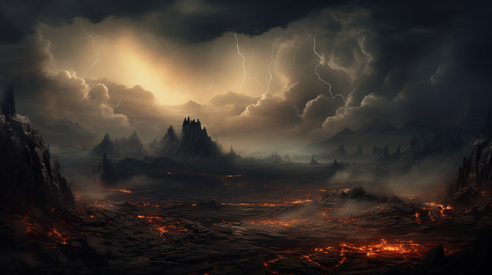
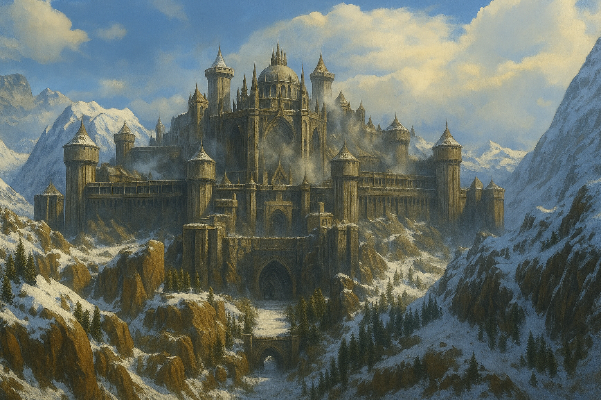

# Страны континента Фарнакс
## Сумеречные Пустоши
Это остров, находящийся северо-западнее побережья Фарнакса и омываемый холодными водами Внутреннего моря. Свое название остров получил из-за застилающих небо пепла и дыма от сотен извергающихся вулканов.

Безжизненная территория, где постоянно бушуют бури и гремят грозы, а воздух отравлен серой и ядовитыми газами. Остров имеет дурную славу и считается проклятым местом. Каждого, кто высаживается на его берег, со временем начинают одолевать тревога и приступы паники. А если человек обладает талантом магии, то его мучает еще и усиливающаяся головная боль.

Многочисленные попытки исследовать этот феномен, как и сам остров, ни к чему не привели. Никто не может дать ответ, какие народы раньше жили на острове и что здесь было когда-то. Известно лишь, что Сумеречные Пустоши образовались из-за масштабного магического катаклизма на закате Золотой эпохи.

## Северная Орда
Орки северного предела. Безумные и яростные дети древнего бога Мундо. Регулярно устраивают набеги и военные походы на южных соседей. Цель всей жизни орков — война и порабощение как других народов, так и себе подобных.

В конце Войн Выживших орки были оттеснены на север, на полуостров Дреймайн союзом первых государств людей, гномов и эльфов. На сегодняшний день пограничные государства Сандорн и Баян`Гол являются главными жертвами и противниками орков.

Если бы не вражда племен внутри Орды, не дающая оркам севера объединить силы под единым стягом, то государства Фарнакса столкнулись бы с большими проблемами. Это показал последний крупный поход орков, названный Войной Трёх Мечей, в котором участвовала от силы половина всех северных орочьих племён.

## Баян’Гол
Королевство Гномов. Вместе с людьми королевства Сандорн на протяжении веков первыми встречают и отражают набеги орков Северной Орды. Имеют мощные крепости в ущельях и хребтах Северных гор. Умелые мастера обработки металлов и драгоценных камней. Их врожденный талант в кузнечном деле не знает равных.

Столица королевства, Ураал, расположена в Железных Горах. Во время великого вторжения орков пятьдесят лет назад была осаждена, но войско орков, хоть и численно превосходило обороняющихся в несколько раз, так и не смогло взять столицу гномов.

Сам король гномов, Дарий Железоволосый, руководил обороной. К великому горю он погиб, возглавив героическую атаку на гигантский таран орков, что собирался пробить главные ворота города. И, что еще более трагично, в пылу битвы было утеряно сокровище, что сохранилось у гномов ещё со времен Золотой эпохи — корона с драгоценным камнем Адамантиум.

Для гномов Горного Престола потеря этой реликвии стала ударом страшнее, чем даже смерть короля. Каждая подобная реликвия была священна для гномов, а сохранить их удалось всего несколько штук.

Гномы Баян`Гол до сих пор со слезами вспоминают этот день и мечтают вернуть свое наследие в столицу. Все члены Железного хирда гномов калёным металлом выжгли у себя на груди клятву, что однажды вернут древнее сокровище. Было предпринято множество попыток найти и возвратить корону, но все они обернулись неудачей.

На территории королевства свободно живут люди, арендуя землю и платя налоги Горному Престолу.

## Королевство Сандорн
Государство людей, веками сдерживающее набеги орков Севера. Храбрые и умелые воины, потомки древнего королевства Золотой эпохи. Верные союзники гномов Горного престола.

Дворянство Сандорн готовит мальчиков к военной службе с юных лет. Поговаривают даже, что на северных рубежах Сандорн женщины несут службу наравне с мужчинами. В Сандорне правит король, управляющий из столицы Грашир. Но, как и все его предки, он предпочитает аудиенциям седло, защищая свою страну во главе войска.

Непрестанное противостояние оркам Орды влияет на все аспекты жизни сандорнцев. Поэтому каждому из них важно, в первую очередь, достоинство жизни и обретенная честь, а не материальные блага. Чувство долга — стержень каждого сандорнца. Не выполнить свой долг — самое тяжкое преступление, которое только можно представить. “Долг тяжелее горы, тогда как смерть легче снежинки”, — так говорят здесь.

## Дорнкун
Княжество, находящееся на севере полуострова Норвей. Снежный и холодный край, в котором живут крепкие и закаленные люди. В жилах дорнкунцев бежит горячая кровь путешественников и яростных воинов.

Опытные и умелые мореходы, бесстрашно выходящие в воды Северного и Внутреннего моря на драккарах, чтобы охотиться на китов и другого морского зверя или устроить славный поход и ограбить своих южных соседей. Немало сложено баллад о храбрых ярлах и их дружинах, а также богатой награде, добытой в морских налетах.

Жители Дорнкуна являются храбрыми воинами и умелыми торговцами. В столицу Каррун снова и снова возвращаются торговые корабли со всего мира за ценным мехом, который так любят придворные дамы Бизарии и Радо, а также за драгоценной костью, которую высоко ценят в империи Дуджун. Княжество Дорнкун — единственное место, где добывают редкую кость морских левиафанов, обитающих у берегов Сумеречных Пустошей.

## Княжество Сидония
Государство людей, что образовалось из объединения мелких княжеств на территории Бейшанской равнины более четырехсот лет назад.

Харлун Гневный — первый представитель правящей династии князей Нордар. На протяжении сорока лет объединял все земли Сидонии под своей властью. Во этом ему помогли природная хитрость и жестокость, а также золото Заянских гор, на которое он смог заручиться помощью наёмников из-за моря. Ибо их ранее не видели на северных просторах Фарнакса.

Дружины Сидонии — умелые воители, которые участвовали в Войне Трёх Мечей. Сидония в хороших отношениях с княжеством Дорнкун, так как оно тесно связано родственными узами с действующей династией князей Нордар. Княжество Сидония — вечный соперник государства Вентурия. Между ними постоянно происходят пограничные конфликты, перерастающие в локальные войны.

## Триумвират Вентурия
Государство людей, управляемое Советом Глав трёх самых влиятельных Домов Вентурии. Традиция восходит к началу десятого века нового летоисчисления, сразу после окончания Голодных войн. Подробно это описано в трудах: “Мироустройство новых государств”. Том 4. Автор Иеромей Савальский. 1336 г. н. э.

Земли Вентурии крайне плодородные, из-за чего страна не испытывает недостатка в запасах еды. Большинство жителей занимаются земледелием на обширных полях феодалов. На берегу озера Эшен, самого большого озера на континенте, раскинулась древняя столица Бэрэр, славящаяся своей архитектурой, грандиозными белыми башнями и шпилями, достигающих облаков.

Полноводная река Нарви — главная торговая артерия страны. Сотни торговых судов поднимаются и сплавляются по ней ежедневно, перевозя заморские товары и всевозможные диковинки для богатых домов Вентурии.

## Королевство Адриеннель
Государство высших эльфов, народа, чьи представители доживают до пятисот лет. Поговаривают, они обладают теми немногими крупицами знаний Золотой эпохи, что еще сохранились до наших дней. А древней магия, наполняющая эльфийские леса, служит залогом силы и безопасности.

Королевство Адриеннель — единственное на континенте Фарнакс, чьи границы остаются неизменными на протяжении тысячелетий. Все войны и конфликты людей обходили эльфов стороной, и на то есть веская причина.

Как записано в хрониках, более двух тысячи лет назад, один король уже не существующего ныне государства похитил нескольких эльфийских женщин. Тогда армия эльфов уничтожила столицу его королевства со всеми жителями всего за три дня.

Память об этих событиях не позволяла соседним государствам даже подумать о том, чтобы оспорить границы земель королевства Адриеннель. К счастью соседей, эльфы никогда и не пытались расширить его пределы.

Эльфы стараются не вступать в контакт с другими странами Джи’Да и не пускают на свои территории никого, кроме торговцев и путешественников из народа гоблинов.

За новую историю армия эльфов лишь несколько раз покидала пределы своих лесов. В последний раз это произошло совсем недавно, не более пятидесяти лет назад. Угроза в лице великого вторжения орков Северной Орды вынудила эльфов Адриеннеля присоединиться к Альянсу армии людей и гномов в Войне Трёх Мечей.

## Бизария
Государство людей на юге континента Фарнакс. Здесь расположена самая большая и древняя академия магии на всём континенте, которую основали на заре Новой эпохи более трех тысяч лет назад. Магическая академия, находящаяся в столице Мирвут, известна на весь мир огромной библиотекой с собранием уникальных старинных свитков и книг. Величайшие маги в истории Фарнакса — выходцы Академии Бизарии.

Номинально страной управляет король Бизарии, но все знают, что на самом деле всем заправляет Совет во главе с архимагом Ордена стихийных магов. Маги Ордена внесли весомый вклад в победу на Войне Трёх Мечей. Некоторые маги даже говорят, что правильнее было бы называть её Войной Посоха и Трёх Мечей.

## Великое Герцогство Радо
Радо находится восточнее государства Бизария, на побережье Моря Слёз. Известно своими торговцами и мореплавателями. Обладает самым сильным и большим торговым и военным флотом на континенте. Флот — это гордость и залог силы государства Радо.

Торговля со странами континента Кхела служит главным источником богатства Великого Герцогство Радо. Именно из его портов большая часть всех заморских товаров попадает в страны Фарнакса.

В Войну Трёх Мечей Альдо Мадо, Великий герцог Радо предоставил Альянсу Трёх Мечей суда в порту Грире, столице герцогства, чтобы перебросить их войска в глубокий тыл Орды орков. Благодаря дерзкому десанту объединённых сил Альянса в той битве удалось переломить ход всей войны.

Великий Герцог Альдо лично руководил переброской войск и участвовал в битве на северных землях Сандорна. К великому горю своего народа, он не вернулся из того похода. На обратном пути герцог Альдо, перебрав гномьего бренди столетней выдержки, пьяным свалился за борт флагмана “Золотой Орёл” и утонул.

