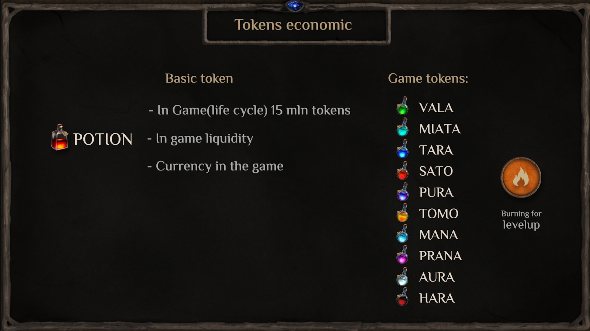
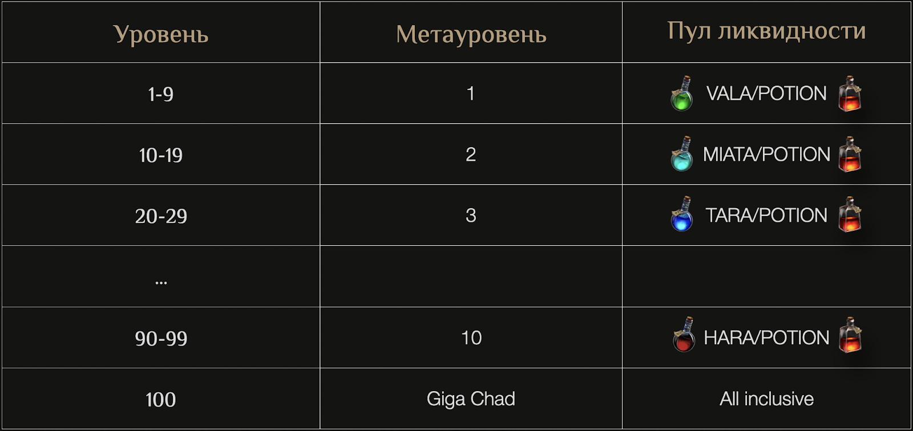
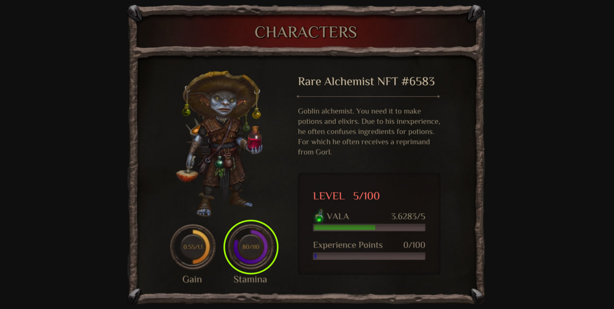
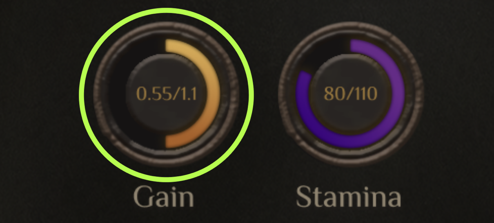
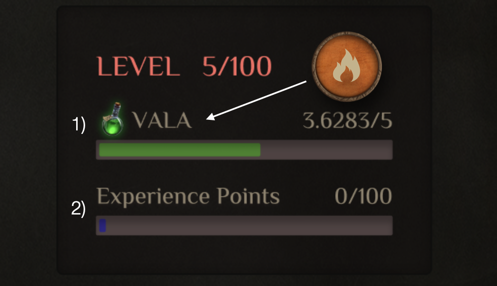
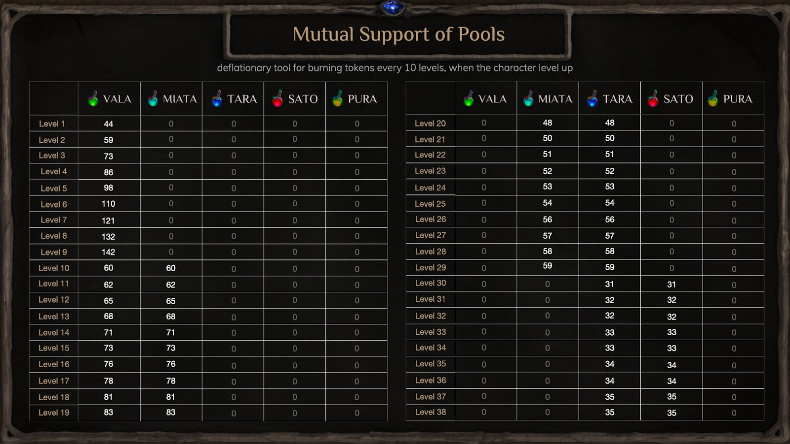
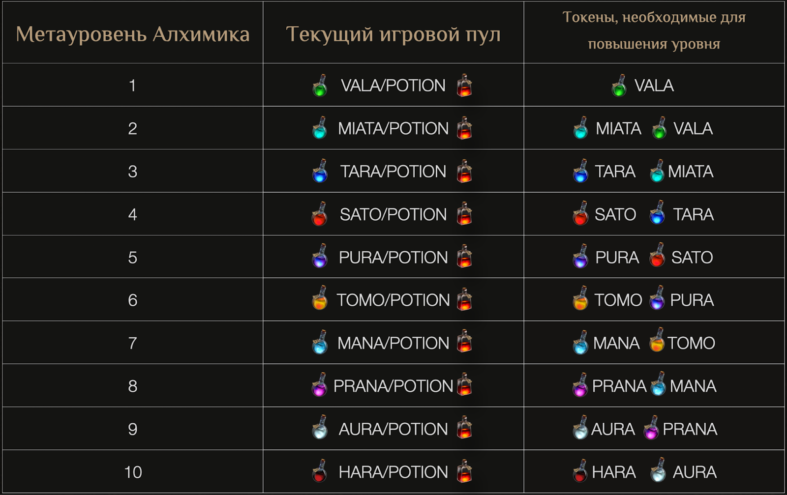
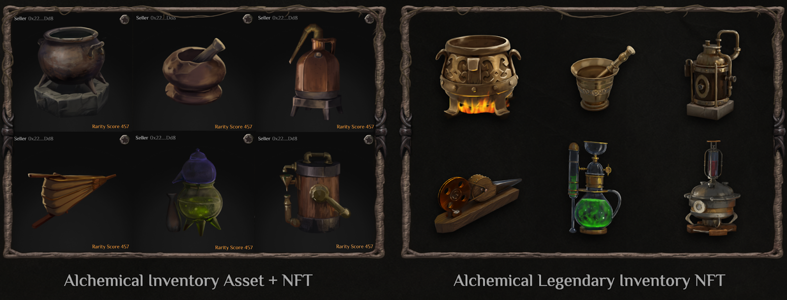
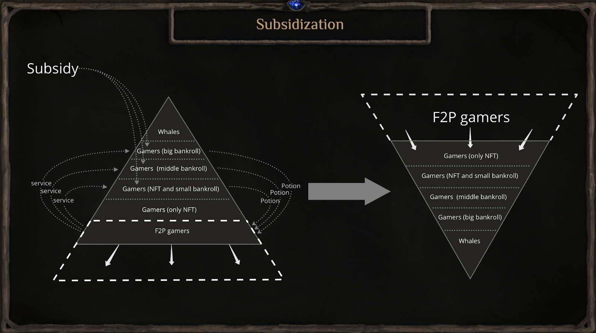
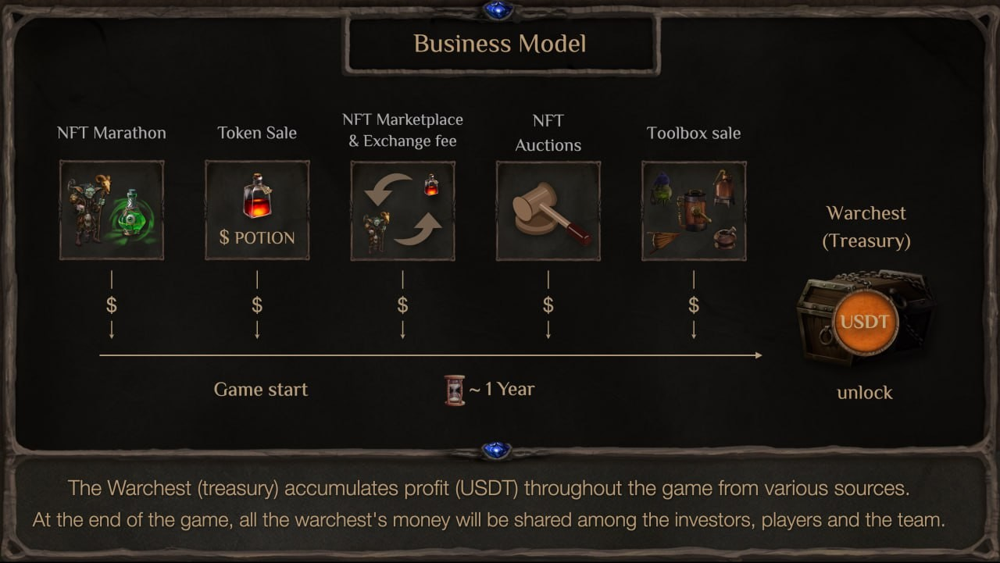

# Defi Часть Magic Alchemy
Magic Alchemy (MA) – это P&E игра, в основе экономики которой лежит механизм классического фарминга (майнинга ликвидности), стейкинга NFT и более привычные механики сбора урожая, крафтинга, а также карточная игра.

[Основные механики и токены](#basic-mechanics)

[Особенности DeFi части MA](#defi-features)

[Формулы расчета наград (только для особо интересующихся)](#calculation-formulas)

[Прокачка Алхимика](#alchemist-leveling)

[F2P часть игры MA](#f2p-part)

[Субсидии](#subsidies)

[Игровые сезоны](#seasons)

[Аукционы бейсик Алхимиков](#basic-alchemyst)

[Варчест](#warchest)

[Заключение](#conclusion)

[FAQ](#faq)

## Основные механики и токены {#basic-mechanics}
В игре Magic Alchemy существует два вида токенов (все токены находятся on chain):

1. POTION — это основной токен игры.
2. Игровые токены (10 видов) — это игровые уровневые токены, которые можно получить, проходя игру, а именно за стейкинг NFT-Алхимиков и участие в фарминге игровых пулов.

Как выглядит стандартный DeFi? А, точнее пулы, ликвидности? Мы полностью переосмыслили подачу пула ликвидности децентрализованных бирж, представляя его в виде чана с зельем, для приготовления которого необходимо два ингредиента: основной катализатор POTION и требуемый ингредиент, являющийся одним из 10 игровых зелий (токенов). Соединяя основной токен POTION с каждым игровым токеном, мы получаем 10 игровых пулов ликвидности (VALA/ POTION, MIATA/ POTION и так далее).

Игрок зарабатывает игровые токены путем стейкинга NFT Алхимика и фарминга в игровых пулах. Сжигая часть наград и зарабатывая очки опыта (см. Прокачка Алхимика), игрок повышает уровни, получает доступ к более ценным пулам (к варке более ценных зелий) и проходит игру.

Захватывающий игровой процесс достигается за счет конкуренции, сезонных событий и возможности выбора различных экономических стратегий для прохождения уровней. Игра предлагает различные настройки пулов, возможности сотрудничества в гильдиях, уникальный сюжет и красивую графику с оригинальной музыкой.

Ценность игрового процесса заключается в приобретении навыков взаимодействия со смарт-контрактами DEX (decentralized exchange), пулами ликвидности и предоставлением ликвидности. Продвинутые игроки также могут изучить on chain аналитику и отслеживать on chain действия других игроков извлекая прибыль.

Игроки могут играть как в DeFi (decentralized finance), так и F2P (free to play) части игры целый день или в перерывах между просмотрами серий любимых сериалов, в зависимости от текущей занятости (жанр очень похож на любые idle игры и не отнимает много времени).

## Особенности DeFi части MA {#defi-features}
Доступ к зельеварению, т.е. к ликвидности игровых пулов (покупка, продажа, фарминг в пуле), дает наличие застейканного NFT Алхимика. Доступ к основному пулу игры POTION/USDT имеют все пользователи без исключения и каких-либо ограничений.

Для минимизации влияния механик Pay to Win и ограничения возможного IL (Impermanent Loss), фарминг в игровых пулах ограничен максимально допустимым размером ликвидности, предоставляемой игроком, за которую распределяются награды. Например, в пуле ликвидности ограничение составляет 1000$ (цифра не точная, для примера). Это значит, что даже если игрок предоставит в этот пул ликвидность совокупной стоимостью 1500$, начисление наград произойдет, исходя из суммы предоставленной ликвидности в 1000$.

Максимально допустимый размер ликвидности определяет спрос на токен POTION и является одной из главных его ютилити. Например, начальная цена POTION в пуле POTION/USDT равна 1$. Допустим, играют 3000 Алхимиков. Чтобы каждый Алхимик смог предоставить ликвидность, например, в 500$ (при цене в 1$ равно 500 POTION), среди всех Алхимиков необходимо равномерное распределение токенов POTION в общем размере 3000*500 (POTION) = 1,5кк POTION.

Однако, начальное циркулирующее предложение токенов POTION у игроков на руках равно 875к POTION, что меньше данного значения. Кроме этого, за майнинг ликвидности в пуле POTION/USDT предоставляются награды минимум 5479 POTION в день, часть циркулирующего предложения POTION отойдет в этот пул (второе основное ютилити POTION). Предполагаемый APR пула POTION/USDT в таком случае будет в районе 150-300%.

С течением игры циркулирующее предложение токена POTION возрастает, но спрос на токен увеличивается, во-первых, из-за прихода новых игроков, а, во-вторых, с повышением максимально допустимого размера ликвидности внутриигровых пулов. Кроме этого, токеномика построена таким образом, что во время игры Алхимикам не надо бояться разлоков инвесторов и команды (т.к у команды токены заблокированы до конца игры) что создает честные условия соревнований DeFi игроков.

Для понимания механики получения наград за предоставления ликвидности в главном пуле POTION/USDT, рассмотрим пример. Предположим, цена токена POTION равна 1$ и каждый день распределяется 5479 токенов POTION среди фермеров пула POTION/USDT.

Игрок Онотолий собирается предоставить ликвидность в размере 500$. Сделать это можно вручную, пройдя все этапы:

1. Свап половины USDT в POTION;
2. Внесение 250 USDT и 250 POTION в ликвидность пула;
3. Стейкинг LP токенов.

Либо это можно сделать в одно действие, когда наш смартконтракт произведет все вышеперечисленные действия в одной транзакции. Таким образом, игроку необязательно будет иметь токен POTION, чтобы предоставить ликвидность в главном пуле, достаточно будет депозита в USDT.

Вместе с Онотолием на самом старте игры в этот пул также предоставили ликвидность 99 других игроков с такой же суммой в 500$. Суммарная ликвидность игроков равна 50к$.

Кроме этого Варчест (казна игры) в пул ликвидности предоставил, допустим, 450к $, тогда среди игроков распределяется 10% от 5479 POTION = 547 POTION. Игрок Онотолий получит 5,47 токенов POTION за 1 сутки предоставления ликвидности, что составляет примерно 400%* APR от суммы предоставленной ликвидности.

**это только пример, взятый из данных условий.*

Кроме основных двух ютилити POTION, токен также необходим для покупок игровых персонажей, бустеров и запчастей NFT. В игре MA, POTION – это не просто очередной WEB3 токен, POTION является по сути кор-механикой игры (в пуле два токена) то есть, токен отчасти и есть сама игра, определяющая спрос, кроме только лишь спекулятивных интересов в подавляющем большинстве других игровых WEB3 проектов.

Важно отметить, что полный доступ к конкретному игровому пулу получает Алхимик соответствующего метауровня (см. таблицу).

Алхимик метауровня n имеет возможность торговать в игровых пулах, соответствующих метауровню от 1 до n+1, однако фармить может только в игровом пуле, соответствующем метауровню n.

Кроме того, для сбалансированной экономики игры Алхимики имеют параметры стамины и мощности, относящиеся к каждому метауровню и являющиеся по своей сути методами издержек и мотиваций, “кнутом” и “пряником”, которые поощряют прогресс и порицают застой.

Стамина – показатель усталости, который понижается, если Алхимик слишком долго находится на одном уровне, и игроку становится сложнее зарабатывать ресурсы. Этот параметр мотивирует переходить на более высокие уровни, вместо того чтобы «сидеть» в одном пуле. Технически – это уменьшение Stamina coefficient (Sc) в зависимости от заработанных токенов текущего игрового пула (см. таблицу).

**параметры данной таблицы могут быть изменены к началу игры.*

Например, коммон и легендарный Алхимики имеют 500$ ликвидности в игровом пуле MIATA/POTION. Предположим, для прохождения уровня необходимо сжечь 100 токенов MIATA, т.е. 100 MIATA это 100% от необходимого количества токенов для лвл-апа. Допустим, Алхимик с такой ликвидностью зарабатывает 10 токенов в час. Тогда и легендарные и коммон Алхимики фармят 10 токенов в час, однако такая скорость фарминга у коммон Алхимика сохраняется пока он не нафармил 101%, т.е. 101 MIATA.

Далее от 101% до 105% (от 101 до 105 MIATA) коммон Алхимик фармит уже с 50% скоростью (Sc=0.5), т.е. зарабатывает 5 токенов в час с предоставленной ликвидностью 500$, в то время как легендарный Алхимик фармит с прежней скоростью 10 токенов в час, т.е. с коэффициентом Sc=1. Когда коммон Алхимик фармит токены MIATA в диапазоне 110-115%, то его Sc=0.2 и скорость фарминга составляет 20% от дефолтной, т.е. 2 токена в час при ликвидности 500$, а скорость фарминга легендарного Алхимика, пока он не нафармил 115%, т.е. 115 MIATA, прежняя и равна  10 токенам в час.

Эта скорость фарминга останется уменьшенной, пока Алхимик не перейдет на новый уровень внутри метауровня. Когда Алхимик повышает уровень, ему необходимо еще 100 MIATA для следующего лвл-апа. Тогда 100% необходимых токенов теперь равны 200 MIATA. Допустим, коммон Алхимик, будучи на первом уровне, нафармил 114% токенов, т.е. 114 MIATA и его Sc был равен 0,2. После повышения уровня считается, что он нафармил 114 MIATA из необходимых 200 MIATA, т.е. меньше 101% и его Sc увеличивается до 1. Т.е. при каждом лвл-апе Алхимика показатель усталости, как и скорость фарминга, восстанавливаются до нормального значения.

Таким образом, более редкий Алхимик может получить бОльшую выгоду от прохождения игровых пулов (нафармить больше токенов без штрафа к скорости фарминга), однако это никак не влияет на скорость прохождения игры, потому что 100% необходимых для прокачки игровых токенов фармятся у всех Алхимиков с одним и тем же коэффициентом Sc.

Из примера выше следует, что легендарный Алхимик сможет за один метауровень нафармить без штрафа к скорости фарминга на 140 токенов MIATA больше, чем коммон Алхимик.

Мощность Алхимика – это воплощение его опыта и искусности зельеварения (см. таблицу). Алхимик имеет Power coefficient (Pc), который соответствует уровню внутри метауровня и повышается от 1 до 1,15 при прокачке Алхимика. При переходе Алхимика, например, с 19 на 20 уровень он переходит со 2 на 3 метауровень и Pc снижается до 1.

## Формулы расчета наград (только для особо интересующихся) {#calculation-formulas}
Итого возможные награды i-ого Алхимика на k-ом метауровне Mi,k определяются следующим образом: 

где Sk – дефолтное количество наград k-ого метауровня, определяемое перед запуском k-ого пула на основе текущей цены POTION,

Sci,k и Pci,k – соответственно Stamina coefficient и Power coefficient i-ого Алхимика на k-ом метауровне.

Награды i-ого Алхимика за стейкинг на k-ом метауровне Msi,k определяются следующим образом: 

где Nk – доля стейкинговых наград k-ого метауровня.

Награды i-ого Алхимика за фарминг на k-ом метауровне Mfi,k определяются следующим образом: 

где LPi,k – ликвидность i-ого фермера-Алхимика k-ого метауровня.

DLPk – дефолтный  максимально допустимый размер ликвидности k-ого метауровня.

## Прокачка Алхимика {#alchemist-leveling}
Кроме этого, в DeFi части игры есть off chain механики, связанные с выращиванием и сбором ингредиентов, необходимых для создания эликсира.

Чтобы повысить уровень Алхимика, игроку необходимо:

* сжечь определенное количество игровых токенов (on chain механика)
* заработать определенное количество очков опыта, готовя эликсиры необходимого уровня сложности (off chain механика)
* 
Получить токены для прокачки Алхимика можно, как заработав их путем стейкинга и фарминга, так и просто купив их с рынка.

В экономической модели реализован механизм поддержки предыдущих пулов, когда для повышения уровня Алхимика необходимо сжечь не только токен текущего метауровня, но и предыдущего. Таким образом, отстающие игроки с повышением метауровня приходят в ликвидный игровой пул, даже если авангард зельеварения находится уже следующем пуле и экономика всех игровых пулов прекрасно работает на протяжении всей игры. Таблица необходимых токенов для повышения уровня Алхимика представлена ниже:

Off chain механика нужна как для исключения влияния механик Pay2Win, когда игрок может только покупать токены для лвл-апа Алхимика, так и для геймификации прохождения сюжетной линии.

Игровая off chain механика выглядит следующим образом:

Алхимик получает задание на создание эликсира, для которого ему необходимо вырастить и собрать определенные растения. Для облегчения и максимизации эффективности сбора ингредиентов он может нанять NFT гоблина-садовника после сбора всех необходимых ингредиентов.

Алхимик в Лаборатории создает эликсир, чистота которого зависит от используемого оборудования, имеющего несколько разных состояний, например, сломанное, простое оборудование, NFT оборудование. Далее для простоты восприятия будем называть такое оборудование бустерами. Кроме чистоты эликсира бустеры влияют на его скорость приготовления, которое в зависимости от совокупного состава бустеров и их состояния варьируется от 5 минут до нескольких дней, что соответствует всем рабочим NFT бустерам и всем испорченным. На бустерах и их починке завязана вся экономика F2P части игры.

## F2P часть игры MA {#f2p-part}
Не NFT и NFT-бустеры имеют очки прочности и ломаются после определенного количества использований. После поломки игрок-Алхимик может купить NFT-бустер или использовать детали NFT, чтобы восстановить прочность своего не NFT или NFT-бустера. Хоть NFT бустеры позволяют варить эликсир быстрее, чем не NFT бустеры, но и тем и другим для ремонта требуются NFT запчасти.

Запчасть NFT может быть создана только в повозке и из сырья, купленного у торговца за серебряные монеты, которые можно выиграть, играя в карточную игру PvP. Играть в карточную игру может каждый, включая игроков free-to-play. Имеющиеся NFT ремонтники позволяют быстрее заработать СМ на сырье, а NFT повозки ускорить изготовление запчасти.

Игроки-Алхимики, несущиеся в авангарде зельеварения, получают экономические бонусы при переходе в новые пулы, отстающие игроки стараются прокачиваться быстрее, а кроме этого, наличие системы сезонов с наградами создают экономическую мотивацию использования NFT-бустеров.

## Субсидии {#subsidies}

Кроме того, предусмотрены субсидии игрокам, использующим NFT запчасти для починки NFT бустеров. На эти субсидии Алхимикам будет экономически выгодно покупать запчасти, тем самым расширяя воронку F2P игроков, что запустит маховик конверсии F2P игроков в Алхимиков.

Мы предлагаем органическую систему, в которой F2P игрок может начать играть в приложении телеграмм. Для такого пользователя сторонним провайдером Dynamic (www.dynamic.xyz) автоматически создается криптокошелек типа аккаунт абстракшн (АА кошелек) (https://www.dynamic.xyz/blog/account-abstraction). После того, как игрок F2P заработает некоторую ценность в игре, он сможет изготовить свою первую запчасть NFT, продать ее и извлечь реальную прибыль. Серебряные монеты и сырье для запчастей NFT находятся на бэкэнде игры и не являются данными в блокчейне.

**Карточная игра F2P (реф. Arcomage).*

## Игровые сезоны {#seasons}
Вся DeFi часть МА разделена на сезоны, в которых определяются лучшие Алхимики и гильдии, а также происходит распределение наград в токенах POTION из огромного пула Game Rewards. Шансы на призовые места в индивидуальном и гильдийном лидербордах равны как для новичков, находящихся на 1 метауровне, так и для авангарда зельеварения.

1. Индивидуальный лидерборд формируется на основе заработанных поинтов за количество сваренных эликсиров и их чистоту (чистота эликсира зависит от NFT бустеров)
2. Гильдийный лидерборд формируется на основе суммы поинтов определенного числа согильдийцев. Создание гильдии первое время будет доступно только для легендарных Алхимиков, далее возможность создания гильдии откроется эпическим Алхимикам.
3. Также есть лидерборд за прохождение игры. В нем фиксируются все Алхимики и их уровни на конец игры. Лидерборд формируется по уровню и времени его достижения. Когда Алхимики достигнут 100 лвл, игра закончится.
## Аукционы бейсик Алхимиков {#basic-alchemyst}

На марафоне токенов и NFT распределяются генезис Алхимики различной редкости. С началом игры и при увеличении числа игроков могут запускаться аукционы бейсик Алхимиков коммон редкости, предоставляющие доступ к DeFi части МА.

Для исключения опасений дампа вторичного рынка NFT Алхимиков, аукцион может запускаться только при превышении на маркетплейсе Floor price коммон генезис Алхимиков над стоимостью коммон генезис Алхимика на аукционе (A1). Стоимость такого Алхимика на Марафоне будет определяться по итогам Марафона по формуле: 

где, Fc и Pc – средние на Марафоне за 42 часа стоимость коммон колбы и вероятность выпадения коммон Алхимика из коммон колбы соответственно.

## Варчест {#warchest}

В экономической модели игры важную роль играет SAFU фонд или Варчест, в который собирается вся прибыль с продажи различных NFT и комиссий пулов и маркетплейса. Варчест также является поддержкой ценности наград Алхимиков, т.е. Варчест является обеспечением токена POTION, именно поэтому POTION защищен от падения цены до 0.

Игрокам выгодны объемы в основном и игровых пулах ликвидности, маркетплейсе NFT, а также увеличение числа игроков, выражающееся в продаже бейсик Алхимиков и второстепенных вспомогательных NFT персонажей (ремонтники, садовники, бустеры, запчасти). Важно отметить, что Варчест наполняется только твердой валютой USDT.

## Заключение {#conclusion}

Magic Alchemy с помощью геймифицированных взаимодействий со смарт контрактами открывает ворота в децентрализованный мир блокчейнов, DeFi, NFT и в целом Web3 экосистему. Возможность монетизации игрового опыта и проработанная история вселенной Magic Alchemy становятся дополнительными мотиваторами для привлечения пользователей, а удобный UX/UI облегчает знакомство с основными игровыми механиками.

Архитектура экономики игры сбалансирована для широкого круга пользователей, а использование в экономической модели проекта Варчеста, который накапливает USDT по мере увеличения популярности проекта и привлечения новых пользователей, позволяет сохранить ценность для игроков, инвесторов и держателей токенов.

## FAQ {#faq}
**1. Какие токены есть в Magic Alchemy и зачем они нужны?**

В игре существует два вида токенов:

* POTION — основной токен игры, используемый для покупок игровых персонажей, бустеров и запчастей NFT. Также он является ключевым элементом механик ликвидности и прохождения игры.
* Игровые токены (10 видов) — уровневые токены, которые игроки зарабатывают, стейкая NFT-Алхимиков и участвуя в фарминге игровых пулов. Эти токены нужны для продвижения по уровням, сжигания для получения опыта и доступа к более ценным пулам.

**2. Зачем нужны NFT-Алхимики?**

* Доступ к DeFi механикам: Только владельцы NFT-Алхимиков могут участвовать в основной DeFi части игры (стейкинг, фарминг).
* Уникальные арт: Каждый Алхимик имеет уникальный дизайн, и коллекционеры могут заинтересоваться покупкой редких персонажей.
* Пассивный доход: После Марафона токенов игроки смогут стейкать Алхимиков для получения токенов POTION.

**3. Чем отличаются NFT-Алхимики?**

От редкости NFT-Алхимика зависит:

* Уровень стамины: Легендарные Алхимики могут фармить на 14% больше токенов без штрафа к скорости, чем коммон.
* Создание гильдий: Только владельцы легендарных Алхимиков могут основать гильдию (Эпические тоже смогут, но попозже).
* Повышенные награды: Легендарные Алхимики получают дополнительные бонусы в токенах POTION за победы их гильдий в лидербордах.

**4. Что нужно для доступа к зельеварению и игровым пулам ликвидности?**

Для доступа к зельеварению (покупка, продажа, фарминг) необходимо застейкать NFT Алхимика. Основной пул POTION/USDT доступен всем пользователям без ограничений.

**5. Что определяет спрос на токен POTION?**

Спрос на POTION формируется за счет:

* Лимитов ликвидности в игровых пулах.
* Его утилитарности: покупки игровых персонажей, бустеров и NFT запчастей.
* Увеличения числа игроков и роста лимитов ликвидности в продвинутых пулах.