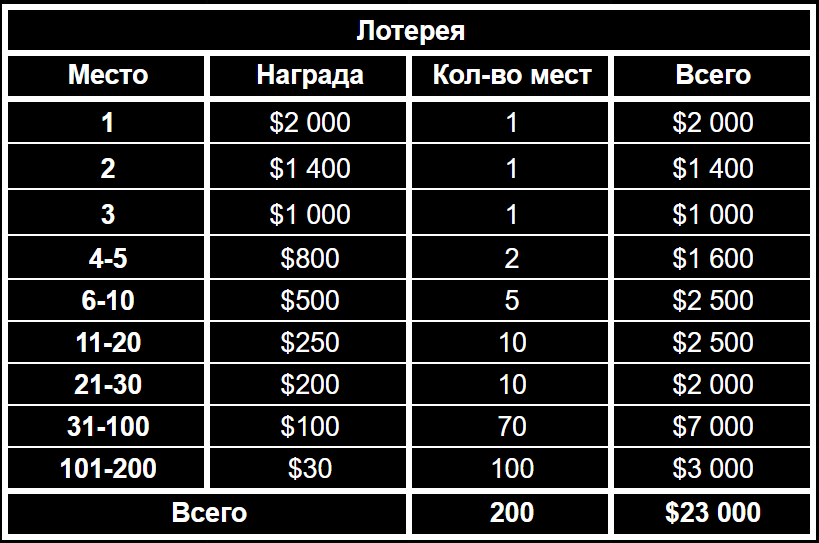
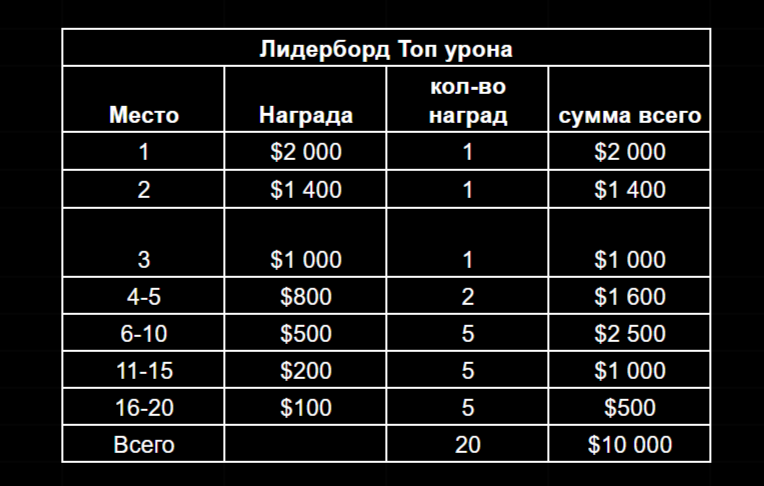

# PvE-ивент “Пыльный король”

*Грядут тёмные времена. Безумный бог Адомион, враг всего живого, вновь стремится вернуться в этот мир. Его слуги, те, кто уцелел, тысячелетиями скрывались в самых далёких и мрачных уголках Джи`Ды после того, как их хозяин погрузился в сон под действием Божественного Эликсира. Но его сила просыпается, и слуги уже вырвались из укрытий. Пока они лишь бесплотные призраки, но уже охотятся за смертными, крадя их души, чтобы вновь обрести мощь.*

*Одним из их сосудов стал Пыльный Король. Алчность сделала его лёгкой добычей. Безумие овладело им: Король кидался на всех, кто был рядом, бормотал неведомые речи. Сначала все решили, что он просто злоупотребил магической пылью, но вскоре стало ясно, в его теле поселилась тьма. И изгнать её может лишь священный гоблинский обряд.*

*Гоблины знают древний способ изгнания. Хоть их оружие и нелепо: склизкие козявки, тухлая рыба и ссаные тряпки, но только они способны усмирить злой дух и очистить сердце Короля. Когда Пыльный Король придёт в себя, он, в знак благодарности, откроет свой Сундук, и тогда каждый герой получит щедрый дар за участие в его спасении…”*  - “Хроники Эхорона”  автор Горл ДаНарга. 

Приветствуем вас, Искатели Истины и алхимики народа детей Менделефа.

Мы открываем для вас новую активность, представляющую кооперативный соревновательный PvE ивент. Где всему нашему игровому сообществу предстоит объединиться, чтобы помочь Пыльному Королю. Нужно будет провести древний гоблинский обряд по изгнанию злого беса, который подчинил себе его тело.

## Механика

Всем игрокам сообща предстоит провести обряд изгнания беса из Пыльного Короля, чтобы он пришел в себя. Для этого вам нужно будет найти его на втором этаже таверны “Fallen Moon” и вступить в битву со злым духом.

У Пыльного Короля, будет общая полоска HP, где урон каждого игрока будет учитываться. Бить его нужно будет специальными орудиями по изгнанию бесов. Козявки, лещ и ссаные тряпки будут ими. Это древние проверенные средства, которые веками уже доказали свою эффективность.  

Все эти орудия нужно будет приобретать за USDT. За каждое их применение, игроки будут получать моментальные награды. **Это гарантированный билет в Большом Розыгрыше**, а также сухарики, рандомно выпадающие за каждый удар.

Также можно будет купить **буст урона** стоимостью **10000 $RUSK**. Он будет действовать в течении **24 часов** и будет давать  **+20% к нанесенному урону**. 

Например, игрок активировал буст урона. Если он наносит 8 500 урона, буст дополнительно добавит 1 700 урона. В итоге суммарный урон составит 10 200. Таким образом, с бустом игрок получает больше наград, нанося фактически меньший урон.

## Ежедневная шкала урона и Мистери боксы

У каждого участника PvE-ивента при первом уроне Пыльному Королю откроется индивидуальная шкала ежедневного урона. Она будет показывать суммарный урон игрока и его рефералов (о них позже) в течении 24 часов. Каждые сутки весь прогресс обнуляется. 

Всего будет три уровня урона, при достижении каждого из них игрок будет получать Мистери Боксы. Таким образом, каждый игрок может **ежедневно получать по три Мистери Бокса**. 

1000 урона → Редкий Мистери Бокс			
3000 урона → Эпический Мистери Бокс			
10000 урона → Легендарный Мистери Бокс	

**Редкий Мистери Бокс** (отметка 1000 урона)			
🎟️ Гарантировано: 5 билетов			
✨ Гарантировано: 3 эссенция			
🎲 Может содержать: Potion ×10 / Potion ×25 / Potion ×60	или Common / Rare / Epic / Legendary зародыш	

**Эпический Мистери Бокс** (отметка 3000 урона)			
🎟️ Гарантировано: 10 билетов			
✨ Гарантировано: 6 эссенции			
🎲 Может содержать: Potion ×20 / Potion ×60 / Potion ×150 или Common / Rare / Epic / Legendary зародыш	

**Легендарный Мистери Бокс** ( отметка 10000 урона)			
🎟️ Гарантировано: 20 билетов			
✨ Гарантировано: 18 эссенции			
🎲 Может содержать: Potion ×50 / Potion ×150 / Potion ×500 или Common / Rare / Epic / Legendary зародыш	

Чем выше редкость Мистери Бокса, тем выше шанс выпадения зародыша алхимика.  

## Реферальная система
Во время PvE-ивента игроки также смогут увеличивать свою шкалу индивидуального урона с помощью своих рефералов. Все те игроки, которые ранее зарегистрировались в Magic Alchemy по вашей ссылке, а также все новые пришедшие в игру по ней будут добавлять к вашей шкале ежедневного урона **по 10% от урона**, который нанесут сами Пыльному Королю в течение дня.  

Также при нанесении всеми вашими рефералами суммарно **1000 очков урона** Пыльному Королю вы будете получать **по 1 билету в Большом Розыгрыше**. Так что народная гоблинская мудрость  “Не имей сто серебра, а имей сто соплеменников”. Становится как никогда актуальна. 

Каждый старый или новый игрок пришедший в игру по вашей реферальной ссылке при первом уроне получает **Стартовый Mystery Box**. 

**Стартовый Mystery Box**
Гарантированно: 1000 серебра
🎲 Может содержать: 100/500/1000 сухарей или Common/Rare/Epic/Legendary зародыш.

## Большой Розыгрыш и Лидерборд Урона
В конце нашего PvE-ивента, когда все игроки сообща смогут победить одержимого Пыльного Короля. Он в награду за свое спасение откроет сундук с сокровищами. 

Пройдёт **Большой Розыгрыш** по билетам, которые игроки получали **за каждые 100 очков** собственного нанесённого урона, а также за каждые **1000 очков урона**, нанесённых суммарно их рефералами.
 
Призами в новом Большом Розыгрыше станут денежные награды в USDT. Примерная общая ценность всего призового фонда всего ивента **«Пыльный Король»** составит впечатляющие **$50 000+ USDT**. Он будет формироваться из первоначальных **$10 000 USDT**, которые выделяет наша команда.

Оставшаяся часть призового фонда будет накапливаться благодаря каждому игроку: **50 % от стоимости каждого купленного орудия отправляется в общий призовой фонд**. Таким образом, все участники ивента совместными усилиями будут  увеличивать его размер.
 
Оставшиеся **50% средств** от покупки орудий для изгнания злого духа, овладевшего Пыльным Королём, будут направлены на будущие маркетинговые активности и дополнительные награды для последующих ивентов.

Финал Большого Розыгрыша мы проведем на одном из стримов INKa и Саши Лора. Победители будут определяться через рандомайзер. Полный список наград и количество мест победителей в Большом Розыгрыше представлено ниже.

Большой Розыгрыш — это не единственный способ залутать достойные награды. Ведь во время ивента будет идти лидерборд по суммарному урону, нанесенному Пыльному Королю одним участником. И все топ-игроки, нанесшие максимальный урон Королю, получат награду в USDT. 

Также часть общего призового фонда будет раздаваться игрокам при каждом нанесенном ударе в виде награды в токенах $RUSK.

Быть активным участником ивента — это не только почет и уважение от всего сообщества, но и также прямая выгода. Всё зависит только от вас и вашего желания помочь общему делу. 
Пусть удача сопутствует вам, а благословение Менделефа ведёт к победе! ✨
### FAQ
**Если я нанес больше 10000 урона и заполнил всю шкалу дневного урона, будет ли переносится лишний урон на следующий день?** 

Нет, урон не переносится на следующий день. Вам придется дождаться окончания суток, чтоб заново заполнять шкалу. 

**Могу ли я купить сразу несколько бустов к урону?**

Нет, в течение 24 часов можно будет купить только один буст. 

**Сколько будет длиться по времени ивент “Пыльный Король”?**

По времени этот ивент не ограничен. Он закончится, пока не будет побежден одержимый король. То есть пока его HP не опустится до нуля.

**Где можно будет посмотреть количество своих билетов?** 

Все билеты будут храниться в вашем инвентаре. Так же, как в прошлом Большом Розыгрыше, приуроченном к годовщине Magic Alchemy. 

**Откуда будут списываться USDT для покупки козявок, леща и ссаных тряпок?**   

USDT будут списываться с внутри игрового баланса. Игрокам необходимо будет перевести средства со своего игрового кошелька на него. По аналогии с сухариками для платных игр. 

**Как часто можно использовать орудия после покупки?**

Каждое орудие используется только один раз. После применения его нужно приобретать заново, если вы хотите снова нанести урон Пыльному Королю.
