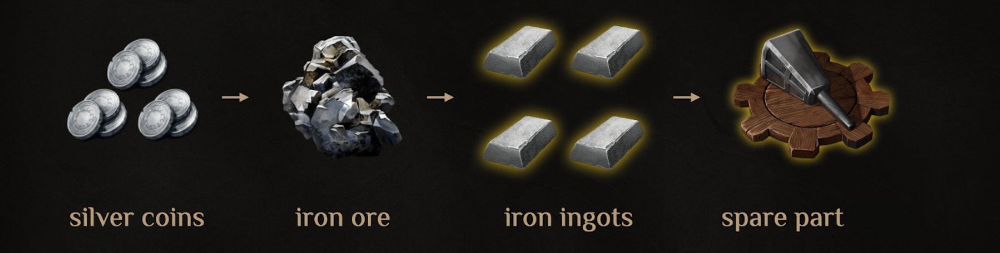

# F2P Part of the MA Game

In the main DeFi game mode, alchemist players can use alchemical tools — boosters. Their use shortens the brewing time of elixirs, which, in turn, speeds up the game progress of those players. Therefore, those aiming for top positions in individual and guild leaderboards are highly motivated to use boosters.

However, alchemical tools have durability points and break after a certain number of uses. Once broken, an alchemist player can either purchase a new tool (booster) or use spare parts to restore the durability of the existing one.

A spare part for an alchemical tool can only be crafted in a workshop-wagon and from raw materials obtained through expeditions of trading caravans, which are dispatched for silver coins that can **only be won** by playing the Magic Tower card game. Anyone can play the card game, including free-to-play players. Existing NFT Goblin Mechanics allow you to earn silver coins for resources faster, while NFT Wagons speed up the crafting of spare parts.

Alchemist players racing at the forefront of potion brewing gain economic bonuses when transitioning into new pools, while those lagging behind try to level up faster. In addition, the seasonal reward system creates strong economic incentives for using alchemical tools (boosters).

