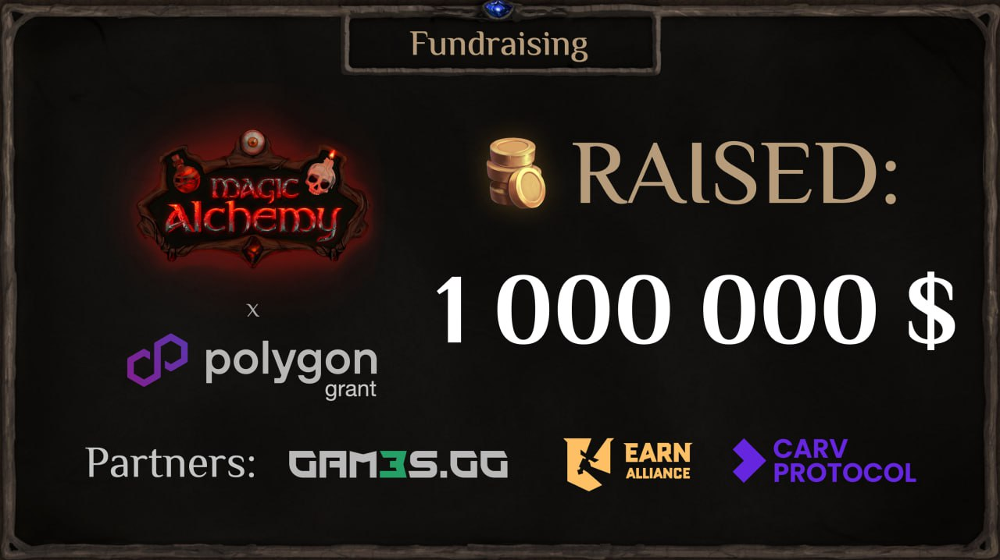

# MA Labs raises $1,000,000 investment - a major step in Magic Alchemy's journey 

MA Labs, the indie studio behind the development of Web3 game Magic Alchemy, has successfully closed a $1,030,920 fundraising round. This is an important milestone for the project and another testament to the power of an idea, an engaged community and a new approach to launching Web3 products.

Structure of the raised funds:

$650,000 - at Pre-Seed stage
$380,920 - through Open Public Sale: NFT marathon and $POTION tokens

The project started as an independent indie studio. Everything that has been achieved is the result of trust and community participation.

Why it matters:
- A transparent, playful fundraising model has proven effective
- The community has become the foundation for sustainability and growth
- Magic Alchemy is not only a game, but also an experiment in distributed participation models

Thank you to everyone who believed and supported. This first million is just the beginning. Ahead: developing a full-fledged DeFi game, launching new games, expanding the universe and growing internationally.

Magic Alchemy continues to develop as a community-first project, where each participant is not just a player, but a co-creator of the world.