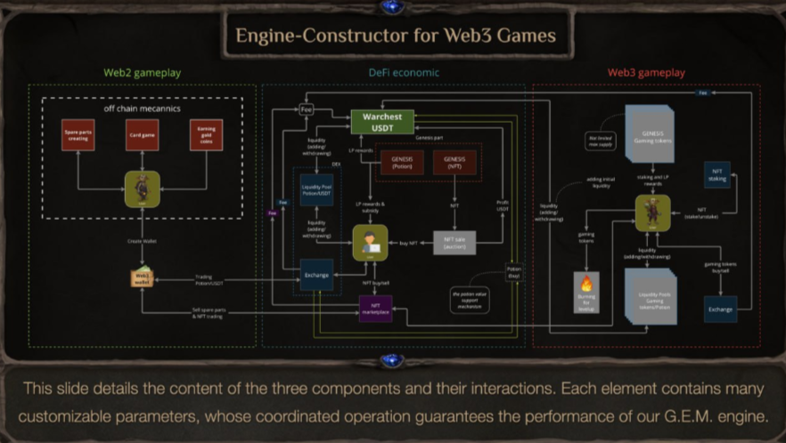
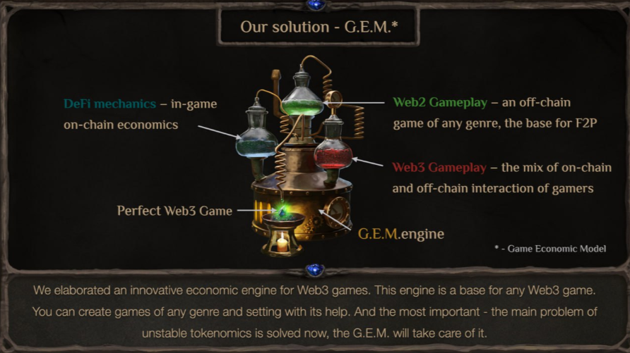

# MA Economic Engine
We also call it G.E.M.

As we built Magic Alchemy, we realized it wasn’t just a game—it was a fully functional economic engine. A scalable infrastructure model that can be applied to any Web3 game.

The **Game Economic Mechanism (G.E.M.)** is built on three core pillars:

🔹 DeFi – The Core & Skeleton of the Game
 - The foundation that drives the economy, liquidity, and financial interactions within the game.

🔹 Web3 Gameplay – The Rule-Defining Mechanics
 - Access to specific liquidity pools via NFT ownership.
- Token burning as a requirement for progression and development.
- Other blockchain-integrated mechanics ensuring economic sustainability.

🔹 Web2 Gameplay – The Off-Chain Experience
- A seamless transition for traditional gamers into the Web3 ecosystem.
- Ensures low barriers to entry while maintaining an engaging and familiar experience.

This is how the **Game Economic Model (G.E.M.)** was born. In our studio, we simply call it The Engine.

Our economic engine is a flexible infrastructure designed for any type of GameFi project. Developers can attach any Web2 game and customize the remaining components to fit their vision.
We've **simplified the game development** process, making it as intuitive as **building with LEGO bricks**. With G.E.M., creating a functional GameFi product is no longer a challenge—it’s a streamlined, modular experience.
