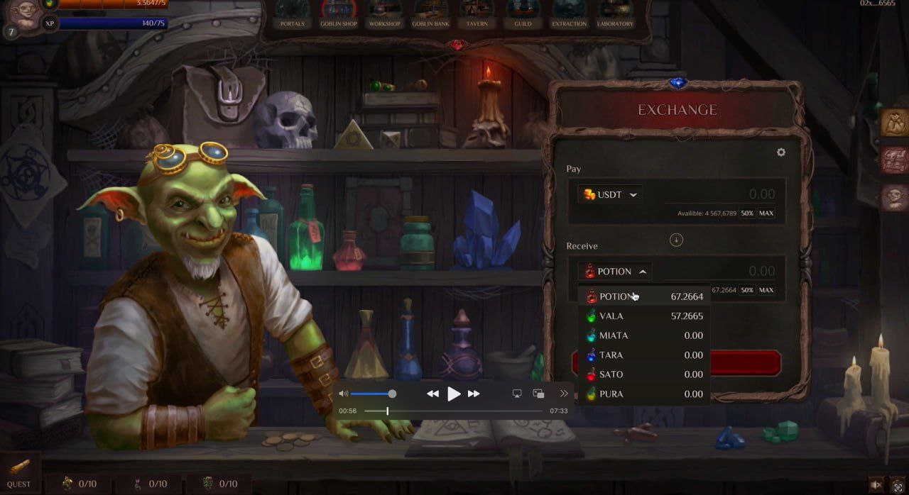

# Лавка гоблина

Welcome to the Goblin’s Shop… and Our Very Own DEX. We’ve seamlessly woven our tokens into the lore and narrative of the game. Here, you’ll be able to exchange any of our in-game tokens for USDT.

By the way, the shop’s owner is Goshan—a goblin with a fondness for knocking back a few glasses of strong brandy before work. That’s why his stall always reeks of alcohol and sour cabbage, the cheapest bar snack at Fallen Moon Tavern.

*"There are always crowds of people waiting outside the goblin's shop to exchange their potions for the ringing coin because Goshan, the owner, has the best exchange rate in the entire Echoron Valley."*

