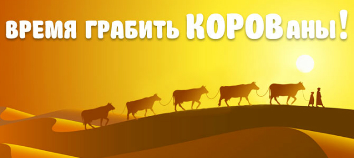
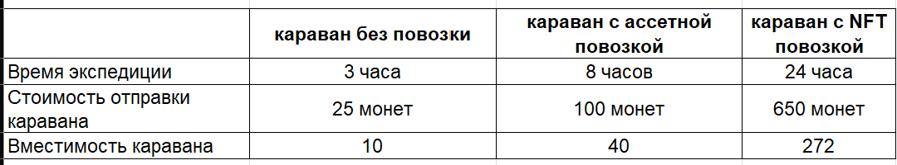
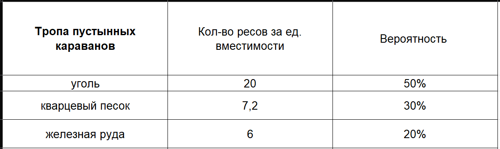
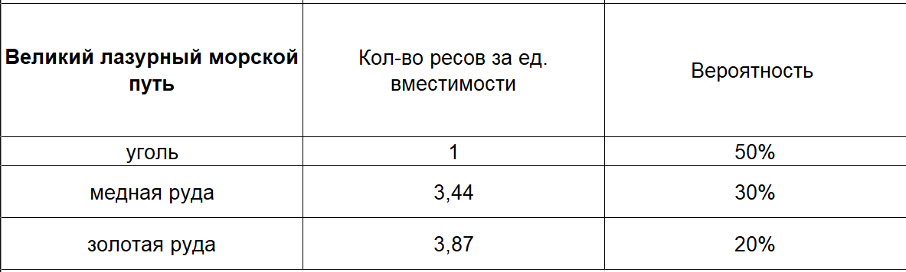
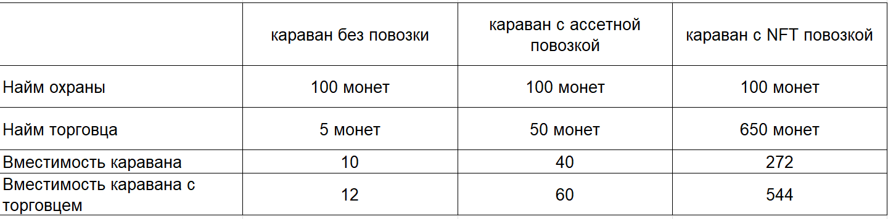
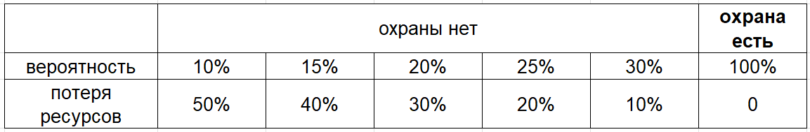
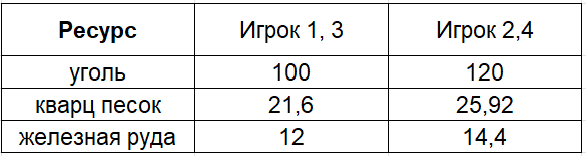
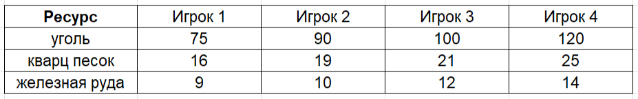

# Новая игровая механика – Торговые караваны

Рады приветствовать вас, Алхимики!

Наступило время развеять “туман войны” над главным вопросом, который занимал многих участников нашего игрового сообщества. А именно, каким способом гоблины-ремонтники будут получать сырье для изготовления запчастей для алхимических бустеров.

На данный момент в игре есть несколько игровых ресурсов: серебро, мана-кристаллы, эссенции, гемы, поинты. И именно серебро, заработанное с побед в карты у Джастора,будет главным источником необходимого сырья для изготовления запчастей.

Всего будет пять видов сырья для изготовления запчастей: уголь, кварцевый песок, железная, медная и золотая руда. Перерабатывая это сырье вы будете получать уже стекло, стальные, медные и золотые слитки. Из них уже ваш ремонтник будет изготавливать запчасти для алхимических инструментов (бустеров) алхимика. А как это будет происходить, будет написано ниже, а пока разберем способы получения сырья для этого.

## Торговые караваны
Основным способом получения сырья в игре будет снаряжение и отправка торговых караванов. Для этого вы будете тратить свои заработанные серебряные монеты.

Снаряжать и отправлять караваны вы будете из игровой локации Комната гоблина. При клике на карту игроку будет показываться карта с торговыми маршрутами и интерфейсом для отправки каравана.

Всего будет два торговых маршрута для отправки караванов:

* Тропа пустынных караванов. Торговая экспедиция по нему будет приносить вам уголь, кварцевый песок и железную руду. Отправляться караван будет за серебряные монеты и доступ к этому маршруту есть у всех.
* Великий лазурный водный путь. Экспедиция, которая будет приносить вам уголь, медную и золотую руду. Отправляться  караван будет также за серебряные монеты. Доступ к этому маршруту открывается игроку, **только пока действует Амулет торговой гильдии.**

Срок действия Амулета торговой гильдии - 30 дней. **Вы его сможете купить за 10 USDT в меню отправки караванов.**

В торговом караване может участвовать ваша повозка-мастерская. И от ее вида будет многое зависеть. Тем игрокам, которые еще не собрали инструменты для получения повозки, не нужно расстраиваться. Отправить торговый караван они смогут и без нее.

Давайте разберем все виды караванов, которые смогут снарядить наши игроки.

Как вы видите, владельцам NFT повозок достаточно будет заходить один раз в день в игру, чтобы максимально эффективно использовать караваны. Не говоря уже о том, что их NFT повозка позволяет им получать значительно больше сырья за одну экспедицию. Игроку без повозки придется более трех дней без отдыха отправлять караваны, чтобы сравниться по количеству получаемого сырья с игроком, владеющим NFT повозкой. И при этом он потратит сопоставимое количество серебра.

Когда караван возвращается из торговой экспедиции, игрок получает какое-то количество ресурсов. За каждую единицу вместимости каравана будет с определенным шансом начисляться какой либо из видов ресурсов.

## Охрана и торговец

При снаряжении каравана вы можете также нанять охрану для его сопровождения и торговца для более выгодного торга.

Во время всего пути каравана он подвергается нападению разбойников, и если у вас нанята охрана. То все товары доходят в сохранности до конечной точки. Если же охрана не была нанята для сопровождения каравана, то он всегда теряет часть добытых в торговой экспедиции ресурсов. **Это часть определяется рандомно для каждого вида ресурсов.** Игроку после подсчета потерь от налетов разбойников в итоге начисляют целые значения количества ресурсов с округлением в меньшую сторону.

Найм охраны для всех видов караванов стоит одинаково 100 серебряных монет. И если для новичка без повозки найм охраны может стоить дорого и от этого быть не столь необходимым. То владельцам ассетных повозок, а тем более владельцам NFT повозок, найм охраны становится более актуальным. 

**Тем же игрокам, которым повезло стать владельцем NFT-питомца, оплачивать охрану не нужно. Для вас торговая гильдия сделала 100% скидку на эту услугу.**

Найм торговца позволяет увеличить количество единиц вместимости самого каравана. И если для каравана без повозки-мастерской это увеличение даст прирост в +20%, то для каравана с NFT повозкой-мастерской это уже +100%.

Давайте на примере разберем для более полного понимания, в чем выражаются преимущества от найма охраны и торговца. Возьмем разные варианты при снаряжении торговых караванов и посчитаем, сколько в итоге каждый из них добудет.

*Пример: Есть 4 игрока без собранной ассетной повозки. Первый отправляет простой караван, второй караван + торговец, третий караван + охрана, четвертый караван + торговец + охрана.*

*Вместимость их повозок - 10, 12, 10 и 12 соответственно. **В среднем** они должны получить столько ресурсов:*

*Но игрок 1 и 2 без охраны, потому у них **в среднем** становится на 25% меньше ресурсов, а с округлением вниз получаются следующие значения:*

Как видно из примера, найм охраны и торговца приносит примерно +57% к итоговому количеству получаемых ресурсов, если сравнивать караван без них. Игроки уже собравшие ассетные повозки, а тем более имеющие у себя NFT повозки-мастерские, будут иметь существенное преимущество на всех этапах изготовления запчастей. Что должно повысить их заработок во free2play части нашей игры. Самой эффективной связкой в режиме free2play становится владение редкого гоблина-ремонтника и NFT повозки-мастерской.

И как вы все знаете, все эти НФТ-шки можно было получить совершенно бесплатно на ранних стадиях игры. Мы всегда говорили, что все “ранние пташки” будут вознаграждены по достоинству на релизе игры.

Да прибудет с вами благословение Менделефа!

## FAQ
В конце статьи мы хотим заранее ответить на некоторые вопросы, которые вы, скорее всего, зададите.

**Меняется ли время торговой экспедиции в зависимости от выбранного маршрута?**

Нет, время экспедиции зависит только от наличия или отсутствия, а также вида повозки-мастерской в караване.

**Какие запчасти я смогу изготавливать, если буду отправлять караван по первому маршруту?**

Так как караваны по этому маршруту могут вам доставить только уголь, кварцевый песок и железную руду, то вы сможете изготовить запчасти для реторты и кузнечных мехов.

**Могу я получить медную и золотую руду, не отправляя караван по второму маршруту?**

Можете, обменяв у Дазара их на серебряные монеты. Но учтите, что обменный курс у него очень высокий.

**Запчасти для бустеров будут в виде NFT?**

Нет, запчасти будут игровыми ассетами. Но они будут торговаться, так же, как и NFT на нашем внутреннем маркетплейсе.

**Не возникнет ли такая ситуация, что владельцы редких ремонтников и NFT повозки-мастерской, смогут закрыть собой полностью потребность в запчастях?**

Нет, ведь в игре всего 266 NFT повозок-мастерских и примерно 120 редких ремонтников, а генезисных  алхимиков 4444. Чисто физически они не смогут закрыть потребность в запчастях для них. А с учетом, что будут еще добавляться бейсик алхимики, то спрос будет больше.

**Не считаете ли вы, что из формата Free2play вы по итогу получаете pay2win, в текущем виде механики торговых караванов?**

Нет, по ответу выше, должно стать понятно, что скорее всего спрос будет большой. И каждый free2play игрок будет иметь возможность собрать и продать запчасть. Вопрос только во времени, которое он потратит для этого. А с учетом, что все NFT в игре кроме алхимиков и садовников игроки могли получить совсем бесплатно. То вопрос о pay2win не уместен.