# Magic Alchemy Behind-the-scenes Workings (may 2024)

As valued members of our Magic Alchemy community, we invite you to delve into the most critical moments and changes that have shaped our project over the past few months.

### Freemint
In May, we completed another important milestone for us–Freemint.

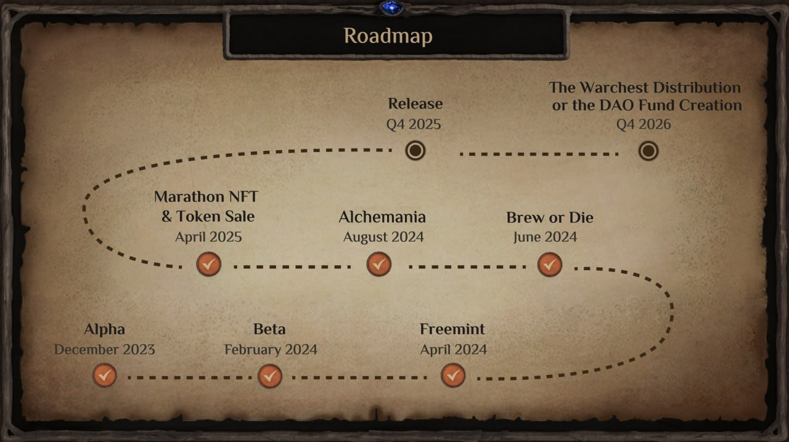

The metrics are excellent:

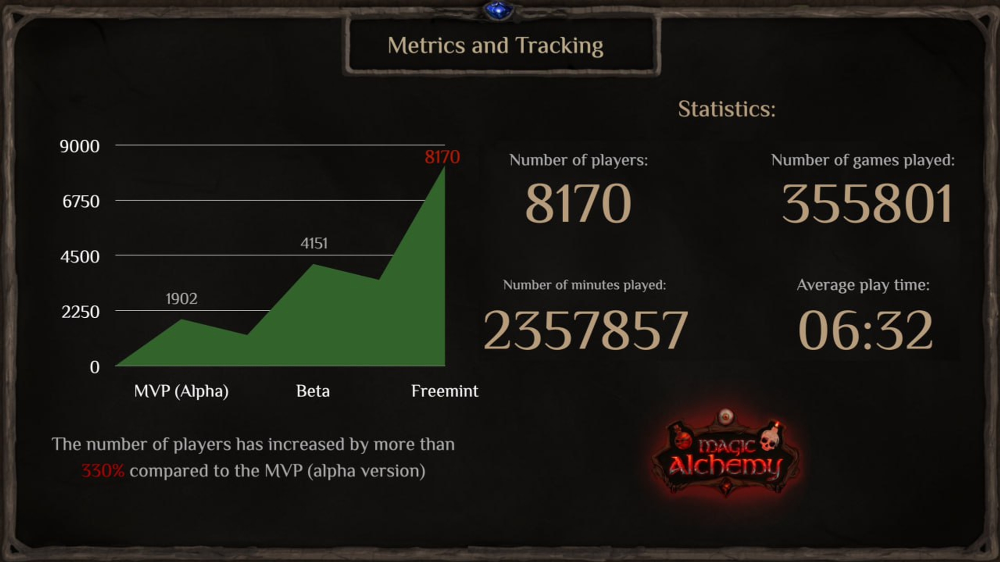

**We’ve compiled and prepared some game stats**:

- Number of unique players — 8170
- Number of games played — 355801
- Number of minutes played — 2357857
- Average game time — 06:32
- Number of Wheel rolls — 35001
- Victories. Tower Building — 48%. Tower Destruction — 38%. Resources — 14%.

The number of players has increased by more than 330% compared to Alpha, which was released last December.

### Let’s talk a little bit about player engagement and retention
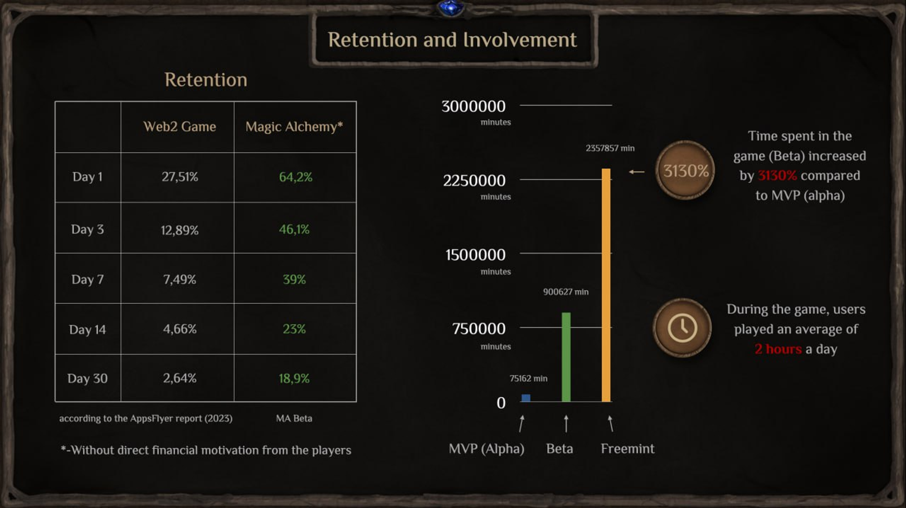

The high retention rates in our game show that players like the cards, and many get involved and stay. And if we consider that we don’t have a direct financial motivation yet, as there is no token in the game, such figures are very pleasing.

Furthermore, we are excited to report that compared to Alpha, the total time spent in the game has skyrocketed by 3130%. On average, players now dedicate 2 hours a day to our game, a clear indication of their engagement and enjoyment.

We are thrilled to share that we successfully hosted the second major leaderboard championship, a testament to our players’ dedication and our game’s growing popularity. The championship, which lasted for 4 weeks, had a prize fund of $ 5000, further enhancing the competitive spirit among our players.

The high retention rates in our game show that players like the cards, and many get involved and stay. Considering that we don’t have a direct financial motivation yet, as there is no token in the game, such figures are very pleasing.

Also, compared to Alpha, the total time spent in the game has increased by 3130%. On average, players spend 2 hours a day in the game.

We also held the second major leaderboard championship, which lasted four weeks and had a prize fund of $5000$.

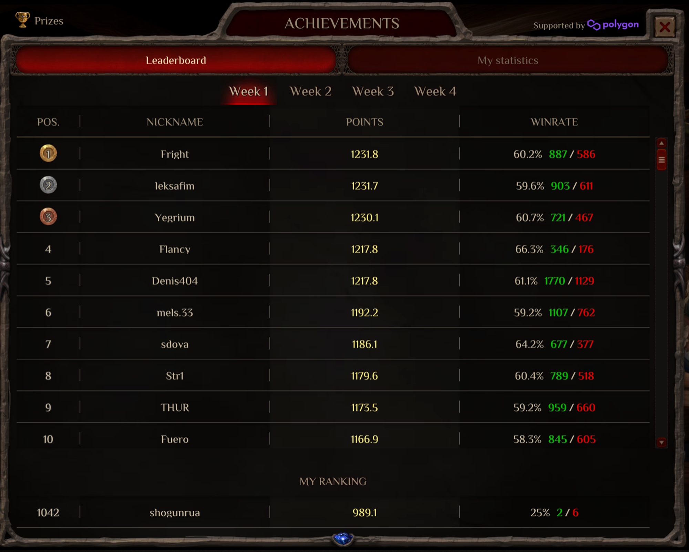

This time, there were 30% more participants than in the first leaderboard. It should be noted that only players with invites could participate in the leaderboard; it was a conditionally closed type of competition. In future stages, we will make the tournaments available to everyone.

### What did we emphasize in game design?

1. One of the key features we emphasized in our game design was the leaderboard. We understand that for many players, the thrill of competition and the opportunity to showcase their skills are major draws. The leaderboard effectively created a competitive environment within the game, enhancing the overall gaming experience.
2. Wheel of Fortune. During the Freemint stage, the Wheel was spun 35000 (!) times. Many players feel a sense of excitement, and spinning the Wheel gives them a small portion of dopamine while waiting for a generous reward.
3. For players-collectors-overcomers, we have prepared various badges to be given for certain achievements.
4. Pet is a Tamagotchi crossed with check-in mechanics. The pet can get sick and die if not cared for enough, but for timely feeding, the player is rewarded with silver coins, which increases retention.
5. Card Daily Quests. This mechanic also helps increase retention, as the player always has a specific daily goal to be rewarded for completing.

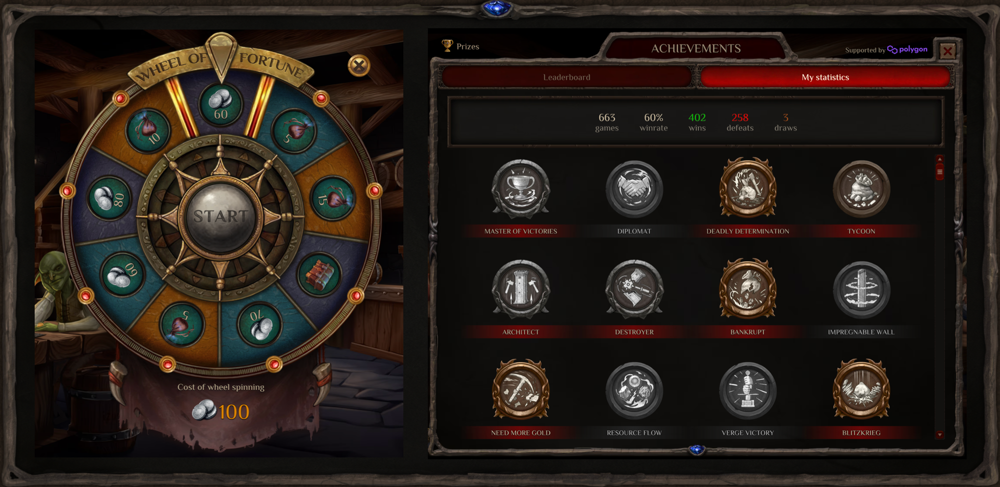
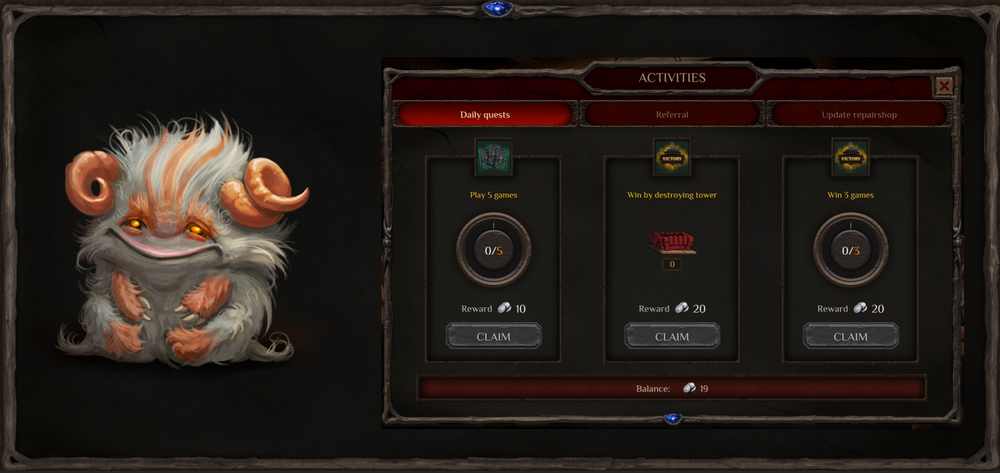

Speaking of goals, a player must have a large-scale objective that will guide them like a guiding star. In our game, this is the quest with the NFT wagon mint. To do this, you need to collect all the tools, and then the player gets the NFT wagon, which alchemy guilds will need in the future. Currently, the floor price on the secondary market is 450 Matic (330$).

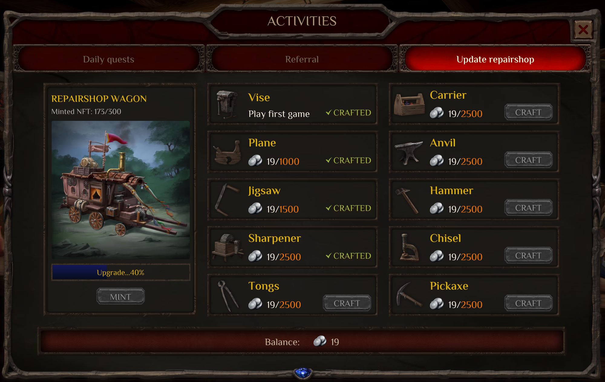

All these mechanics were implemented to understand what interests players and what does not. During three stages, we improved some of them and got the most critical result–player interest expressed in Retention. Creating a giant funnel is another task, but even the highest numbers don’t work if your product doesn’t hook users. It is one of the major mistakes of our fellow Web3 games. I believe that in the F2P part, we found the right points of contact with the target audience.

### Social Networks
We initially went organic, so our numbers may seem modest to some, but you have to consider that the increase since the last beta stage was 200%. At the current moment (end of May):

- Discord — 3776
- Twitter — 3177
- Telegram blog — 1061
- Telegram chat — 658

In the following stages, we want to increase these figures tenfold. But there are always risks; we call them “dead souls.” It’s not the numbers but the quality of subscribers, views, and comments. That is why organic growth is always better than inflated metrics.

### Fundraising:
In May, we embarked on the seed round and successfully secured an additional $75,000 from an angel investor. This brings our total raised funds to an impressive $435,000. Furthermore, we are proud to announce strategic partnerships with the industry’s leading Web3 platforms, including Gam3s.GG, Earn Alliance, and Carv Protocol.

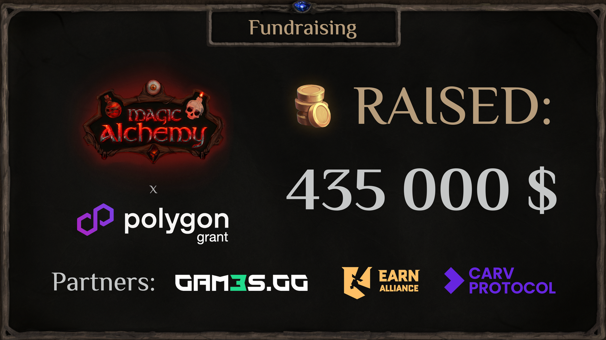

On June 7–8, our BDM will attend the largest conference in SEA. His task there is to get acquainted with the maximum number of funds and colleagues to continue communicating with them in the future.

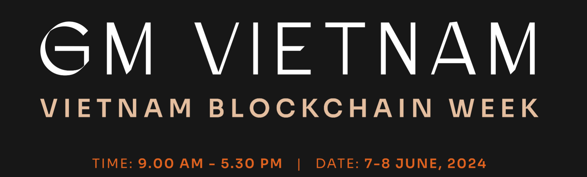

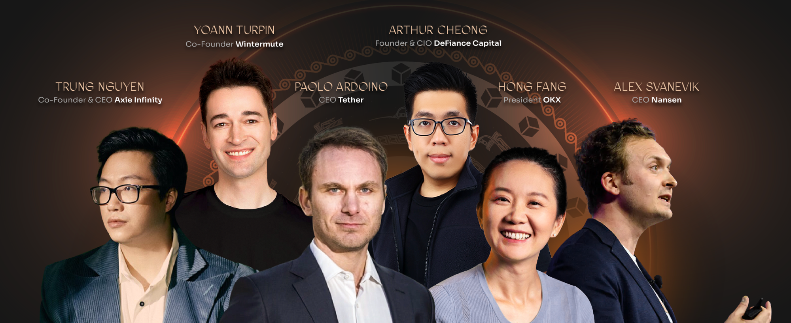

As the SEA market has traditionally been the leading supplier of Web3 games, many Web3 studios, crypto funds, and other industry representatives will attend the conference.

### Plans & Product
At the beginning of June, we are launching the following crucial stage, Brew or Die, which will open up new player opportunities. Technically, it’s about farming points for future Potion token drops. But it’s not just quests, but full-fledged new game locations and different farming strategies. So far, without the basic DeFi mechanics, there will be staking USDT (Lockdrop).

It is essentially a transitional step to our main DeFi feed mechanics.

I want to say a few words about the points meta. It originally appeared in the Blur project and then moved to Blast. At the moment, it is mainstream. Points are used everywhere, even where it is not necessary, but in GameFi, they are an ideal gamification tool. I am convinced that a competent and native approach to play2airdrop will be used in the prelaunch of any Web3 game.

We’ve taken a significant leap forward by introducing not just simple, monotonous quests like ‘pour liquidity, swap, subscribe to social networks’, but full-fledged quests integrated into the game mechanics. This is a game-changer that we’re sure you’ll love.

For example, growing plants, brewing elixir, and staking in an accurate Goblin Bank. Players should like this approach.

That’s all I can say for now, but there will be an extensive article on Brew or Die very soon. We’ll also launch our secret product in early July, so stay tuned so you can experience it.

On that note, I’ll wrap up the report. Our main goal is to build a cohesive, robust, and organic community genuinely interested in the Magic Alchemy project. Looking forward to the launch of the next phase, and I’d also appreciate it if you have interesting thoughts on how we can come to launch the game with better results.

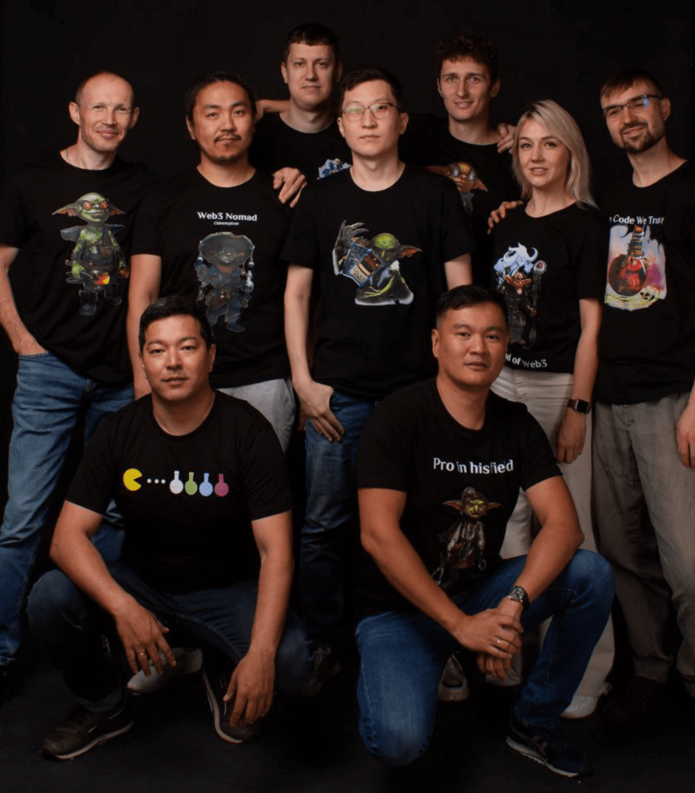