# Magic Alchemy Behind-the-scenes Workings: October 2024 Update

Let’s quickly recap the milestones we’ve rolled out since our last “brick.” Just to refresh: in May, we launched Freemint. By late June, we introduced a key phase, *Brew or Die*, which marked the debut of staking and potion brewing. On the very first day, over 50k USDT was deposited into the Goblin Bank! Currently, the Bank holds 130,000 USDT from over 1,000 players. At that time, we averaged more than 1.5k daily players, with a monthly audience of over 10k.

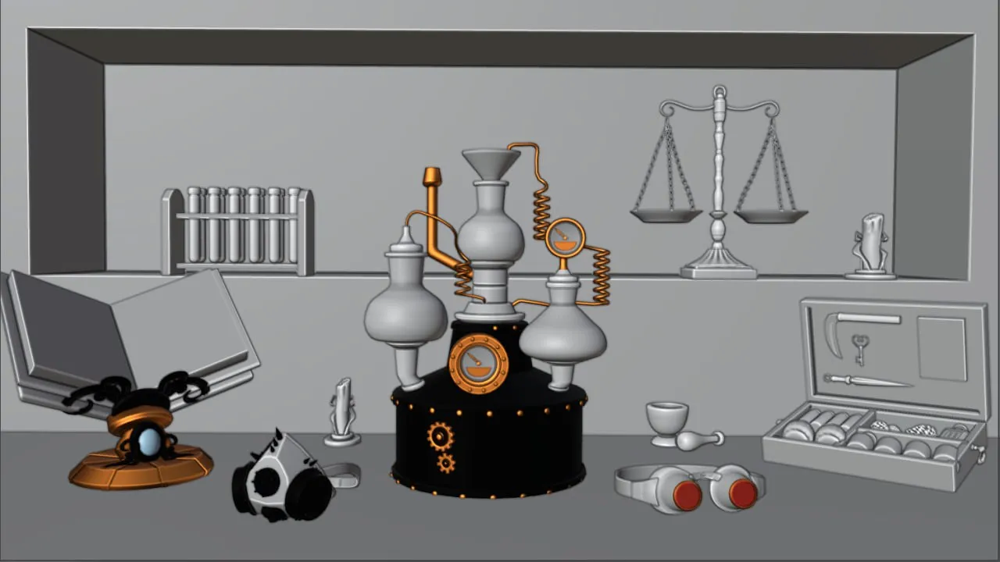

In past [“bricks,”](../kuxnya_may/kyxnya_en.md) I shared insights into the new horizontal clicker mechanic of our game (Miniapps). Designing an engaging leveling mechanic and building it out as an idle mini-game — not just a clicker — and embedding it into the main game demanded more time for game design and implementation. We also faced some challenging technical integration with Telegram. Our goal was ambitious: create the first horizontal clicker and make it cross-platform, ensuring it would look and work smoothly both in a browser and in the TG bot.

Additionally, a significant amount of time went into making it adaptive and optimizing it across devices. We ran into issues with Android (different screen sizes and weaker processors), as well as overheating and freezing problems.

Instead of the planned month and a half, it took us two and a half months to complete, and by the end of August, we finally launched Alchemania. To give you a preview, the feedback from our colleagues was along the lines of, “How did you pull this off technically?”, “Impressive!”, “This is the best-looking tap game,” and so on.

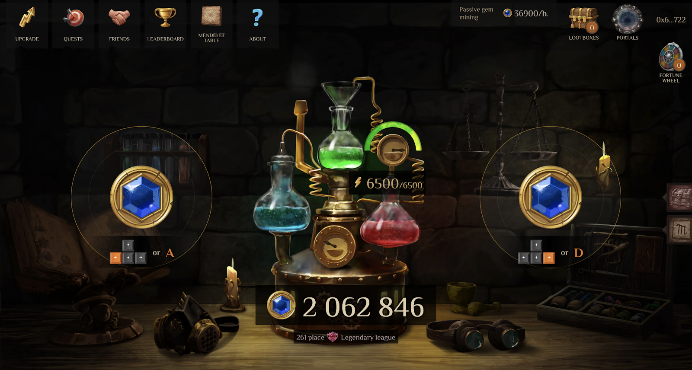

From a technical standpoint, we implemented three standout solutions:

1. **One-Click Account Creation** via TG login or Gmail, making entry smooth and quick.
2. **Wallet Creation for the Player.** For any player joining through the bot, we created a smart wallet (Account Abstraction). This solution lowers the entry barrier and streamlines onboarding from Web2 to Web3.
3. **Token Subsidies Using Smart Wallets.** We cover POL tokens needed for network gas fees, so players don’t have to worry about acquiring tokens to access the network.

Essentially, players don’t even need to realize they’re in a Web3 game. We’re bridging the gap between Web2 and Web3, making our game accessible to anyone — from students to stay-at-home parents. And we’re seeing many examples of that!

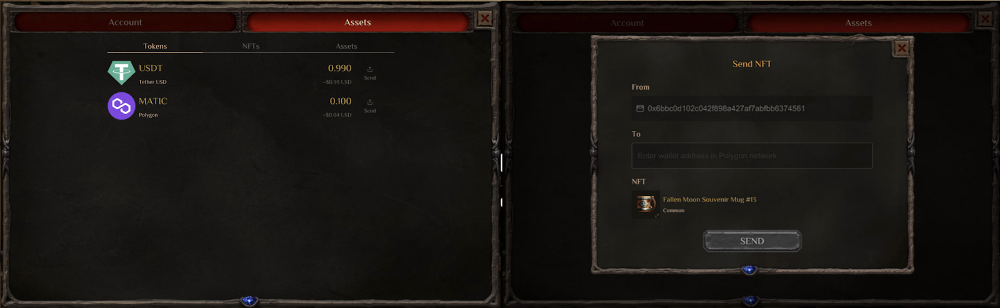

### Metrics and Traction
With the launch of Alchemania, we’ve been gaining around a thousand new players each day. Here’s where our current metrics stand:

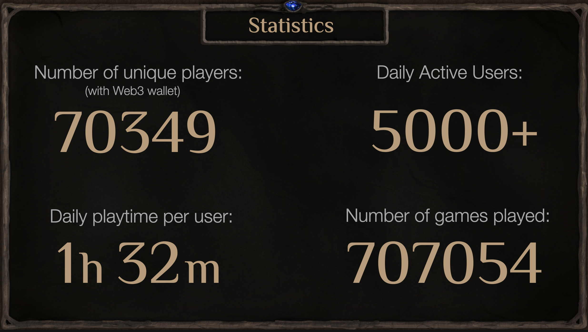

Across most metrics, we’ve achieved impressive, multiplied growth, and our decision to focus on TG mini-apps has clearly paid off. We’ve tapped into a new Web2 audience, for many of whom this is their first Web3 experience.

At our peak, we reached 70K MAU. With the launch of the TG mini-app, it’s worth noting that these numbers reflect reach and views more than active player counts, due to the presence of bots, farms, and inactive accounts in this sector. Still, this is an outstanding outcome. We also peaked at 10K daily players (with an average of 4–6K). By our stats, we’ve grown 5–7 times overall — though there’s an interesting twist on that, which I’ll dive into shortly.

But first, let’s talk about three major trends in mini-apps.

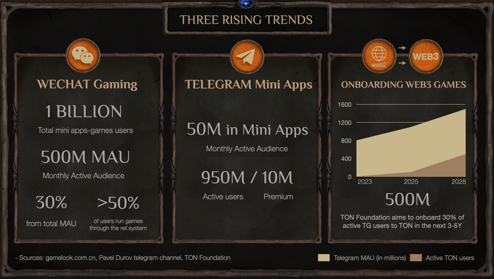

Miniapps originally emerged long ago in a popular Chinese messenger (specifically, WeChat). Now, they represent an enormous, well-established market, with over 500 million MAU actively using apps within the messenger and making daily transactions. Telegram and TON have followed a similar path, with a few unique differences — primarily, the addition of crypto. TON aims to bring 500 million new users into Web3 within the next five years. While the recent releases of NotCoin and HamsterCoin have signaled a slowdown in the casual “tap” game trend, the Miniapps market itself continues to grow. As outlined earlier, Miniapps significantly lower the entry barriers to crypto, fueling their rise.

**So, what does this Miniapps market mean for Magic Alchemy? As we know, Magic Alchemy aims to solve two key issues in Web3 gaming:**

1. Ensuring economic stability
2. Seamless onboarding from Web2 to Web3

While our approach to the first goal will be tested over time, the second challenge was one we had been exploring until the NotCoin case emerged. It demonstrated the potential strategy we should adopt to attract a broader audience. This is what inspired the concept of Alchemania. Now, we can confidently say that our case proves it’s possible to not only attract low-cost traffic to the game but also to build a well-designed funnel, high conversion rates, and effective audience engagement. Check out the slide for a closer look!

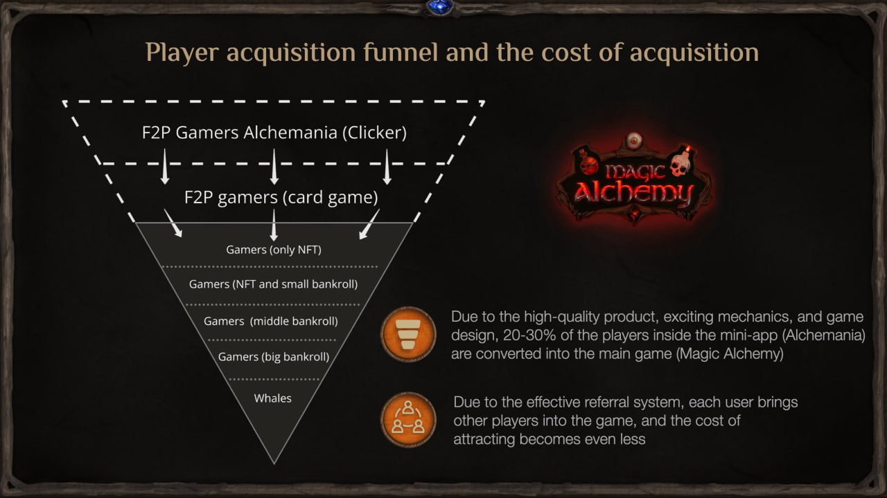

At the top of our funnel, we attract new players into a specific part of the game — Alchemania. We’ve designed this segment to offer an easy entry experience. Players enter the Alchemical Machine location, where a wallet and account are automatically set up for them behind the scenes. From there, the straightforward clicker mechanics make it easy to grasp the basics, and players quickly get into the flow, earning gems and upgrading their machine.

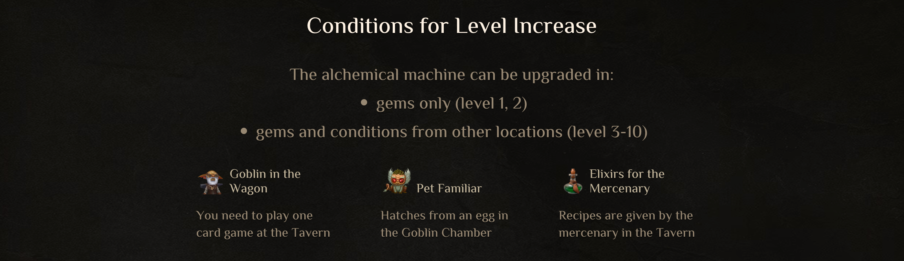

As players advance to levels 3–4 in the Alchemical Machine, they hit a new requirement: upgrading further requires a goblin mechanic, which they can only obtain by transitioning to a new area to play the card game. Here’s where the first conversion to the full game happens — players cross through the portal, complete a quest, and dive into the card game.

From there, the game design and mechanics guide them deeper into the lore and various gameplay elements. This approach transitions them into full-fledged F2P (free-to-play) players. Next, the goal shifts to converting these players from free to “paying” status by encouraging them to engage with paid features:

1. Staking
2. Purchasing NFTs on the secondary market

To progress more effectively, players recognize that they need to make a deposit or buy an NFT, and this is where the final conversion happens. This approach creates a solid unit economy — but there’s a caveat.

We’ve observed that the less familiar a player is with crypto, the longer this journey takes. While they adapt to the game, they may also begin following our channel, reading articles, and participating in chats. This onboarding process can take up to a month but stands as an impressive Web2-to-Web3 case. We refer to this process as the “conversion lag.”

### Retention and Engagement
It’s one thing to attract affordable traffic and convert it into active players, but the real challenge lies in retaining that audience — a point where many clicker games have stumbled. The market currently lacks solid cases of full-fledged games or mini-apps with a substantial core product inside.

Here’s what our September statistics reveal.

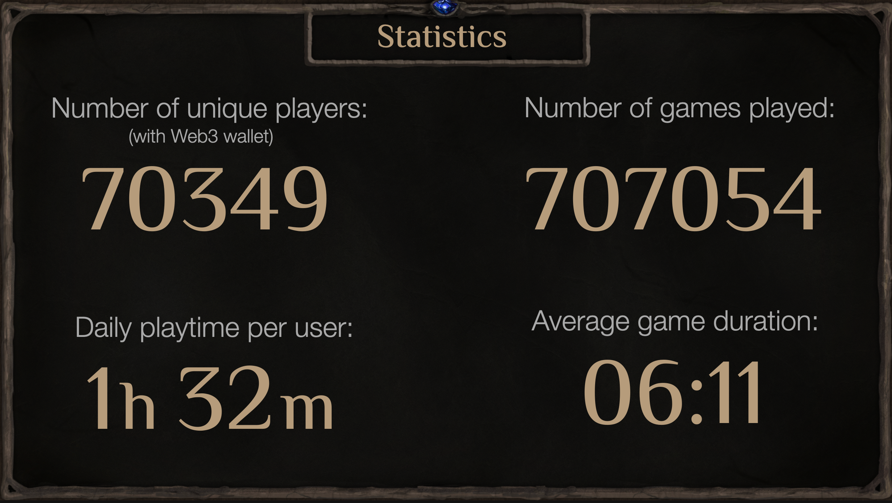
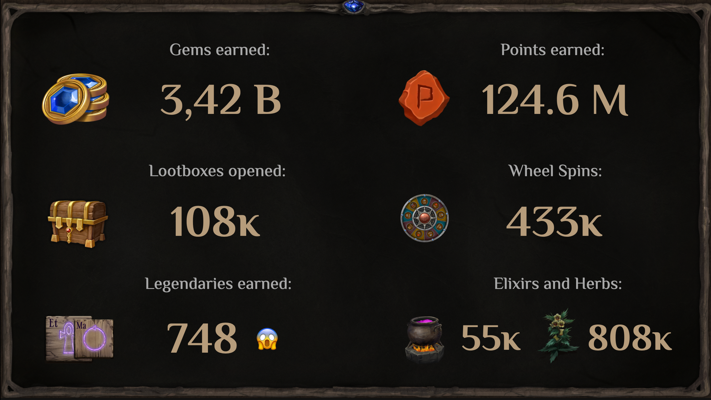

Most clicker games rely heavily on traffic arbitrage, and with costs dropping every day, it’s becoming harder to maintain a sustainable audience. This is where our approach stands out: not only do we offer an actual product within the clicker, but we also have strong retention metrics. On average, players spend over an hour each day with us, and we’re closing in on 1 million matches in our card game!

We have a dedicated group of top leaderboard players who set alarms to grow plants and brew potions, keeping gameplay lively and immersive. For nearly a year, we’ve been building a core Web3 audience, with every fourth player in Alchemania sticking around in Magic Alchemy. In past “insider blocks,” I shared some key numbers on this.

In short, our engine is running smoothly. Now it’s time to fuel up for project scaling.

### Marketing
At the launch of *Brew or Die* over the summer, we primarily used Web3 inflows. We partnered with existing ambassadors (mainly from the Web3 gaming community) and ran targeted infusions, with video content on YouTube proving highly effective. A quick search for “Magic Alchemy” will show you just how many videos have been made about us already!

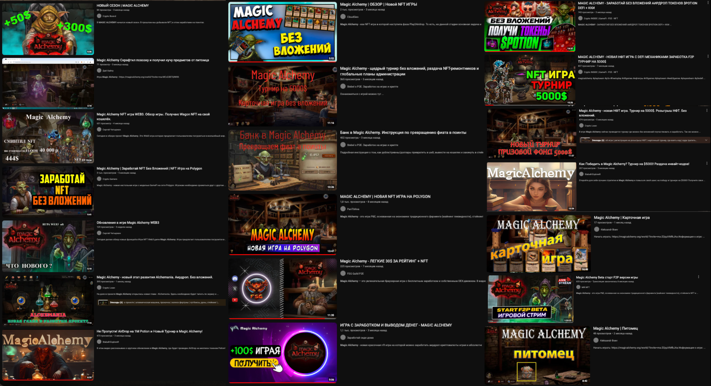

When we launched Alchemania, initial seeding efforts in miniapp channels ended up being overrated. The results were, frankly, underwhelming. CPM advertising networks like Adsgram also fell short; with inflated bids due to the presence of casino and other shady apps, the traffic quality was, unfortunately, poor.

The real boost came from one specific miniapp where we sponsored a campaign. One key factor that made a difference here: the traffic flow from their app to our Telegram bot was **non-incentivized**. This was a promotional spot in their app, not a task with incentivized actions, which reflected positively on our audience quality. We saw strong numbers in both our conversion funnel and unit economics.

Next, we initiated cross-tasks to exchange traffic with other smaller clicker apps. However, the results here were similarly low, with conversions from these miniapps being almost negligible. Those with decent audiences had very small numbers overall. We’re continuing to test different strategies and will keep iterating. It’s an ongoing process with a lot of learning along the way!

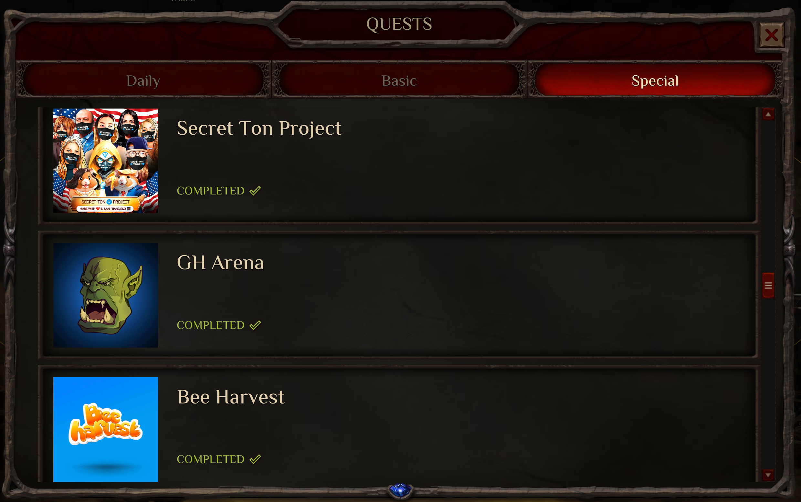

As we gear up for the public sale (Marathon), Web3 traffic has become an even higher priority for us. While it tends to be more expensive, it’s essential for reaching our core audience of Web3 gaming enthusiasts and crypto fans.

We’re thrilled to share that we’ve partnered with Games.GG, one of the largest platforms in Web3 gaming. Through their Battlepass, players complete quests in various games to earn XP on the platform itself — giving us direct access to new, engaged users from their community. We’re looking forward to seeing a strong boost in our Western, English-speaking audience through this campaign!

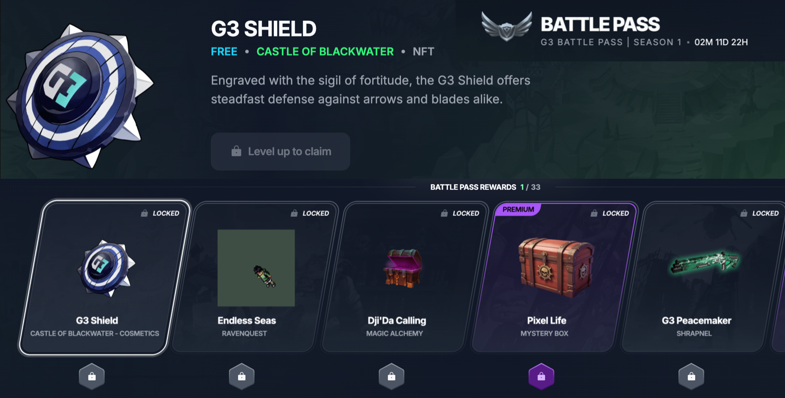

We’ve had some great experiences collaborating with gaming platforms in the past. As a reminder, we launched our first NFT mug collection on Earn Alliance a year ago, followed by a Freemint NFT goblin drop on Carv.Protocol. Both platforms brought in impressive results, with player acquisition costs ranging from $0 to $1.

Let’s dive into our latest social media metrics. Here’s the progress from May to October:

- **Twitter:** 3,177 → 9,103 (+287%)
- **Telegram blog (CEO):** 1,061 → 2,638 (+250%)
- **New Telegram channel:** 0 → 15,800 (note: some inactive accounts, so numbers may adjust)
- **New Telegram chat:** 0 → 1,711
- **Discord:** 3,776 → 5,660 (+50%)

Our primary goal has always been organic growth. Artificially boosting numbers is easy, but our recent growth has been naturally driven, especially since the launch of Alchemania. In just 4.5 months, these numbers are a strong indicator of what we’ve achieved so far.

### NFT Collections
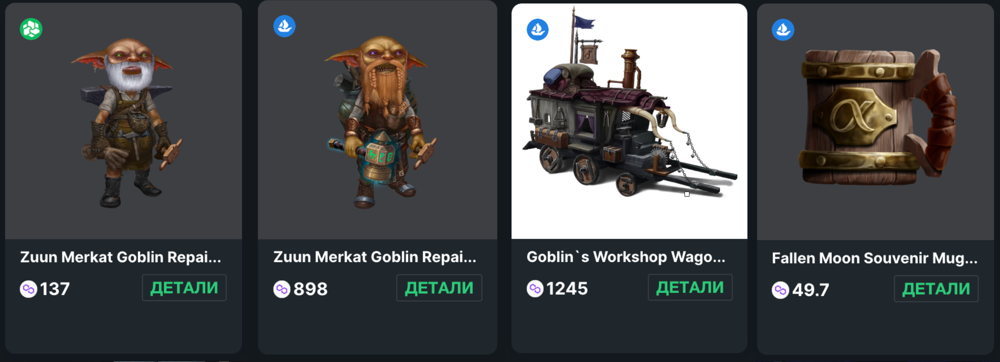

With the influx of new players, expanding NFT utility, loot box giveaways tied to NFT ownership, and the active involvement of our key whales, our NFT prices have naturally surged. Since the last update, average prices have more than doubled. Importantly, we haven’t sold any NFTs — every single one was distributed for free! The total market value of our collections now exceeds $300k:

- **NFT Wagon:** 449 POL → 1245 POL (+280%)
- **NFT Common Goblin Mechanic:** 49 POL → 137 POL (+280%)
- **NFT Rare Goblin Mechanic:** 450 POL → 898 POL(+200%)
- **NFT Mug:** 25 POL → 49.7 POL (+200%)

### Fundraising Progress
In past updates, we highlighted our participation in Vietnam Blockchain Week, where we connected with several Tier 3–5 funds and influencers. This time, Stas attended Token 2049 in Singapore, the biggest crypto expo so far, and we’ve established high-impact contacts:

- Animoca Brands: Meetings with five different team members, including a successful pitch to the Group President.
- New connections with notable players like Outlier Ventures, DWF Labs, Hashkey, Spartan Lab, Tenzor Capital, OKX VC, and Gate Labs.

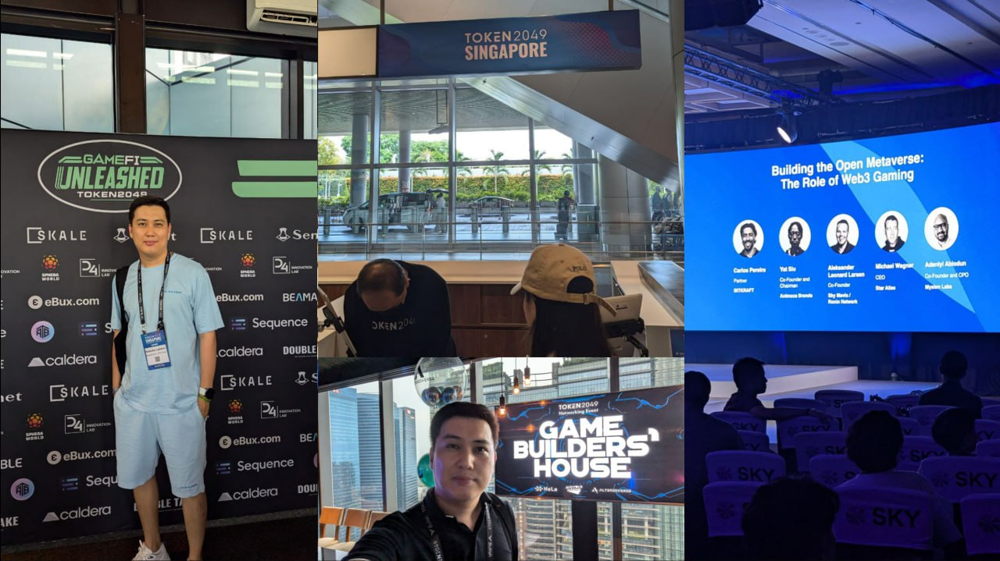

At Token 2049, we didn’t just make an appearance — we dove deep into networking! Beyond our major connections with Animoca Brands and other big players, we also established solid contacts with Tier 4–5 funds and exchanged ideas with leading Web3-focused colleagues, including several Asian studios heavily invested in Miniapps.

We had valuable discussions with the Polygon Labs business development lead about our upcoming Marathon. And we made sure to reach out to other blockchain platforms and exchanges such as Aptos, Ronin, Tezos, Moonbeam, Mexc VC, and 1inch.

We discovered that the real action isn’t at the main event; Token 2049’s scale makes it challenging to dive deep into meaningful conversations. Instead, the side events focused on Web3 gaming were where we gathered impactful connections. Going forward, we might skip the main stage entirely and go straight to these niche meetups.

Polygon is particularly interested in our on-chain metrics, yet they’re also intrigued by the way we’re driving traffic from Telegram via our bot — an exciting synergy in the making!

### Community (AMA, Tournaments, Streams)
We’ve always supported our community; after all, they’re the foundation of everything we build. That’s why we consistently host tournaments with real prizes, such as USDT and NFTs. Over the summer, we held more than five tournaments, ranging from small events to larger ones with prize pools of $2,500–$4,000. Our players love these competitions — our last Alchemania card tournament saw over 10,000 participants

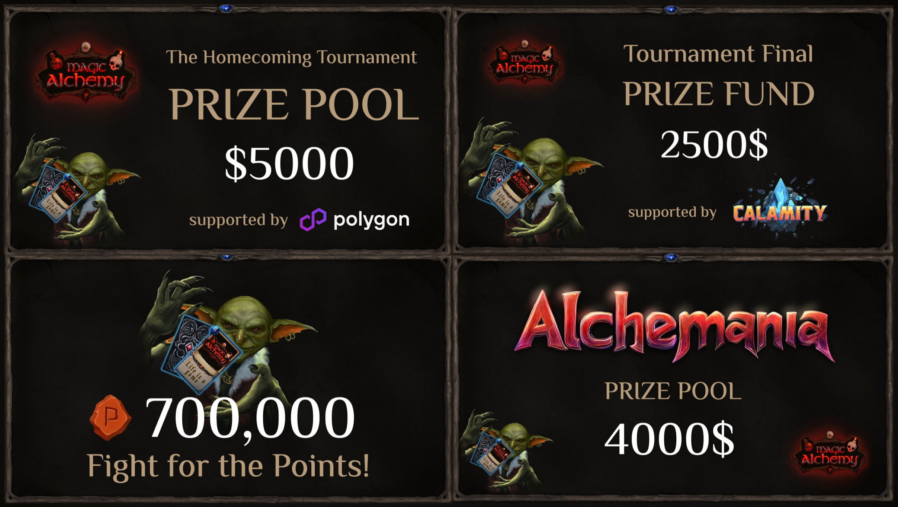

We also hosted our first-ever AMA, where we received a ton of quality, engaging questions. Since it was our debut, the AMA ended up lasting almost two hours! You can watch it with timestamps [here.](https://www.youtube.com/watch?v=-dGvi4fFXBA)

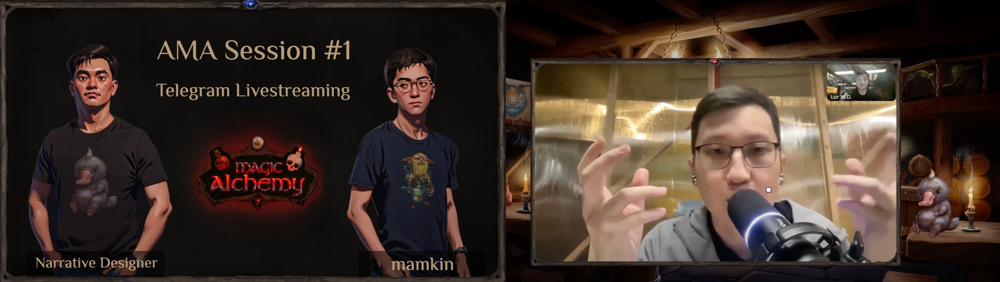

After a while, I finally made it to Ink’s streams! Our amazing Community Manager has been streaming almost daily, playing MA with the community for the past three months. Ink and I announced a battle and took on the top 1–2 players from recent championships. It was a blast!

We should host these events more often because they’re a great way to connect with the community. I’m in our cozy chat and on social media every day, aiming to be a “one-click CEO” who truly understands our audience and ensures players know they’re genuinely heard.

For the blog, I also gave an [interview](https://www.youtube.com/watch?v=IBhpJnM2xDo) on the future of Miniapps and GameFi as a whole. It’s more of an industry deep-dive for those interested in Web3 gaming.

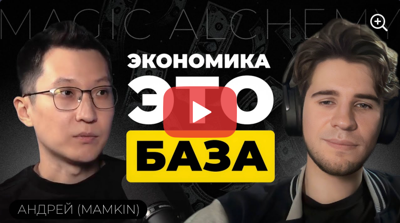

### Plans
As we approach the Marathon launch in November (tentative dates, subject to change), we’re expecting to roll out five key updates:

1. A new mechanic for recurring elements. As mentioned in the AMA, we’ll be meeting an old friend, Vitalius, and crafting formulas together — brewing, brewing, brewing, just like Heisenberg!

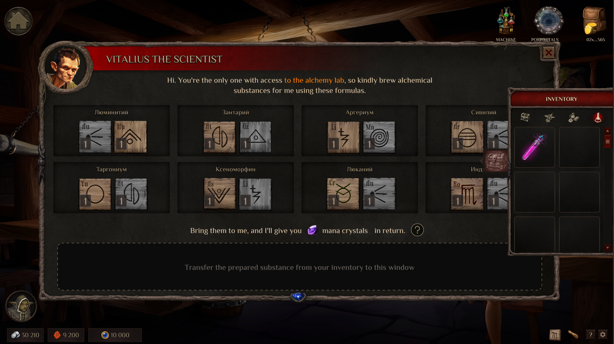

2. To celebrate the anniversary of the Fallen Moon tavern, we’re launching a mini-quest where you can mint a free soulbound NFT as a keepsake poster featuring all the tavern’s characters — or, if you’re lucky, a poster with Lilith herself. This initiative aims to onboard our mini-app audience to the on-chain experience, build some excitement before the Marathon, and serve as an additional metric for the upcoming drop.

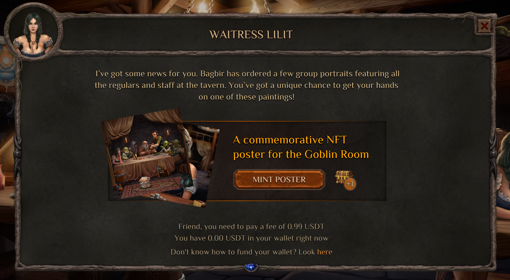

3. We’ve long wanted to introduce USDT wagers in the card game, something many players have requested. This potentially brings a whole new experience — it’s one thing to play for silver, but it’s a different thrill to play for real money (USDT). Plus, this could help boost streaming for our game.

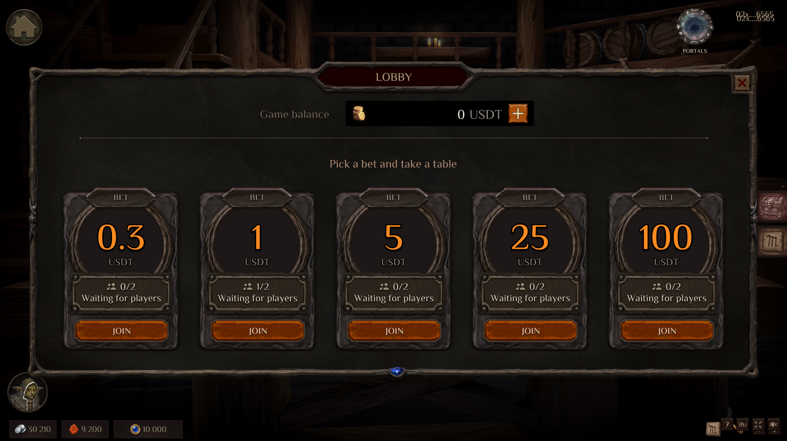

4. Rune Quests. We decided to go forward with the Rune Quests, as they’re an essential part of the storyline and a lead-up to the Marathon stage. Young Gorlo will travel across the map, with players in our chats working together to decipher a Seed Phrase that, in the final quest, will unlock the portal to Mendelief’s Abode (the Marathon location) and transition us seamlessly to the next phase. Each quest will come with loot box rewards.

5. In-Game Marketplace. Initially, we planned to launch our Marketplace after the Marathon, as it’s a complex feature that could easily warrant its own phase. However, we realized that our AA smart wallets (created within the game) wouldn’t integrate directly with external marketplaces like OpenSea or Element, adding an unnecessary barrier for less experienced users.

This conflicts with our game’s “all-in-one” philosophy, where everything is accessible within the app itself — DEX, Swap, DeFi, NFT — with native functionality in different locations. Therefore, we’re building it in-house. Our Marketplace will be located in the “Bazaar” area, allowing any player to easily buy or sell NFTs without ever leaving the game.

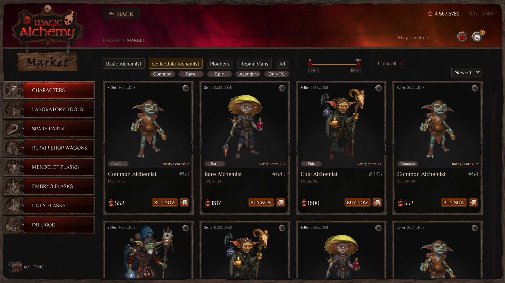

### The Marathon
We’re nearing the most significant phase before the full game release — the Auction stage. Briefly put, our Marathon is a dual auction of tokens and NFTs, presented as a mini-game. Lasting 42 hours, it’s tightly intertwined with our game’s storyline. Players make bids and compete for token amounts and NFT rarities. Very soon, we’ll publish a detailed article about the Marathon mechanics for you to explore.

Almost a year has passed since we launched the alpha in December 2023. During this time, we deliberately chose not to sell any NFTs or tokens. Instead, we’ve only given out rewards: USDT (through card tournaments) and NFTs (mugs, goblins, wagons) — all free of charge. This approach is our Win-Win concept: we started by giving back to our community, and only now do we approach a stage where our community can support us, not through donations but by participating in this thrilling auction. I can say with confidence that this dual-auction format is truly unique in the space. Right now, the Web3 gaming and crypto market feels a bit uninspired and stale, with marketing often at the forefront. We’re offering a refreshing alternative.

All it takes to join is an initial bid of $10. Players are guaranteed to receive tokens, an NFT bottle, and in-game assets (loot boxes, gems, and points), as well as a sense of excitement and competition.

With that, I’ll wrap up this update and extend my thanks to our dedicated team, tirelessly working day and night to bring this vision to life; to our angels, whose support makes this possible; and, of course, to all our players who make it all worthwhile. Ultimately, this is all created for you and stands firmly on your support.

With respect,
Mamkin

