# Внутренняя Кухня MA   (октябрь 2024 года)
Давайте кратко пробежимся по этапам, которые мы запустили с последнего "кирпича". Напомню: в мае мы стартанули Freemint. В конце июня мы запустили очень важный этап Brew or Die, где впервые ввели стейкинг, а также варку эликсиров. В первый же день в Банк Гоблинов положили больше 50к USDT. На данный момент в Банке лежит 130000 USDT от более чем 1000 игроков. В среднем, на тот момент ежедневно играло более 1,5к игроков. Месячная аудитория была более 10к игроков.

В [прошлых "кирпичах"](../kuxnya_may/kyxnya_ru.md), я описывал новую механику горизонтального кликера нашей игры (Miniapps). Продумывание интересной механики прокачки и создание не просто кликера, а Idle мини-игры и встраивание в основную игру потребовало больше времени на геймдизайн и реализацию. Также мы столкнулись со сложной технической реализацией с Телеграмом. У нас была комплексная задача сделать первый горизонтальный кликер + сделать его кроссплатформенным, чтобы он хорошо смотрелся и работал и в браузере и в TG-боте. Помимо этого, долгое время ушло на адаптив и оптимизацию работы на различных устройствах. Были проблемы с андроидами (множество разных экранов и слабые процессоры), перегрев и зависание.

На все про все у нас, вместо запланированных 1,5 месяца, ушло 2,5, и в конце августа мы, наконец, запустили Alchemania. Забегая вперед, скажу, что фидбек от наших коллег был такой: "Как вы это сделали с технической точки зрения?", "Жирррр!", "Это самая красивая тапалка" и так далее.

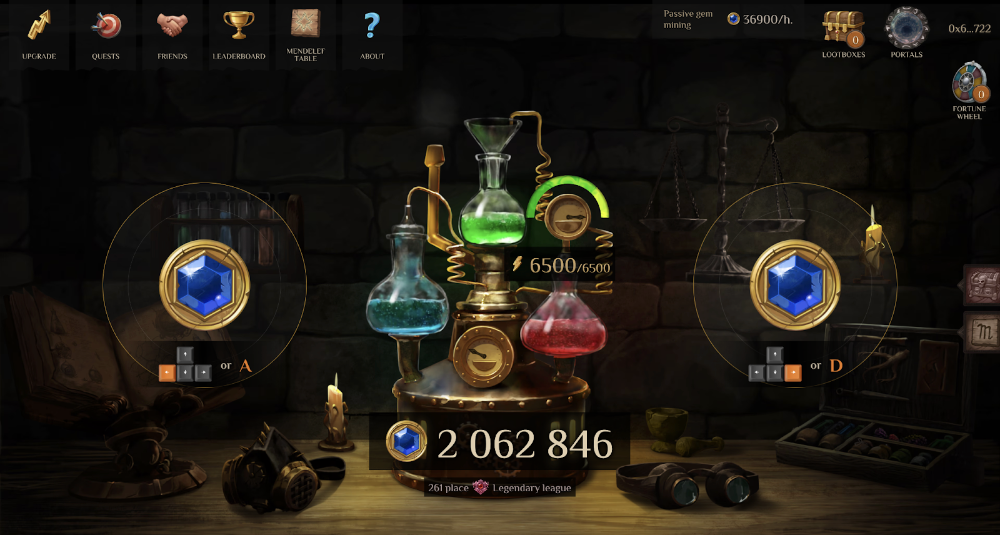

**С технической точки зрения мы сделали 3 крутых решения**: 

1. Создание аккаунта в 1 клик, с помощью TG-входа или через Gmail. 

2. Создание кошелька за игрока. Для любого игрока, который заходил через бота, создавался смарт-кошелек (АА). Это то решение, которое уменьшает порог входа и решает вопрос онбординга из Web2 в Web3. 

3. С помощью смарт-кошельков, мы субсидируем токены POL, которые нужны для газа в сети. То есть, игрокам вообще не нужно думать, где достать токены для пользования сетью. 

По большому счету, игрок может даже не понимать, что он играет в Web3 игру. Мы стираем грань между Web2 и Web3, и поиграть в нашу игру может любой, от школьника до мамочки в декрете. И такие кейсов у нас много!

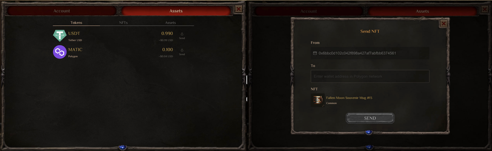
### Метрики и Трекшен 
С запуском Alchemania мы каждый день получали по тысяче новых игроков. На данный момент наши метрики такие:

По большинству параметров мы получили кратный рост. Ставка на TG-miniapp оправдала себя. Мы получили новую аудиторию из Web2, для которой мы зачастую являемся первым Web3 проектом.

Мы достигли в пике 70к MAU. С запуском TG-миниаппа, эти показатели стоит скорее рассматривать как охваты и просмотры, чем как реальное кол-во игроков, потому что в этой отрасли идет засилье ботов, ферм и мертвых душ. Однако, в любом случае, это очень крутой результат. Также на пике у нас было 10к ежедневных игроков (в среднем 4-6к). По нашей статистике, в целом мы выросли в 5-7 раз, но есть нюанс, о котором чуть позже. А сейчас я хочу рассказать о трех трендах в Miniapps. 

Изначально Miniapps появились очень давно в одном китайском мессенджере (конкретно в WeChat). На данный момент, это уже сформированный огромный рынок, более 500млн MAU используют App внутри мессенджера и исправно платят каждый день. Как мы видим, Телеграм и ТОН выбрали ровно тот же путь, с небольшими различиями (крипта). В планах ТОН за 5 лет привлечь в Web3 500 млн новых пользователей. С выходом Ноткойна и Хомяка мы видим угасание и схлопывание пузыря тапалок, но сам рынок Miniapps продолжит расти. Так как выше я описал причины роста миниаппов, они значительно уменьшают порог входа в крипту. 

**Что для МА в целом рынок миниаппов? Как мы помним, МА решает две главные задачи в Web3 играх**: 

1. Стабильность экономики 

2. Онбординг из Web2 в Web3

Если по первому вопросу нам еще предстоит пройти проверку в будущем, то на второй вопрос мы долго искали ответ, пока не появился кейс Ноткойна. Он как раз подсказал, какое решение мы должны использовать в нашей игре для привлечения массовой аудитории. И вот тогда и появился концепт Alchemania. Теперь мы можем смело сказать: наш кейс доказывает, что можно не только получать дешевый трафик в игру, но и выстраивать правильную воронку, конверсию и прогрев новой аудитории. Покажу на слайде: 

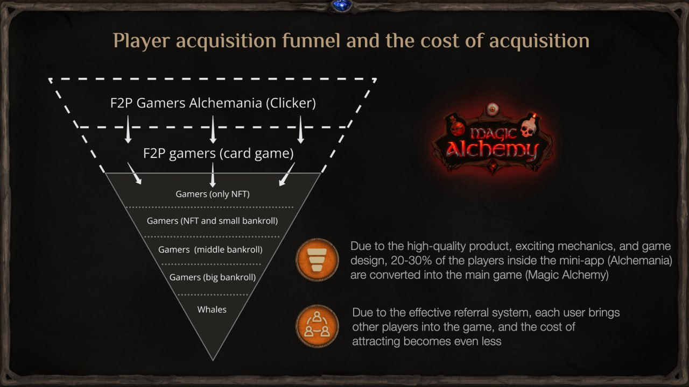

Вверху воронки мы получаем новых игроков в часть игры (Alchemania), для которой создаются все условия для легкого входа в игру (в локацию с Алхимической Машиной), под капотом создается кошелек и аккаунт. Игрок в начале путем простой механики кликера обычно сразу понимает, что к чему, начинает зарабатывать гемы и прокачивать свою машину.

Дальше, на 3-4 уровне Машины, чтобы прокачивать уровень, игроку нужно получит гоблина-ремонтника, а для этого ему нужно перейти в другую локацию и сыграть в карты. Так и происходит первая конверсия в полноценную игру: перейдя через портал, игрок выполняет квест и знакомится с карточной игрой.

Дальше геймдизайн и механики настроены на более глубокое погружение в лор и другие игровые механики. Так мы получаем полноценного F2P игрока. После этого встает задача из бесплатного игрока сделать «платного», то есть, игроку нужно воспользоваться «платными» продуктами в игре: 

1) Стейкинг 

2) Купить NFT на вторичке

Игрок видит: чтобы сильнее развиваться в игре, нужно внести депозит или купить NFT. Тут и происходит окончательная конверсия. Так мы получаем рабочую юнит-экономику. Но есть нюанс. 

По нашим наблюдениям, чем более неподготовленный игрок в плане крипты, тем больше этот путь занимает времени. Пока игрок освоится в игре, параллельно начнет читать канал, статьи, чат, на этот прогрев может уйти до месяца. Но это в любом случае очень крутой кейс из Web2 в Web3. Мы это называем «лаг конверсии».

### Удержание и Ретеншн
Мало получить дешевый трафик, а также суметь сконвертировать его в более активных игроков — нужно удержать аудиторию. То, на чем все тапалки в данный момент и погорели. На рынке практически отсутствую кейсы полноценных игр или миниаппов, где есть твердый продукт внутри.

Наша статистика с сентября.

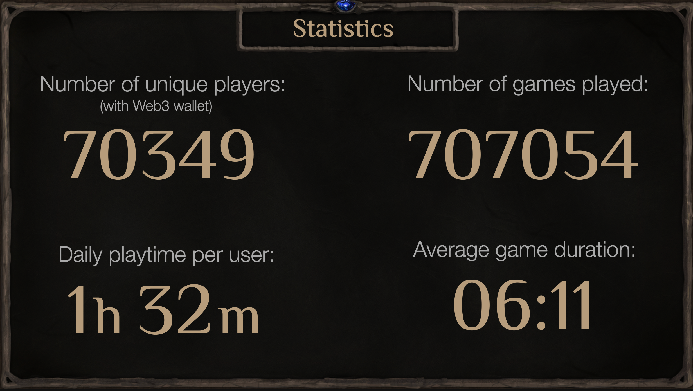

Все тапалки зарабатывают на арбитраже трафика, и с каждым днем цена этого трафика падает. Поэтому наш кейс уникальный. У нас есть не только продукт внутри кликера, но и очень крутые показатели ретеншена. В среднем игрок проводит в игре больше часа каждый день, а также мы уже приближаемся к 1 миллиону партий в карточной игре. 

Есть когорта очень активных игроков (топ в лидерборде), которые по будильнику выращивали растения и варили эликсиры. 

Также уже почти год мы формируем костяк Web3 аудитории, а еще каждый 4й игрок в Alchemania остается в МА. В прошлых "кирпичах" я рассказывал про цифры.

Итак, мы имеем рабочий двигатель. Теперь осталось залить бензин на масштабирование проекта.

### Маркетинг
При запуске Brew or Die летом мы использовали в основном Web3 инфлов. Была договоренность с текущими амбассадорами (преимущественно Web3 игры) и также сделан посев инфлов. Хорошо показали себя видеоролики на YouTube про нашу игру. Можно набрать "Magic Alchemy" и увидеть, как много роликов уже успели наснимать:

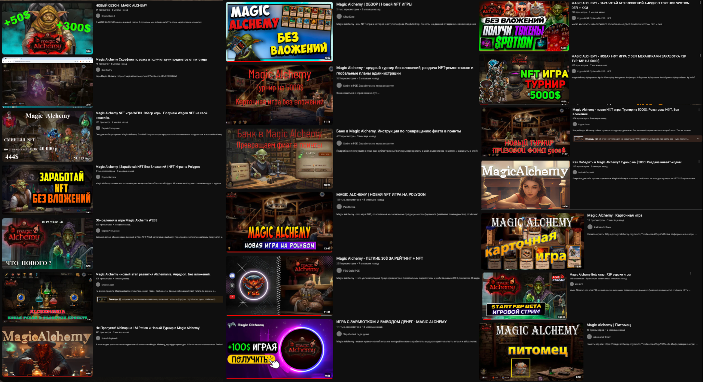

А на этапе Alchemania посев среди миниапп-инфлов, наоборот, оказался переоцененным. Результаты были откровенно слабыми, также не оправдала себя сетка CPM рекламы через Miniapp — Adsgram, казино и прочие мутные аппки раздули ценники на аукцион, и трафик оказался довольно мусорным. Основной прирост мы получили от одного миниаппа, где мы выступили спонсором. Один важный нюанс: перелив трафика из их аппки в наш TG-бот был БЕЗ мотива. То есть, это был не таск с мотивированным действием, а промо нашего проекта в их аппке, что отразилось на качестве аудитории. Мы получили очень хорошие цифры по воронке и юнит-экономике.

Дальше мы запустили кросс-таски по обмену трафиком с другими небольшими тапалками. Результаты тоже слабые, так как конверсия с таких миниаппов катастрофически минимальная (мусорный трафик), а у тех, у кого адекватная аудитория — слишком маленькие цифры. Но мы продолжаем тестить различные подходы. Этот процесс бесконечный.

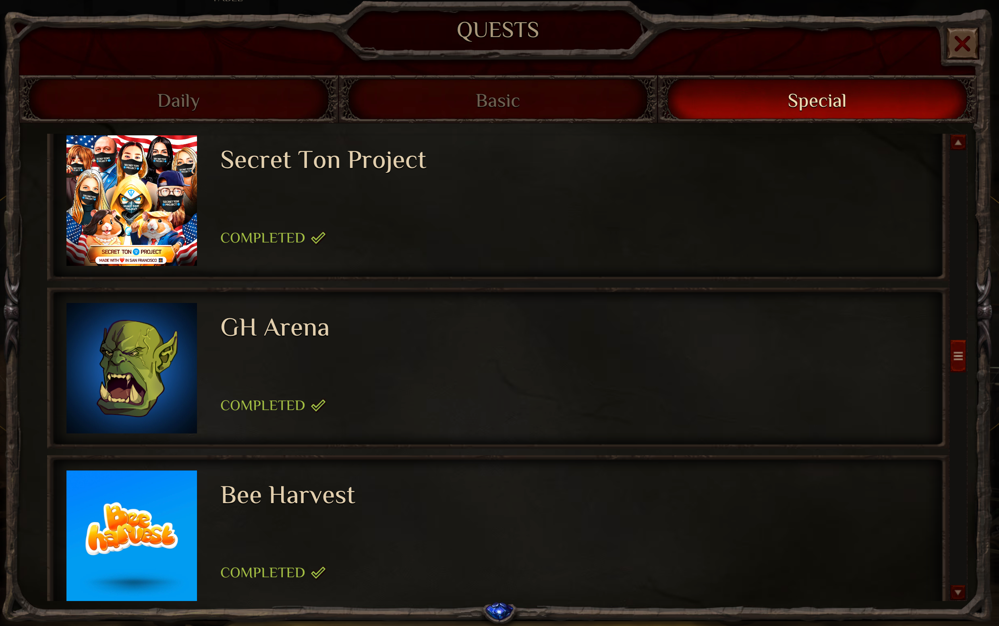

Поговорим и о Web3 трафике, так как это наиболее приоритетное для нас направление. Он более дорогой, но и в преддверии паблик-сейла (Марафон) нужно не забывать привлекать нашу кор-аудиторию — любителей Web3 игр и криптанов. 

Мы договорились с одной из крупнейших площадок по Web3 играм — Games.GG, что будем участвовать в их Battlepass (игроки должны выполнять квесты в играх, чтобы получать XP на самой площадке).То есть, мы получаем трафик с этой площадки. Мы ожидаем хороший прирост западной, англоговорящей аудитории.

Мы уже имели опыт сотрудничества с игровыми площадками. Напомню: год назад мы запускали нашу первую коллекцию NFT-кружек на Earn Alliance, а потом Freemint NFT-гоблинов на Carv.Protocol. Обе эти площадки показали очень хорошие результаты. Стоимость привлечения игрока была от 0 до 1$.

Поговорим о метриках в социальных сетях. Данные из предыдущего "кирпича" (май) —> (октябрь):

Twitter: **3177 —> 9103 (+287%)** 

Telegram blog (CEO): **1061 —> 2638 (+250%)** 

NEW Telegram channel: **0 —> 15800.** Есть мертвые души, ожидаем сокращения цифр. 

NEW Telegram chat: **0 —> 1711** 

Discord: **3776 —> 5660 (+50%)**. Сказался уход Discord из РФ. 

В целом, я всегда говорил, что наша главная цель это органический рост. Накрутить можно любые цифры, а текущий рост более органический и связан с запуском Alchemania. За 4,5 месяца, я считаю, мы получили очень хорошие результаты.

### NFT Коллекции
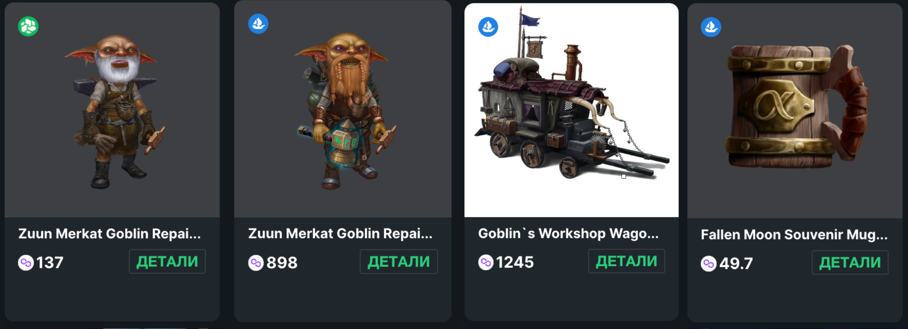

С привлечением новой аудитории и раскрытием функционала NFT, раздачей лутбоксов за NFT и активизацией наших китов, цены на наши NFT очевидно стали расти. С прошлого "кирпича" в среднем цены выросли больше, чем в 2 раза. Напомню, что мы не продавали ни одного NFT, а все раздавали бесплатно. Суммарно все коллекции стоят $300к: 

NFT Повозки: **449 POL —> 1245 POL (+280%)** 

NFT Коммон гоблин-ремонтник: **49 POL —> 137 POL (+280%)** 

NFT Рарный гоблин-ремонтник: **450 POL —> 898 POL (+200%)** 

NFT Кружка: **25 POL —> 49.7 POL (+200%)**

### Фандрайзинг
В прошлых "кирпичах" мы посетили крупнейшую в ЮВА выставку Vietnam Blockchain Week. Удалось получить некоторые контакты, с кем-то созвониться, но в целом это были тир3-5 фонды и инфлы. 

В этот раз Станислав посетил уже крупнейшую выставку в крипте на данный момент Token 2049 в Сингапуре. В этот раз удалось познакомиться с Animoca Brands (независимо с 5 разными сотрудниками). Удалось даже выдернуть Group President at Animoca Brands и запитчить ему нашу игру. Также познакомились с:

- Outlier Ventures 

- DWF Labs 

- Hashkey 

- Spartan Lab 

- Tenzor Capital 

- OKX VC 

- Gate labs

И многими другими тир4-5 фондами. Помимо этого, пообщались с главным биздевом нашего блокчейна Polygon Labs насчет Марафона. И, конечно, не забыли о других блокчейнах и биржах: Aptos, Ronin, Tezos, Moonbeam, Mexc vc, 1inch. Было много коллег, включая азиатские студии, которые тоже усиленно ударились в Miniapps. 

Вообще вся движуха проходит не на самом 2049, там кпд знакомства очень низкий, так как слишком много народу и мало глубины. В следующий раз можно даже не посещать главный ивент, а сразу идти на сайд ивенты. Были митапы, заточенные чисто под Web3 игры. Там как раз мы и нафармили контакты. 

Полигон больше интересуют ончейн-метрики, но им нравится то, как мы получаем трафик из Телеграм с помощью бота.

### Сообщество (АМА, турниры, стримы)
Мы всегда поддерживали наше сообщество, ведь по факту на их плечах мы и стоим. Поэтому мы постоянно проводим турниры с реальными призами: USDT и NFT. За лето мы провели больше 5 турниров, от небольших до призовых в 2500-4000$. Вообще игроки любят участвовать в чемпионатах, в последнем карточном турнире Alchemania поучаствовало свыше 10к игроков.

Также мы провели нашу первую АМА, где получили очень много качественных и интересных вопросов. Это был наш первый опыт, поэтому АМА длилась почти 2 часа). Посмотреть с тайм-кодами можно [здесь](https://www.youtube.com/watch?v=-dGvi4fFXBA).

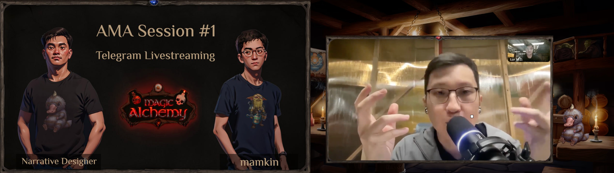

Через некоторое время я-таки добрался до стримов Инка. Наш ламповый КМ проводит стримы почти каждый день и играет с игроками в MA на протяжении 3 месяцев. Мы с Инком объявили баттл и сыграли против топ 1-2 игроков с последних чемпионатов. Было весело. 

Такие мероприятия надо устраивать чаще, потому что это взаимодействие с сообществом. Я каждый день сижу в нашем ламповом чате и в других социальных сетях, стараюсь быть 1клик СЕО, чтобы тонко чувствовать нашу ЦА и чтобы игроки знали, что их по-настоящему слышат.

Также для блога я дал [интервью](https://www.youtube.com/watch?v=IBhpJnM2xDo) про будущее Miniapp и GameFI в целом. Это больше отраслевое видео для тех, кто интересуется Web3 играми.

### Планы
В данный момент до старта Марафона в ноябре (даты неточные, могут поменяться), мы ожидаем 5 ключевых нововведений:

1. Новая механика с повторными элементами. На АМА я рассказывал, что мы встретим старого знакомого Виталиуса и будем составлять формулы и варить-варить-варить, как Хайзенберг.

2. В честь годовщины таверны Fallen Moon, планируется запуск мини-квеста, где можно заминтить бесплатную соулбаунд NFT на память в виде постера (всех персонажей в таверне) или, если повезет, постер с Лилит. Это сделано для решения вопроса онбординга в ончейн мини-апп аудитории, плюс прогрев перед Марафоном, а также это является некой дополнительной метрикой перед дропом.

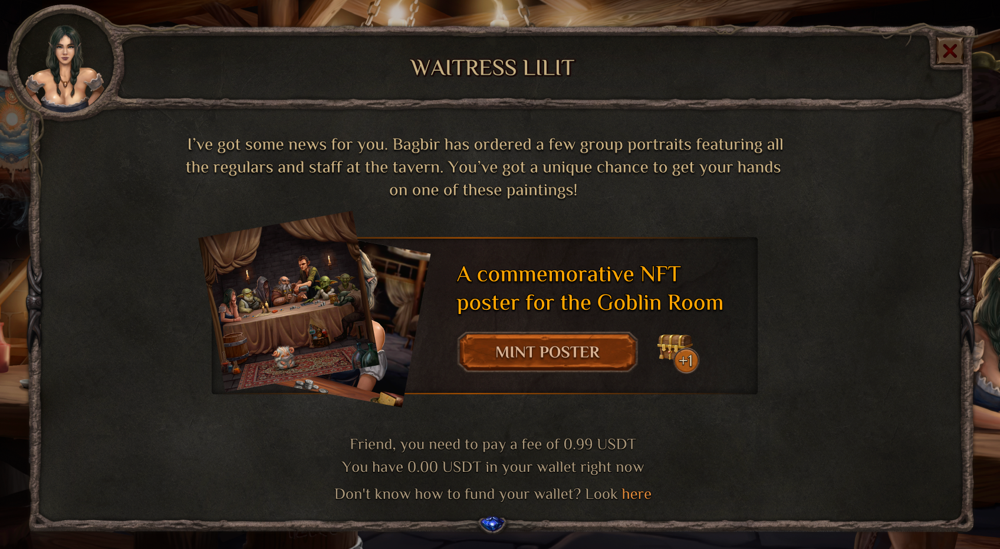

3. Мы уже давно хотели запустить игры на USDT в карточной игре. Многие игроки просили нас об этом. Это потенциально открывает новый опыт. Одно дело, когда ты играешь на серебро, совсем другое — на настоящие деньги (USDT). Плюс, это может поспособствовать развитию стриминга нашей игры.

4. Рунные квесты. Также мы решили все-таки сделать Рунные квесты, ведь это важная составляющая сюжета и подводка к этапу Марафона. Молодой Горл будет путешествовать по карте и отгадывать вместе с игроками в наших чатах Сид-фразу, которая в заключительном квесте откроет портал в Обитель Менделефа (локация Марафона) и логически подведет к следующему этапу. За каждый квест будут вознаграждения в виде лутбоксов.

5. Внутренний Маркетплейс. Раньше мы думали запустить наш Маркетплейс после Марафона, так как он очень сложный сам по себе и тянет на отдельный этап. Но затем мы поняли, что наши смарт-кошели АА (которые создаются внутри игры) не будут работать напрямую с внешними маркетплейсами (опесни, элемент) и для неподготовленного пользователя это дополнительный барьер. 

Это идет в разрез с нашей идеологией игры (все в одном), когда игроку не нужно выходить за пределы App, DEX, Swap, Defi, NFT. Когда все под боком и нативно расположено в разных локациях. Поэтому нужно обязательно делать под ключ. Наш Маркетплейс будет расположен справа в локации «Базар» и любой игрок сможет купить или продать NFT очень легко, не выходя за пределы игры.

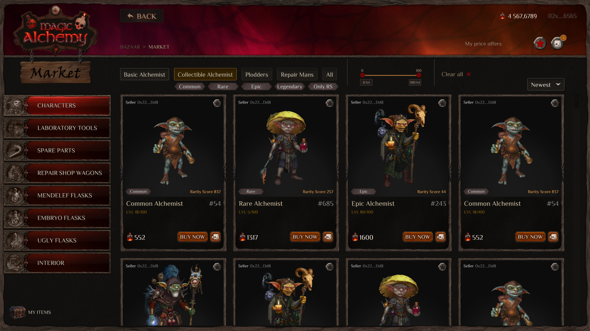

### Марафон
Мы плавно подходим к самому главному этапу до релиза основной игры — этап Аукциона. Если очень кратко описывать механику сейла, то наш Марафон — это двойной аукцион токенов и NFT в виде мини-игры. Длится он 42 часа и тесно связан с сюжетом. Игроки делают ставки и соревнуются между собой за кол-во токенов и рарности NFT. Мы написали об этом целую статью, прочитать можно [тут.](../marafon_2/marafon_ru.md) 

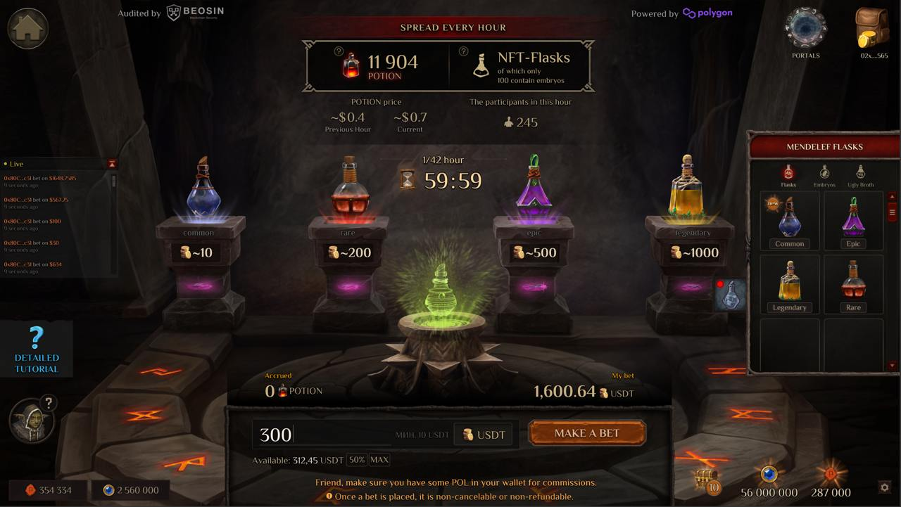

С выпуска альфы прошел почти год (декабрь 2023). Мы намеренно не продавали ни одного NFT и токена. Наоборот, мы только раздавали USDT (карточные турниры) и NFT (кружки, гоблины, повозки), и все бесплатно. Это концепция Win-Win: сначала мы отдавали и формировали сообщество и только сейчас подходим к этапу, когда наше сообщество нас поддержит. Не донатами, а участвуя в этом безумно увлекательном сейле. Могу 100% сказать, что такого формата (двойной аукцион) до этого не было. Рынок Web3 игр и крипты в целом в данный момент очень безыдейный и скучный. 

Фундаментальных проектов мало, балом правит маркетинг. Мы предлагаем глоток свежего воздуха. Игроку нужно прийти и поставить первую ставку в 10$. Он гарантированно получит токены, NFT бутылки и внутриигровые ассеты (лутбоксы, гемы и поинты). А еще фан и дух соревнования (теория игр). 

На этом я хочу завершить эти "кирпичи" и отблагодарить всю команду, которая днями и ночами пилила эту красоту; наших ангелов, ведь благодаря вам мы можем это реализовывать; и, конечно же, спасибо всем игрокам, которые играют. В итоге это все делается для вас и держится на ваших плечах. 

С уважением, Мамкин.

