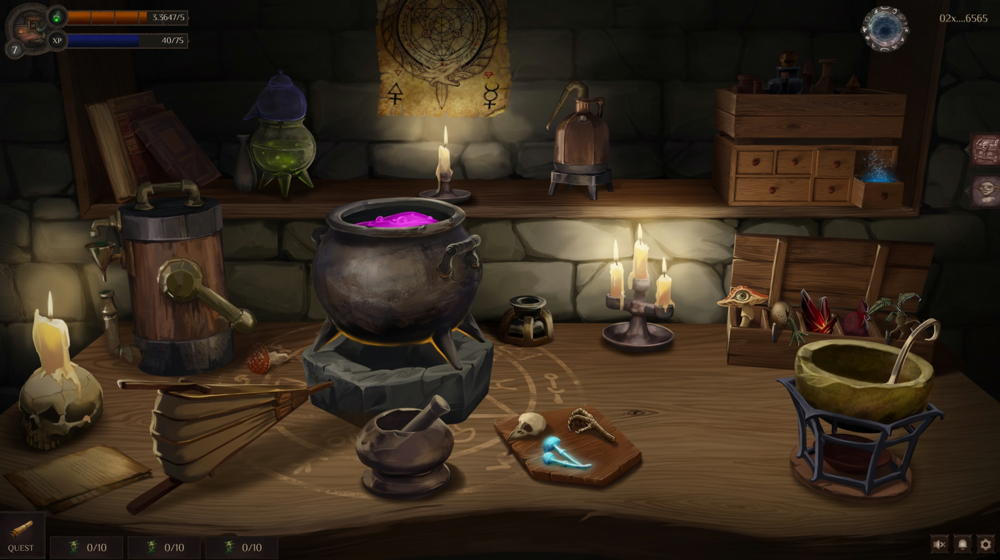

# The Laboratory

Before you stands the alchemist’s table, dominated, of course, by a bubbling cauldron at its center. Surrounding it are neatly arranged a mortar and pestle, various flasks, bellows, retorts, alchemical handbooks, and the recipe you’ll be following to brew your potion.

This is where you will bring your ingredients and delve into the intricate craft of alchemy.

A word of advice—always study the recipe carefully before starting your brew. Otherwise, you might end up wasting precious time and resources.

*"The new alchemical devices made by the darhans delighted the alchemist. It took three days to make the Elixir of Endurance in the past, but with these instruments, it was brewed in only two days. Moreover, now there is no need to monitor the process constantly..."*