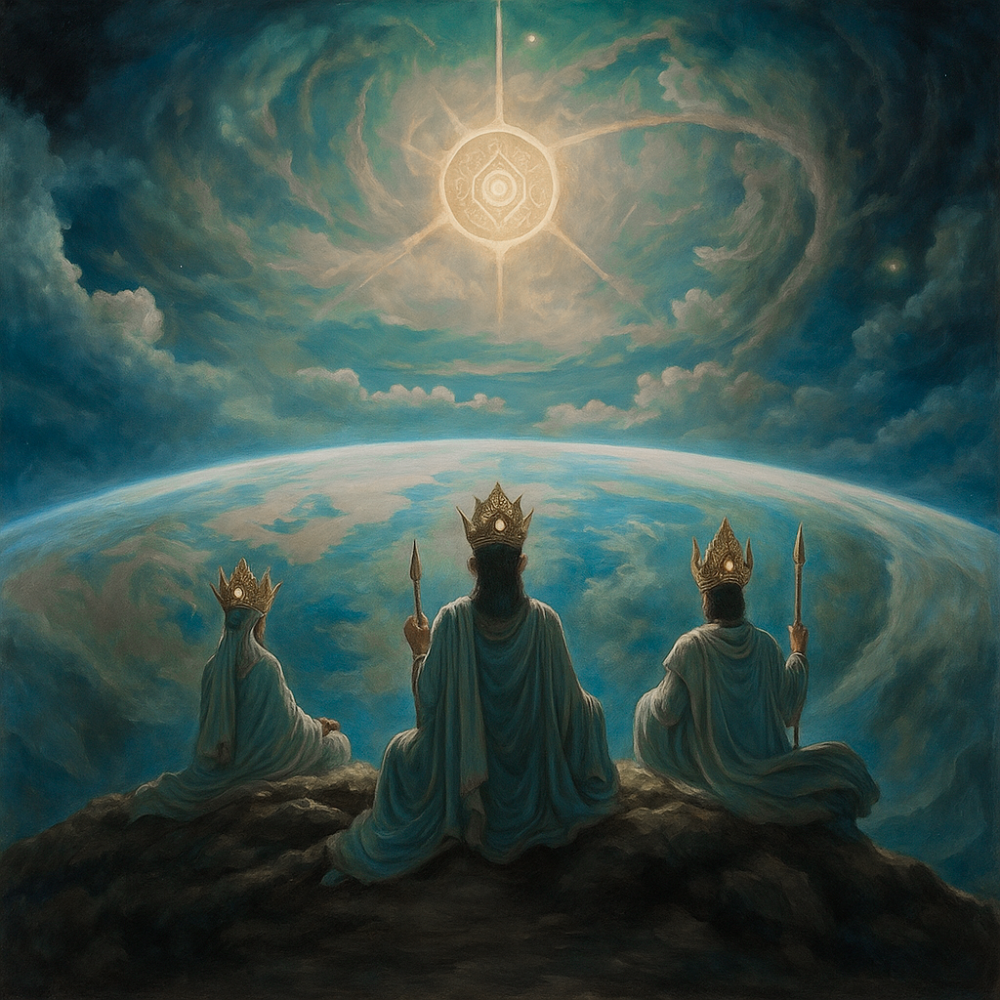

# The Horn of Souls and the Cycle of Rebirth

The gods created their children and shared the Flame of Mana with them, which endowed them with souls. As the Flame of Mana was the source of Tara’s power, the souls nourished the people of Dji’Da.

The gods were bound to their heirs by the Flame, and it was a subtle bond between a parent and their child. The more mortals were born, the more Mana the gods gave away. And when the Flame runs out, the gods will dissolve and return to the one stream of energy of the universe that gave birth to them.

So that the cycle of life would not cease when it happened, the gods decided to create a space in the depths of the world — the land of Pardesa, where the souls of all the dead would gather and wait for a new rebirth.

*The elder Tara look upon the world of Dji’Da*

The gods appointed the youngest brother, Adomion, to be the guardian of this land. He was entrusted to initiate the cycle of rebirth with the help of the Horn of Souls, the artifact his older brothers had been working on. As they pass through the Horn, the souls of all mortals will be cleansed of the memories and anxieties of their past lives and reborn clean and innocent again.

The gods loved their children and shared their joy, taste for life, and passion for conquering the world. They found meaning and realized their purpose. But Adomion, the youngest of gods, did not share so much love for mortals.

He was forced to watch his brothers and sisters lose more and more strength with each era. Adomion loved his family with all his heart, entirely without understanding or accepting their decisions. How can one obtain a willingness to die? And for what? For the sake of a handful of mortals who are deaf to the vibrations of the cosmos and cannot even come close to understanding the power and beauty of the Universe? For the sake of the insignificant creatures who cower in meaningless worldly affairs and see no farther than their noses?

Adomion began an argument with his brothers and sisters, but none gave up what they had planned. They only regretted that Adomion did not see in their children the design of the unified will of the Universe. It also became painful to the gods that he was destined to a hard fate — to witness the departure of the elders of Tara from this domain. And he will be left alone to carry the uneasy burden of being the keeper of the Horn of Souls.

Atanoel, the gentlest and most compassionate of the gods, took pity on her brother and said that after the Horn of Souls had started the cycle of rebirth, Adomion could be reunited with his brothers and sisters. He must give all of his Flame of Mana to keep the Horn of Souls running indefinitely, as long as the Universe exists.

Atanoel wanted to give her brother hope with these words, to give meaning to his service, but instead, Adomion’s mind was only sinking further into doubt and sadness. Over time, these feelings turned into anger and even hatred.

He hated those for whom his brothers and sisters gave up their divine role and immortality. Adomion lurked in the depths of Dji’Da with the minor Tara serving him and began considering his plan.