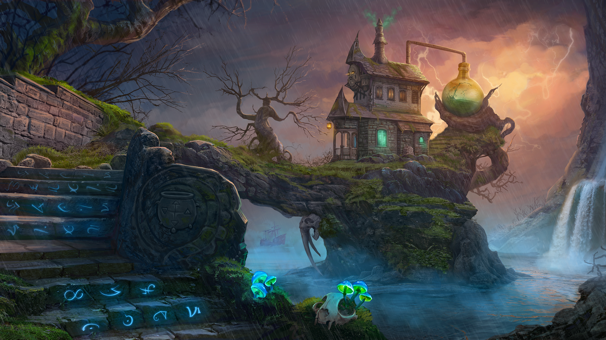

# Что такое Magic Alchemy? 

## Введение
Централизованная игровая индустрия приучила пользователей довольствоваться лишь конечным продуктом — игрой, в то время как разработчики и издатели получают все экономические выгоды. Игроки не могут влиять на свои инвестиции и степень контроля в системе, в которой они участвуют. Именно поэтому децентрализованные инфраструктурные проекты, такие как Метавселенная, DeFi, NFT и децентрализованные автономные организации (DAO), все больше начинают влиять на эволюцию игровой индустрии.

Слияние игр и децентрализованного блокчейн-мира привело к концепции GameFi, которую можно выразить простым уравнением: GameFi = Игра + DeFi.

Хорошо продуманная игровая экономика (токеномика), в сочетании с использованием NFT, переносит ценность от разработчиков к пользователям, что кардинально изменяет подход к миру компьютерных игр. Теперь пользователь получает беспрецедентный игровой опыт с возможностью его монетизации, участвует в управлении геймифицированными метавселенными, а персонажи, инвентарь и различные скины в виде NFT принадлежат исключительно игроку.

## Вдохновение 
Почему наша игра посвящена алхимии? И какие игры об алхимии мы можем вспомнить? Например, такие как Potion Craft, мини-игра из Гарри Поттера, Minecraft и механики в Elder Scrolls.

Как поклонники старых игр, мы вдохновлялись Might&Magic VIII 2000 года. Это культовая игра во вселенной Героев. Алхимия в этой игре является частью механики, где игрок создает зелья, и если не удается — получает урон в зависимости от уровня зелья.

Существует тысячи фэнтезийных игр, где нужно кого-то убить, но мы решили сделать нечто другое. Второстепенной целью было упростить интерфейсы (UX/UI) и представить сложные вещи через призму крафта, чтобы каждый мог быстро разобраться.

В 2020 году в крипто-пространстве появился Goblinswap — одна из первых геймифицированных DEX-игр с использованием NFT-стейкинга.

Goblinswap был построен на модульном блокчейне Nuls, использующем протокол консенсуса Proof of Credit (PoC). Nuls был малоизвестен в 2023 году, как и в 2020. Однако на стадии разработки разработчики Goblinswap считали его оптимальным решением из-за его скорости и низких транзакционных затрат.

Эта игра стала прототипом для Magic Alchemy.

С большим потенциалом для развития, Goblinswap имел много недостатков: отсутствие полноценного рынка (позже игроки создали «черный рынок руды» самостоятельно), неудобный интерфейс и, пожалуй, самое главное — игра не развивалась и прекратила свое существование всего через пару месяцев после запуска.

## Что такое Magic Alchemy? 
Представьте себе большой котел, бурлящий на огне — в нем мы будем готовить особенное зелье под названием Magic Alchemy. Это браузерный экономический симулятор в жанре Epic Fantasy на собственном DEX движке. 

**Какие у него ингредиенты?** 
- Фундаментально сильный DeFi, размер рынка которого достигает сегодня более $100B.
- Разнообразные игровые механики (карточная игра, фермерство, головоломки, квесты и основной сюжет).
- Токеномика, над стабильностью которой мы работали несколько лет.
Вручную отрисованные арты персонажей, локаций, больше 10 коллекций NFT и многое другое. 
- Густая и непередаваемая атмосфера олдовых игр в духе HOMM или Diablo. 

Это и есть Magic Alchemy — продукт, довольно сильно отходящий от трендов современного GameFi: казуальность F2P части, медитативность основного геймплея, фокус не на 3D графику и экшен, но на создание экономических стратегий. Такой наша команда видит игру, с упором, в первую очередь, на сильные стороны Web3.

Magic Alchemy это не просто игра. Это технический фундамент и движок для всей экосистемы MA Labs и будущих игр студии, в котором десятки смарт-контрактов, ончейн-механик и внутриигровая экономика работают как единое целое.

Каждая фича проектируется как модуль, способный выдерживать нагрузку, масштабироваться и интегрироваться в будущие игры.

Сроки могут сдвигаться,
потому что мы делаем ставку на надёжность, стабильность и безопасность.
Мы заботимся о сохранности активов игроков и проводим аудиты, тестируем вручную и стараемся не выпускать сырой продукт.

Мы не гонимся только за скоростью, мы создаём то, что будет работать на годы вперёд.

