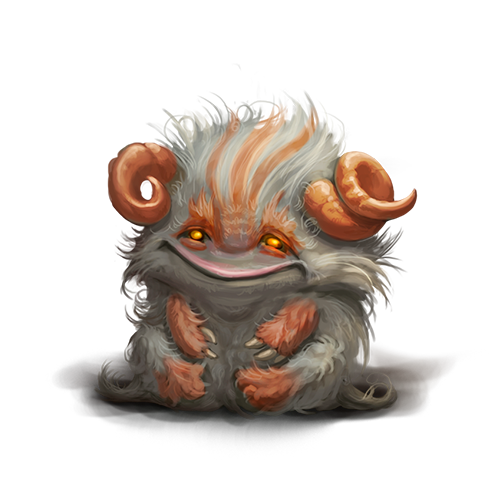

# Of Magical Creatures. Part IV

This information on newfound magical beings is compiled from the few surviving ancient records and supplemented by the research of Vitalius, a member of the Supreme Magical Council of the Academy of Ankorlan, and scholars of the Order of Truth Seekers. The ancient chronicles do not specify for what purposes magical creatures were kept. However, it is undeniable that they were all handheld familiars of the magicians and alchemists of the past.

## Bigachu

In the myths of the people living in the territory of the modern Dudzhun Empire, there is a reference to a magical creature called Bigachu, who dwells high in the sky and commands lightning and thunder. According to surviving images in ancient written sources, this creature resembles a bear with two twisted horns on its head.

The familiar found by the goblins matches the description of Bigachu’s appearance. So, I decided to name it the same as in the legends of the Dudzhun Empire. Bigachu could be mistaken for a tiny horned bear cub, but unlike bears, they are herbivores.

I am inclined to believe that at the dawn of the New Age, the first settlers in what is now the Dudzhun Empire encountered Bigachu. They were probably the last members of the species to survive in the wild since the Golden Age. Over time, as Bigachu became fewer and fewer, the memory of their unusual abilities became a legend, and the legend became a myth.

Bigachu, like all other familiars, have unique properties. And if the legends are not true about their flying ability, Bigachu can still strike with lightning. In some unfathomable way, these creatures can produce and store magical energy in their bodies, which materializes in the form of lightning.

I think that wild-dwelling Bigachu use this to fight off large predators. Empirically, I have proven that Bigachu can regulate the strength of their lightning. Let’s go into more detail here.

During the experiment with Bigachu’s lightning bolts, I only experienced a slight tingling sensation on my skin. Still, an unpleasant incident happened to one of the goblins helping me in the lab. I asked him to taunt and anger Bigachu to see what would happen. The poor guy literally got roasted. Thanks to Yueve, alchemists were in the lab at that moment, and they saved the goblin with their potions.

I don’t know why, but the goblin stopped visiting the lab after that incident. Now, I have to clean it and prepare research materials myself. That’s unfortunate.