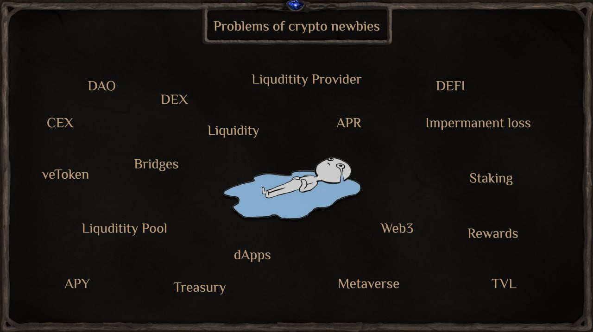

# Проблемы Web3 токеномики

Криптоиндустрия растет, но у нас все еще много проблем и вызовов, которые необходимо решить, прежде чем криптовалюта станет неотъемлемой частью жизни каждого.

### Проблемы

Проблемы новичков: им нужна помощь, чтобы начать использовать децентрализованные обменники.

Проблема с игровыми механиками — сложные механики обычных игр накладываются на трудность понимания интерфейсов и процессов DeFi.

Проблема токеномики Pump & Dump.

Короткая жизнь проектов, когда основные пользователи теряют свои инвестиции.

Слабое сопротивление массовым выводам.

Отсутствие механизма сдерживания массовых продаж.

Отсутствие механизма стабилизации накопления фондов.

Нет динамичных дефляционных механизмов.

Проблема честности и прозрачности в проектах.

Быстрый выход команды и ранних инвесторов в ущерб первым пользователям.

Отсутствие децентрализованного резервного фонда — warchest.

Отсутствие нескольких источников пополнения резервного фонда — warchest.

Отсутствие принципов DAO в управлении деньгами в warchest.

### Как Magic Alchemy решает эти проблемы?

**Создание собственного DEX** для отвязки от логики сторонних DEX-платформ.

**Упрощение механики** работы с ликвидностью через платформу DEX по принципу одной кнопки.

**Заменили крипто-термины** на обычные, используемые в играх.

**Обеспечили игрокам привычный игровой процесс**, не связанный с терминами DEX.

Увеличили интерес к игре благодаря возможности зарабатывать, играя, а не платя за игру, как в классических играх. Создали захватывающий игровой мир и легенду в стиле тёмного фэнтези, что является уникальным для крипто-игр. Разработали стратегии для вовлечённых и занятых игроков, которые хотят тратить на игру только немного времени.

### Проблемы в GameFi

На текущем этапе развития GameFi большинство криптоигровых проектов используют концепцию Play to Earn (P2E), которая в своей текущей форме больше ориентирована на "Заработок", а не на саму игру, что в конечном итоге приводит к плохому интересу к игровому процессу и визуалам.

**Недостаточно развитая токеномика большинства игр** приводит к тому, что они работают по принципу Понци-схемы, где новые пользователи обеспечивают рост, но не получают ценности по завершению игрового цикла.

**Недоверие к DeFi** и высокие комиссии создают дополнительную точку отказа для новых пользователей.

### Злоупотребления в P2E
В концепции P2E есть возможность злоупотреблений со стороны игроков с большими капиталами. Вкладывая значительно больше, чем обычный игрок, такие пользователи получают преимущества в скорости игры, борьбе за места в таблицах лидеров и монетизации игрового времени.

**Ключ к успеху** часто зависит не от игрового мастерства, а от наличия толстого кошелька, что несправедливо по отношению к игрокам с небольшими депозитами.
