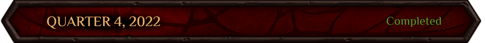
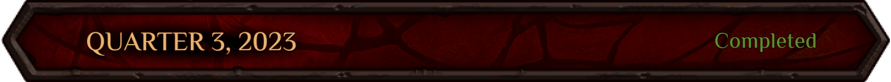
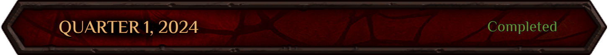
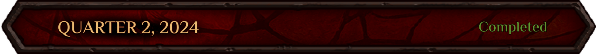
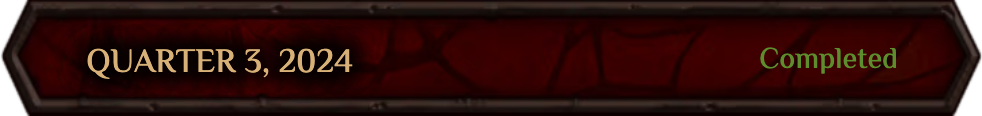
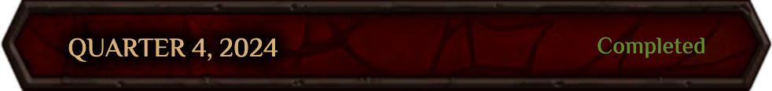
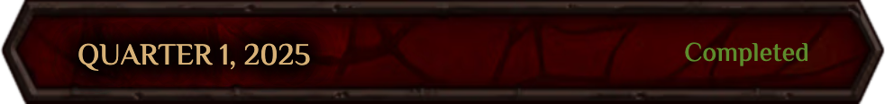
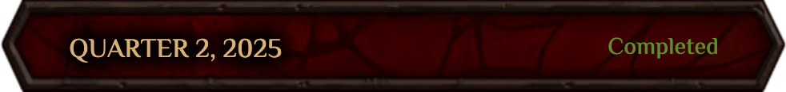
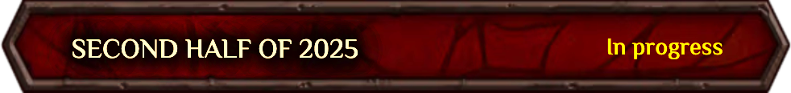

# Roadmap Magic Alchemy

- Team Formation 
- Development and discussion of the game idea 
- Starting to work out the game design document 
- Working through the concept of the NFT alchemists 
- Working out the concept of basic game mechanics 
- Research of existing blockchains, selection of smart contracts development stack 
- Adoption of the tokenomics architecture concept 
- Developing the concept of a game world setting

- Basic implementation of DeFi MagicAlchemy protocol
-Development of wireframe locations with DeFi mechanics 
- Implementation of a card game as additional game content 
- Preparing alchemist characters, flask collection, and playing cards 
- Development of locations and their rendering 
- Logo development 
- Creation of game mechanics, limiting "abuse"
- Creation of a map and description of Dji'Da world countries 
- Writing the World Legendarium

- mplementing the frontend for DeFi 
- Location development and rendering 
- Game UI development, location building 
- Design NFT collection and in-game assets 
- Tokenomics modeling
- Implementation of additional NFT items for the lab 
- Balance of character progression 
- Development of marketing activities before the launch of the game 
- Description of goblin society structure and its tribes 
- All the lore quests for the marketing phase

- Video content production 
- Marketplace UX/UI development 
- Tokenomics modeling and finalization 
- Free-to-play scenario development and implementation 
- Trial backend and authorization mechanism implementation
- Project deployment and backup 
- NFT-collections and in-game assets design 
- Location development and rendering 
- Drawing arts for lore and marketing 
- Free-mint implementation: modification and revision of marketing quests 
- Lore texts, game characters and their backgrounds for Free-to-Play

- Expanding the team 
- Backend architecture design 
- Project decomposition according to development directions 
- Working on the in-game locations UX/UI 
- Working on the art and interface of the NFT auction concept
- Intensive work on the lore and marketing texts
- Angel round
- Modeling and finalizing the tokenomics 
- Web site design and launch
- Launch of the development blog on Telegram 
- Shaping the content for the project's social networks 
- NFT-collections and in-game assets design
- Location development and rendering 
- Drawing arts for the lore and marketing 
- Extending the game's lore, preparing texts to describe the game mechanics

- Card game backend implementation 
- Frontend architecture refactoring
- Expansion of the development team 
- Work on the game design document 
- Working on the in-game locations and activities UX/UI  
- Preparing a marketing plan for implementation 
- Monitoring and improving in-game economy 
- Preparing the project's Whitepaper and Gitbook 
- NFT collection and in-game assets design 
- Card game artwork 
- Drawing arts for the video 
- Creating the main game story 
- Preparing texts for all game quests

- Implementation and release of a card game frontend
- Writing all in-game dialogues
- Creating the background of all game characters 
- Review and final editing of all literary texts

- ALPHA version of the card game release
- NFT Mugs mint 

- The First Card Tournament
- The release of the BETA version of the card game
- Starting the exchange of mugs for the first game character
- Conclusion of a marketing agreement with the platforms Gam3s.gg , EarnAlliance, CARV
- Work on new game locations for the RepairMan FreeMint stage
- Improvement and introduction of new game mechanics.
- Launching of the Wheel of Fortune.
- Introduction of a rating system for players and achievements
- Working on the balance of the card game, introducing new cards

- The release of the new game stage RepairMan FreeMint
- Organization of the second major card tournament
- Improvement and introduction of new game mechanics.
- Development of game locations for the next stage of "Brew or Die"
- A new rebalance of the card game
- The launch of a new game stage "Brew or Die".

- Optimization of the game on mobile devices
- Development and release of the new game stage "Alcemania"
- Alchemania release, via miniapps on Telegram
- Launch of the "Alchemania Cards Tournament"
- Launch of the ambassador and marketing program

- Introduction of the "Rune Quests" storyline
- Launch of the meme coin "RUSK"
- Release of a new game mode in Towers with the introduction of paid matches using "RUSK"
- Start of the largest prize pool card tournament
- Launch of a grand giveaway to celebrate the anniversary of the Fallen Moon tavern
- Publication of Magic Alchemy's tokenomics for public access

- Launch of Soulbound NFT minting
- Third-party audit and validation of smart contracts
- Launch of the "Glob's Prophecy" event

- Launch of the main game phase — "Token & NFT Marathon", featuring a dual auction for main game characters and the POTION token
- Conclusion of the Great Anniversary Lottery
- Release of the second limited-edition merch collection from Magic Alchemy — "Elixir of Madness"
- Introduction of the "Flask Transmutation" and "Soul Infusion" phases
- First DAO vote on how to allocate Warchest funds across lending protocols
- Card game "Towers" rebalance and introduction of the new mechanic: "Return Formula"

- Start of the "Ready, Alchemist one!" phase — a staking mechanic for Alchemists, allowing players to earn additional rewards in POTION
- Opening of the in-game NFT marketplace
- Launch of the in-game mechanics: "Trade Caravans" and crafting of spare parts for Alchemy Boosters
- Conclusion of the "Brew or Die" and Alchemania events, with token airdrop distribution
- Official game release
