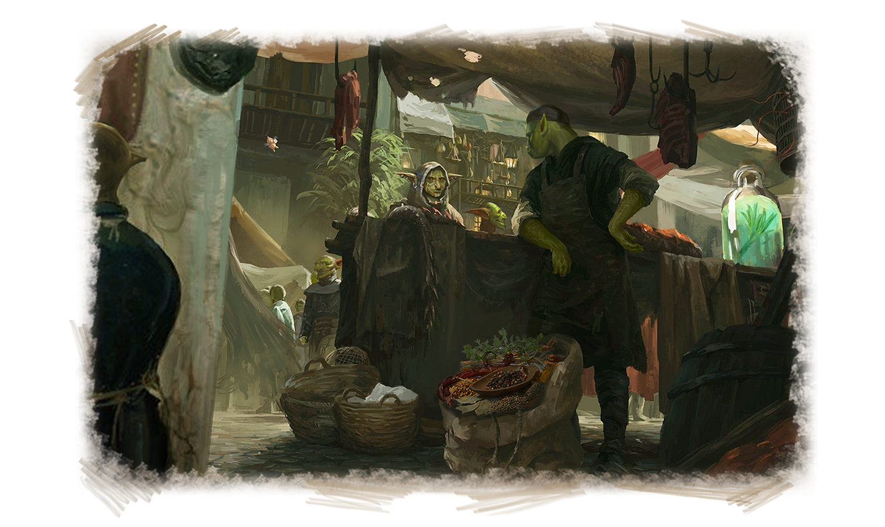
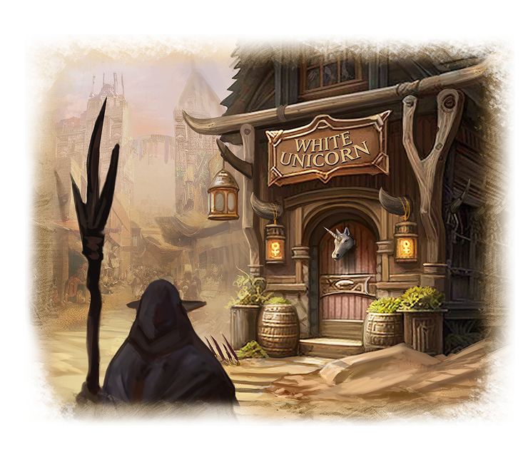
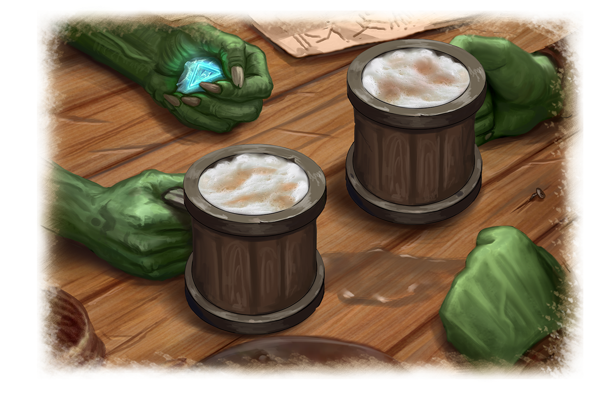

# Хозяин “Белого Единорога”

Полуденный зной душной завесой заполнил улицы Грир. Столица Великого Герцогства Радо всегда страдала от жары в это время года. Даже дневной бриз не мог развеять эту духоту. 

Горл, вытирая пот со лба, пытался пробиться через толпу людей, заполнивших торговую площадь. Ему нужно было найти одного пожилого гоблина. Горл считал, что лишь он может знать что-то о найденных им артефактах.

Пластины с Символами Огня и Воздуха, добытые Горлом около десяти лет назад, не давали ему покоя. Он находил еще несколько подобных артефактов, но все они были повреждены или разбиты по прошествии стольких лет.

Хоть пластины были сделаны из металла, но со временем становились хрупкими. Алхимики-гоблины предположили, что большая часть пластин потеряла магическую силу. Только две, которые добыл Горл, сохранили в себе энергию изначальной Маны Менделефа.

Горл провел много времени в библиотеках в поисках информации и обнаружил, что последние записи по исследованию пластин принадлежат гоблину по имени Корд, одному из Ищущих.

Горл хотел встретиться с ним и обсудить его изыскания, но Корд уже пятнадцать лет как покинул Орден. Он решил уйти на покой, хотя ему и предложили высокий пост в Ордене.

Корд обосновался в Грире, городе, куда стекались товары и диковинки со всего света. Он открыл небольшую лавку по продаже предметов старины. Именно ее искал Горл в торговом квартале.

Потратив два дня на поиски, Горл, наконец, стоял у порога лавки "Белый Единорог". Зайдя внутрь, Горл не успел даже мельком осмотреться, как из глубины зала его окликнули.

– Приветствую, Ищущий. Что потребовалось Ордену от старого, доживающего свой век гоблина? – произнес сидящий за стойкой пожилой гоблин.

– Здравствуйте, уважаемый Корд. Меня зовут Горл. Вы единственный, кто может мне помочь. Что вы можете мне рассказать по поводу этого? – задал вопрос Горл, доставая и показывая пергамент с изображением пластин. 

– Занятные вещицы, но на рисунке у вас неточность. Все пластины, которые мы когда-либо находили, были разбиты или повреждены, а у вас здесь они изображены целыми. Или вы хотите мне сказать, что были найдены две целые?

– Да, я лично добыл две пластины с символами стихий.

– Превосходно. Я знал, что должны быть еще на свете неповрежденные, но лучше об этом поговорить в моем личном кабинете. У меня как раз есть бутылочка гномьего эля из личных запасов герцога Радо. За ним беседа будет проходить намного живее.
Устроившись поудобнее в кабинете, Корд рассказал все, что ему удалось узнать о пластинах. Он предположил, что это не простые пластины с рунами стихий, а магические ключи. Но Корд так и не смог узнать, что именно они открывали.

– Я всю жизнь провел в исследовании и поиске этих артефактов, и уже потерял надежду, что когда-нибудь смогу найти целые. Поэтому я решил уйти на покой и оставить это дело молодым гоблинам, таким как ты.   

Так получилось, что мне в руки пару лет назад попала целая пластина с Руной Воды. Да-да, я знаю, что должен был немедленно передать ее Ордену, но я решил ее оставить себе. Считай это старческой блажью и приятным напоминанием о славных делах молодости. Я не в силах был отказать себе в удовольствии обладать ею. 

Теперь я вижу, что ты добился больших успехов в поисках и готов ее отдать, но есть одно условие. Ты должен правильно ответить на все мои вопросы. Это своего рода проверка, достоин ли ты владеть артефактом.

В течении нескольких часов Корд закидывал Горла вопросами по всем учебным дисциплинам, правилам и положениям, которые должны были знать члены Ордена Ищущих Истину. Испарина появилась на лбу Горла. Так трудно ему не было даже на финальном экзамене, когда он отвечал на вопросы Верховного Совета Ордена. Он уже думал, что эти вопросы никогда незакончаться, когда их поток резко прекратился.  

– Молодец, Ищущий! Ты достоин этой награды. Я буду верить всем сердцем, что у тебя выйдет найти все пластины и открыть тайну, которую они скрывают.

Горл взял в руки металлическую пластину с Символом Стихии Воды. Как и в прошлые разы, он чувствовал легкое покалывание в пальцах, когда прикасался к ней.

Утренние лучи солнца уже показались на сторожевых башнях города Грир, когда Горл покинул "Белый Единорог". Любуясь рассветом нового дня, Горл был твердо уверен, что стал на шаг ближе к своей цели.
