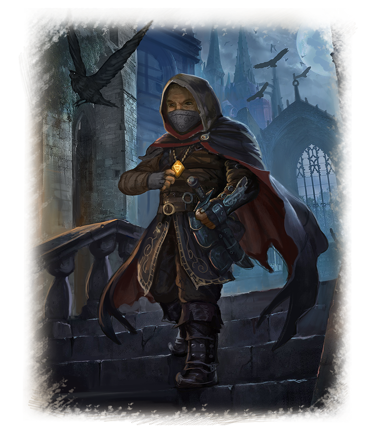
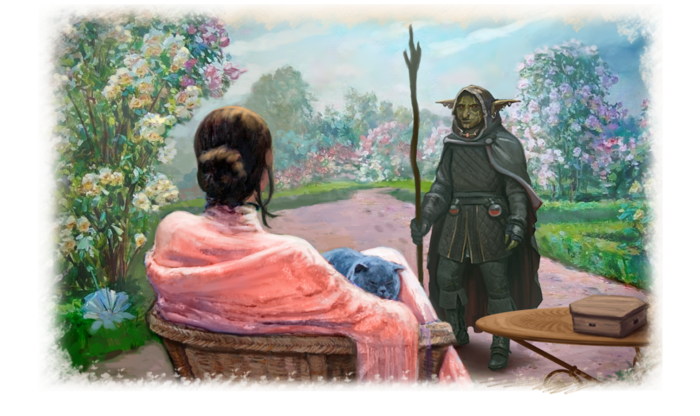

# Queen of Thieves
Gorl rubbed the scar on his chest that he had received years ago from an orc sword during an expedition into the lands of the Northern Horde. This habit manifested itself in moments of great excitement.

Years of searching for the Elemental Runes would end today, and the realization made his heart beat faster. Years of research, studying ancient texts, and looking for any information on artifacts with the Runes of the Elements have finally borne fruit.  

Three months ago, one of the Seekers' informants reported that a similar artifact might be stored in the treasury of the Cathedral of the Holy See of Leria. It took another month to confirm the information about the authenticity of this Rune of the Elements. 

The Council of the Order knew that it was impossible to obtain the Rune of the Elements from the treasury without the written permission of the Lord Pontiff. Alas, the chance of getting this permission was less than the chance of finding a virgin in Greer's harbor brothel, so a different course of action was required. 

The Council turned to those who sometimes did the delicate orders for the Truth Seekers - the Thieves' Guild.  

After a while, the Guild claimed they had the artifact. Gorl, as a trusted member of the Council, was instructed to make the exchange.

The goblin went to the meeting. His carriage stopped at the main entrance to Château de Monsin. The manor's owner, Baroness Sonja De Monsin, was one of the wealthiest noblewomen in the Kingdom of Erteland. 

However, only a dedicated circle knew the whole truth about her. Sonja De Monsin led a double life and carried a double title - baroness to the nobility queen of the Erteland Thieves' Guild to the underworld. 

Gorl was led into the summer garden, home to countless beautiful flowers collected worldwide. The mistress of the manor, surrounded by two personal bodyguards, was waiting for him there. 

A woman, beautiful by human standards, sat at a table and looked intently at the goblin. A summer sunset dress harmonized with her red curls, and Lantian emerald jewelry accentuated the beauty of her large green eyes.

There was an iron will and a strong character in those eyes. Gorl felt uncomfortable under her gaze. He jerked his hand away, reaching out to scratch the scar on his chest to cope with the excitement.

– Welcome, dear Gorl. It's good to see you. Are you surprised that I am attending this meeting in person?

– Greetings, my lady. Honestly, I didn't expect to see you here. What was the reason for such a high honor?

– A love of mystery. Not every day you get an order to rob the Holy See's treasury. And it would be fine if we were talking about a magical artifact. But no, we had to steal a simple and unremarkable metal trinket. My magicians checked it and found no traces of magic. 

Obtaining it was much more complex than we had hoped, not to mention that the Holy See began a search for those involved in the theft. In Leria, my colleagues suffer oppression and losses from the church's actions. The Holy Fathers are not keen on having a burglar infiltrate their main cathedral. 

I need to know the truth. Why did the goblins need this thing? Your answer will determine whether I give it to you or not. 

– My lady, but what about your honor and your word? We made an agreement. If I walk away with nothing, word will spread quickly that the Guild is not fulfilling its contract. 

– "If" you leave, you're right to point it out. It's not safe for anyone to travel alone, including goblins. It is said that bandits often attack travelers in these parts. 

– I see your point. Will you let me have a look at the plate first? I have to make sure it's all right. 

The Baroness nodded, and a nearby bodyguard placed a box with a metal plate in front of Gorl. A glance was enough for Gorl to realize it was the Earth Rune.

– Very well, Baroness. No, Sonja, the queen of thieves. I will tell you the truth. Order some jasmine tea and honey. It will be a long story, and your hospitality has made my throat dry.

The servants changed the teapot twice while Gorl told his story.

– It's a fascinating story. I can sense when someone is lying, so I'm sure you're telling the truth. But don't think I believed your people's prophecy. In any case, my curiosity is delighted. 

I won't keep you any longer. Goodbye. Oh yes, I almost forgot. I hope you don't need to tell me that our little misunderstanding today must not be revealed to anyone. 

– Of course, my lady. No one will know about it. I always keep my word, unlike you.

– You have a lot of courage. I'll pretend I didn't hear your last words. My servant will escort you to the gate.

Five minutes later, Gorl left the thief queen's castle. 
