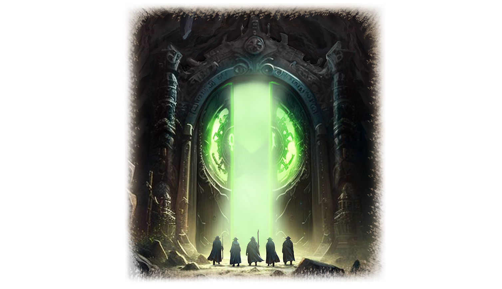

# Врата Менделефа

Огромные металлические врата возвышались над отрядом Ищущих. От магии Менделефа, исходящей от них, все гоблины поблизости ощущали легкое покалывание по всему телу. Эти ворота были скрыты в недрах Замковых гор долгие тысячелетия.

Врата удалось обнаружить благодаря древней карте, добытой Горлом в землях Северной Орды более двадцати лет назад. Долгие годы и большие усилия были положены на поиск проходов в пещерах, но лишь недавно одному поисковому отряду удалось добиться цели.

Горл вместе с другими членами Совета прибыл в это место, как только Орден получил весточку, что врата найдены.

Попытки разведчиков открыть их не увенчались успехом, и Горл даже не удивился, когда узнал об этом. Он догадывался, что только Руны Стихий способны отпереть их, так что, разумеется, все пластины были доставлены сюда.

Горл во главе группы старейшин подошел к вратам. Он, наконец, смог подробно их рассмотреть вблизи. Створки ворот были богато украшены узорами и барельефами, изображающих Менделефа и первых гоблинов.

В центре ворот, где смыкались створки, виднелось четыре углубления. Над каждым из них был нанесен Символ Стихий: Огня, Воды, Земли и Воздуха. Горл с волнением достал пластины и поочередно вставил их в углубления.

Зеленый свет начал растекаться по створкам ворот. Грохот заполнил своды пещеры, и створки врат начали медленно раскрываться.

Всем гоблинам открылся туннель, уходящий в глубины пещеры, из стен которой словно лился свет.

Горл невольно почесал свой шрам, оглянулся на окружающих его братьев и сделал шаг вперед, навстречу неизведанному…     
