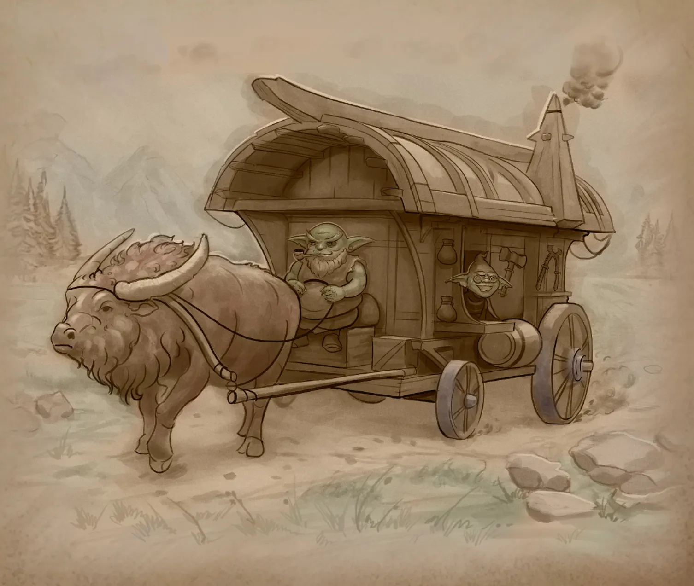
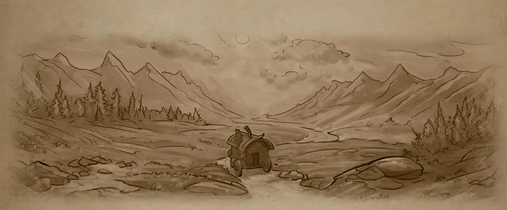

# Master and apprentice

A workshop wagon pulled by a mossy yak rolled slowly along the dusty road leading to the foot of the Seleng Mountains. This yak, a rare breed bred by the goblins of the Zuun Mercat tribe, was the pride and possession of the wagon master. Though much smaller than the wild mountain yaks of the foothills, he was as hardy and more peaceful. He was easy to care for and had often helped Dazar on his long journeys.

  – Ulzar, Coaly seems to sense we're getting closer to home. Look how its nostrils are flaring. That's right, little one; we'll be home soon, – Dazar said to his apprentice and foster son, sitting on the box. 

 – Father, why are we coming home early? We weren't supposed to be back here until early fall, – the young goblin asked, peering out the window at the front of the wagon. 

  – I don't know. In my memory, this is only the second time in history that all traders and darhans of Zuun Merkat have been ordered to interrupt their annual expeditions and return to their homelands urgently. Last time, it was because of the human war that our tribe had to flee its aftermath and look for a new place to settle. So this is a grave matter –  Dazar sighed loudly at these words and began to fill his pipe with tobacco from the pouch hanging from his belt. 

Ulzar knew that if his father sighed like that and began to smoke his pipe, he was thinking about something serious in his head. It was best not to distract him at such times. 

– Ulzar, the time has finally come when you can call yourself a master darhan, – Dazar suddenly announced, shaking the remains of tobacco and ash out of his pipe. – I've taught you everything I know. I would announce it when we got home from our annual expedition. But fate must have wanted it to happen sooner.

– Father...Oh! – Ulzar shrieked, rubbing his head where it had hit the windowpane from which it was sticking out. – I never dreamed of being called a darhan now, not in two years. Thank you, father.   

– You should thank yourself first of all, – Dazar replied with a smirk, – And, of course, you were fortunate to have a mentor who was able to make a master smith worthy of the title of darhan in just eight years from a goblin who didn't know which side to approach the forge. But it's too early to rejoice, Ulzar. Before you can own a workshop wagon, you must honor the tradition of our buhlag. 

Each new darhan must make all the tools for his future workshop-carriage with his own hands. You can use mine for that. When we get home, you can start right away. Hey, did you hear what I said?

But Ulzar was no longer listening to his father. He stomped happily inside the wagon and hummed a cheerful song. Dazar grumbled paternally at his apprentice, who, as usual, had not listened to his long instructions. He would have been glad to give in to his son's cheerful mood, but his inner uneasiness about the reasons for the urgent gathering of the entire tribe prevented him from doing so.  

The dusty road to the foothills of the Seleng Mountains continued to wind ahead of the workshop wagon on which the two darhan masters were traveling to meet their fate. 

