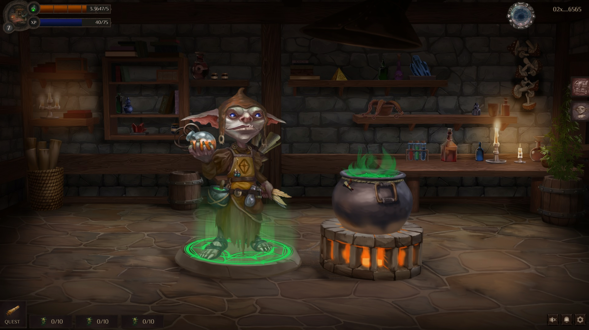

# Мастерская

*"В центре комнаты в большом бронзовом котле на медленном огне варилось зелье Вала. Алхимик из племени Лесных гоблинов внимательно следил за огнем и в определенное время помешивал зелье строго по часовой стрелке.
И, не дай Тара, помешать его против часовой. Тогда недельный труд пойдет коту под хвост..."*

Мастерская это основная игровая локация для вашего Алхимика. Здесь он будет варить основной пул игровых токенов Vala, Miata и т.д. Игроку нужно будет застейкать NFT алхимика, чтоб он смог влить в основной пул свои игровые токены "начал варить зелье". 