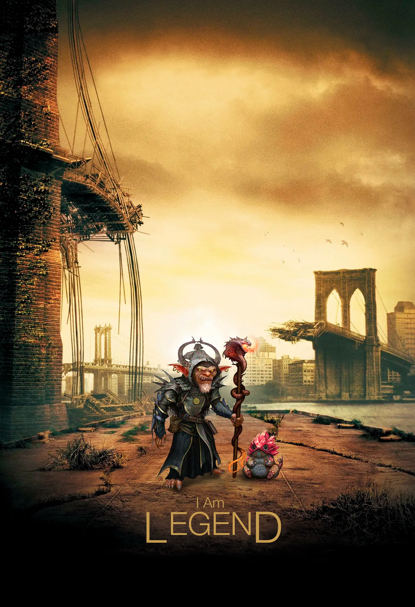
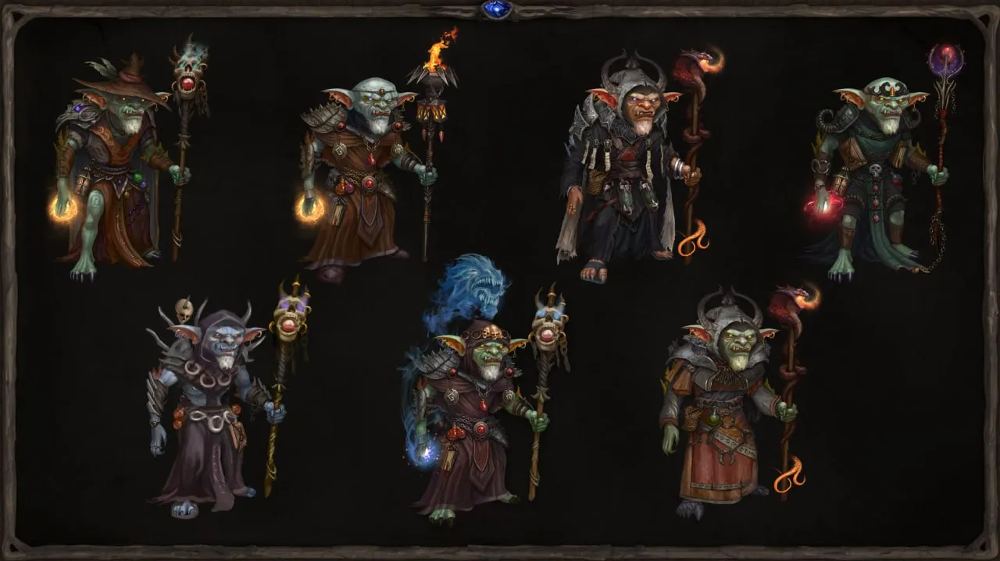

I Am Legend
===========

We want to share the value and utility of our Alchemists. As mentioned earlier (more details in the [article about the Marathon](/@MagicAlchemy/token-and-nft-marathon-by-magic-alchemy-7992d9279312)), the game will feature **4444 NFT Genesis Alchemists**, divided into 4 rarities:

* **Common** — 2222 units
* **Rare** — 1342 units
* **Epic** — 660 units
* **Legendary** — 220 units

The primary value of Alchemists lies in the fact that **only their owners can participate in the core DeFi mechanics of Magic Alchemy.** We position ourselves as a gamified DEX platform, and it seems we’ve succeeded in creating a new gaming genre — **LP2Play.**

In short, the essence of this genre lies in players adding liquidity to the **cauldron (pool)** in the form of game potions (in-game tokens). By “brewing” these potions, they compete for rewards. At the same time, players progress through the storyline using various in-game mechanics. You can read more about the DeFi aspect of the game [here](../MA_DeFi_Part/MA_DeFi_Part_en.md).

Another key feature of the Genesis Alchemists is their exclusivity and the uniqueness of their artwork. Each character has been meticulously hand-drawn by our lead artist, a process that took several months of dedicated effort. No two characters in the game will have the same design — this applies not only to the Alchemists but also to other in-game characters like Repairmen and Gardeners. We’re confident that collectors will be eager to add these one-of-a-kind goblins to their collections.

What are the amazing unique features of Legendary NFT Alchemists? Let’s break it down step by step!
===================================================================================================

**I.** After the Marathon, players will enter a new phase where they can stake their Alchemists and earn rewards in POTION tokens. The reward multipliers will vary depending on the rarity of the Alchemist.

**II.** Different rarity levels of Alchemists determine their stamina levels, which influence how many game tokens can be farmed without a reduction in farming speed. For example, a Legendary Alchemist can farm 14% more tokens without penalty compared to a Common Alchemist. This aspect is explained in more detail in the article about the [DeFi mechanics of the game](../MA_DeFi_Part/MA_DeFi_Part_en.md).

**III.** Only owners of Epic and Legendary Alchemists will have the ability to create guilds within the game. Guilds will have a dedicated leaderboard with seasonal rewards. This makes participation in guilds even more rewarding, as players can earn prizes from both individual and guild leaderboards.

**IV.** Increased POTION rewards. Guildmasters whose guilds secure top positions in the guild leaderboard will receive higher rewards.

**V.** Share of rake from paid games. Legendary Alchemist owners will receive a portion of the revenue from rake in the paid game mode. This mode, similar to the paid mode in poker, will allow players to place bets using our meme token **$RUSK** and compete in the card game *Towers*.

**VI.** Future drops and beyond. Exclusive NFT drops are planned for Legendary Alchemist owners. These drops will extend not only to *Magic Alchemy* but also to future games by the studio!

Alchemists in *Magic Alchemy* are not just game characters but essential elements of the game’s economy and competitive dynamics. Thanks to their utility, scarcity, and uniqueness, they grant access to an exciting gameplay experience while offering numerous opportunities for progression and earning.

We’re confident that every Alchemist owner — be it Common or Legendary — will find something they love in the game, from engaging in DeFi mechanics to collecting one-of-a-kind artworks. Owners of the rarest Legendary Alchemists, however, will enjoy unparalleled advantages, from increased rewards to exclusive features.

*Magic Alchemy* is continuously evolving, and even more content, mechanics, and updates are on the horizon. Stay tuned for news, and prepare to conquer the world of Ji’Da with your Alchemists!
