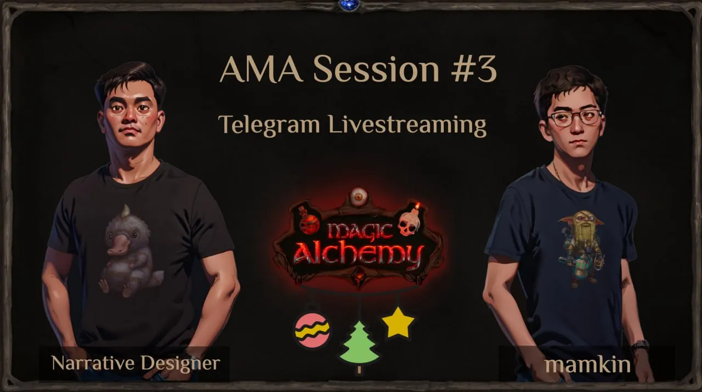

Magic Alchemy AMA Recap (New Year’s Edition)
============================================

Hello everyone! Here’s a quick summary of our third, festive AMA session. If you’re curious for more detailed answers, you can watch the [**full video**](https://www.youtube.com/watch?v=UuPkaIh4TaA) on YouTube.

**00:05 — Starting the AMA: A Look Back at the Year**  
Approximately a year ago, on December 12th, the alpha version of Magic Alchemy was launched. It featured the first card game mechanic and a single location — the Tavern. Players could earn NFT mugs after five victories. Many sold these mugs, while others held onto them, believing in the project.

**01:56 — Magic Alchemy’s Growth and Achievements**  
Over the year, Magic Alchemy has grown nearly **30x** in key metrics, including daily active users (**5,000+**) and monthly active users (**100,000+**). For more insights, refer to the article [*Behind the Scenes*](/@MagicAlchemy/magic-alchemy-behind-the-scenes-workings-october-update-b2d01bf89419)*.*

**02:59 — Goblin Bank TVL Reaches $150,000**  
This figure reflects the trust users have placed in the project and the reliability of the Goblin Bank — the most secure institution in Dji’Da.

**03:57 — The Launch of $RUSK (Community Meme Token)**  
What began as a spontaneous joke has become a surprising success. Despite no formal announcement, **70% of players held onto their tokens**, showing the strength of the community.

**06:31 — Marathon Strategy for Magic Alchemy**  
We’ve prioritized a long-term approach: delivering value before starting sales. This strategy has made $RUSK a win-win initiative, rewarding our community and fostering loyalty.

**09:41 — Key Criteria for $POTION Airdrop**  
The main factors for receiving $POTION include:

1. Participation in the Marathon.
2. NFT ownership.
3. Pre-Marathon staking.
4. Performance in gem leaderboards and point leaderboards.
5. Holding mana crystals.
6. One undisclosed criterion.  
   The goal is to reward active participants and ensure organic growth.

**13:55 — Multi-Account Policy**  
In the **DeFi core gameplay**, multi-accounts are allowed. However, they are prohibited in the Free-to-Play modes. For DeFi, each NFT Alchemist is tied to one wallet, and multiple NFT flasks can be acquired or shared.

**15:56 — Treasury Security Measures**  
The treasury (war chest) cannot be accessed for non-game purposes, ensuring token value stability. All Marathon proceeds are allocated to the treasury.

**17:52 — Security and Audits**  
The treasury is safeguarded by regular audits, reducing the risk of hacking or depletion.

**18:34 — Treasury Price Support Mechanism**  
Token prices are dynamically maintained based on treasury funds. As the treasury grows, the mechanism activates at higher price thresholds.

**20:52 — Alchemist Subsidies**  
The specific amounts for subsidies depend on the number of players and the price of $POTION. These figures will adjust over time.

**21:51 — Purpose of $POTION Token**  
$POTION serves as the backbone of the game’s economy. It’s the main ingredient for crafting potions (liquidity pools) and is required for all in-game purchases.

**29:24 — Future Utility for $RUSK**  
Additional utility for $RUSK isn’t planned unless it can be implemented naturally and seamlessly.

**32:10 — Post-Game $POTION Options**  
After the game ends, players can:

1. Exchange all $POTION for USDT based on treasury rates.
2. Partially exchange $POTION and keep the rest in DAO.
3. Keep all $POTION in DAO.

**36:12 — Prize Fund Formation**  
All profits from NFT sales, marketplace fees, and other sources are funneled into the treasury, growing the prize fund for players.

**39:44 — Magic Alchemy as a Reputation Project**  
For the team and CEO, Magic Alchemy is a flagship case study. It serves as a gamified crowdfunding platform, setting the foundation for future projects.

**41:55 — DAO Governance**  
Decisions on funding and project investments will be made collectively by the DAO through votes and discussions.

**44:33 — New Wheel of Fortune Features**  
The revamped Wheel of Fortune introduces exciting new prizes. Players can increase their odds using scrolls, which can be earned through staking, Soulbound NFTs, or in the clicker game.

**49:03 — Handling Price Arbitrage Between Markets**  
During price spikes, the treasury mechanism may release tokens to stabilize the market.

**51:18 — Seasonal Rewards Distribution**  
Seasonal rewards, including guild and individual leaderboards, are tracked in the metadata of Alchemists and distributed at the end of the game.

**53:45 — Liquidity Pool Caps**  
Players can add any amount of liquidity, but rewards are capped per pool. For example, if the cap is $500 and a player adds $1,000, rewards are calculated on $500, while pool fees apply to the full $1,000. Caps vary by pool.

**55:29 — Airdrop Options**  
Participants can choose:

1. Immediate access to **25%** (with 50% locked until the game’s end).
2. Stake for **50%** plus additional rewards.

**58:14 — Post-Game Utility for $RUSK**  
Yes, players can continue to use $RUSK after the game ends.

**01:00:45 — Grand Card Tournament Details**  
The tournament began on December 30th with a prize pool of **$25M $RUSK** (~$17,000) plus NFTs. Entry is either by ranking in the top 8 during one of four qualifying weeks or purchasing a **battle pass** for 300,000 $RUSK (32 slots available). The final stage uses a Double Elimination system.

**01:03:56 — Player Influence on the Game’s Storyline**  
The storyline is linear and pre-written, meaning players cannot influence it.

**01:05:02 — Guild Sizes**  
Guilds are capped at **15–20 players** for a more intimate experience.

**01:06:08 — Guild Tournament Prize Allocation**  
**10%** of the prize fund is reserved for the guild tournament, with leaderboards tracking collective progress.

**01:08:58 — Treasury Simulation Testing**  
The team spent years modeling the treasury under various scenarios to ensure stability.

**01:11:38 — Hard Floor Mechanic**  
The hard floor is governed by strict mathematical formulas tested under diverse conditions.

**01:12:43 — Treasury Management**  
Initially, the treasury was intended to be automated but will now be manually managed, likely under the CEO’s supervision.

**01:15:47 — Game Completion Definition**  
The game lasts a year, transitioning to DAO governance. Completion occurs when a set number of players reach **level 100**, unlocking endgame content.

**01:19:06 — Deck Composition and RNG Mechanics**  
Decks contain approximately **400 cards**, with expensive cards capped at 2 per deck and others at 3. RNG is unaffected by external factors, ensuring fair gameplay.

**01:23:18 — Project Funding Sources**  
Initially self-funded by the CEO through trading profits, Magic Alchemy later secured **$600,000** from angel investors. The project remains independent of major funds.

**Thank You for an Amazing Year!**  
This year proved that together, we can achieve incredible heights. In 2025, we’ll aim even higher, with new milestones, challenges, and victories.

With love,  
mamkin and the Magic Alchemy Team
