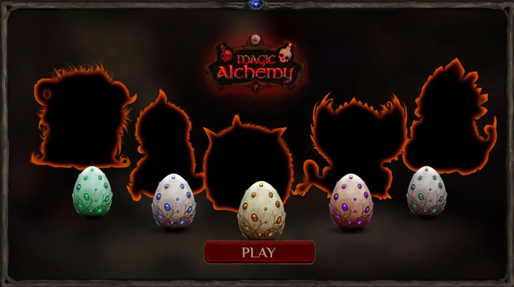
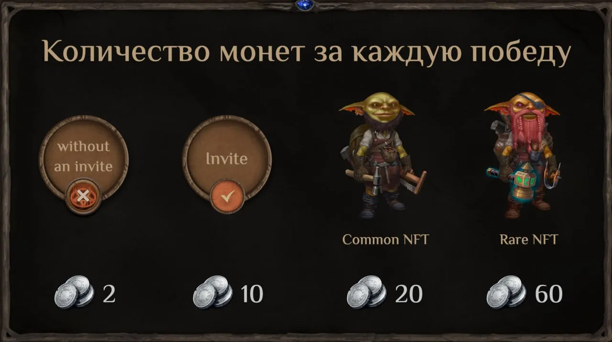
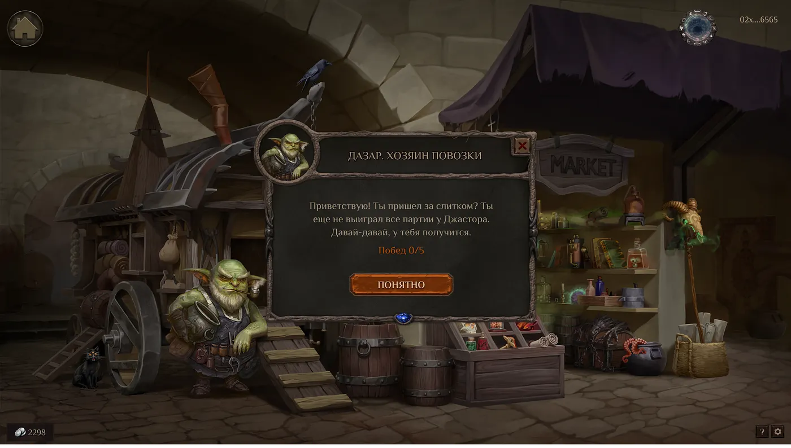
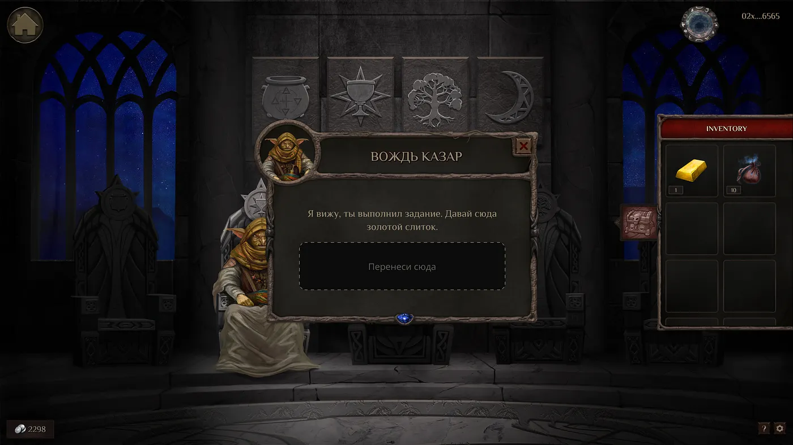
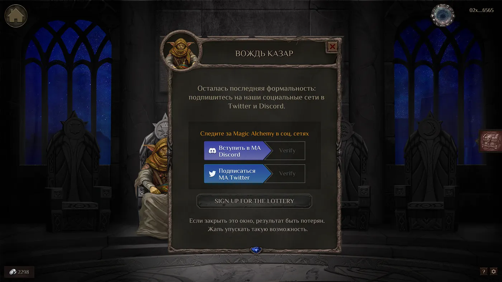
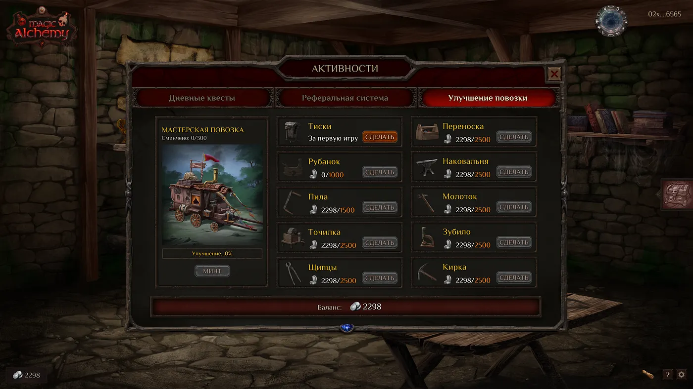
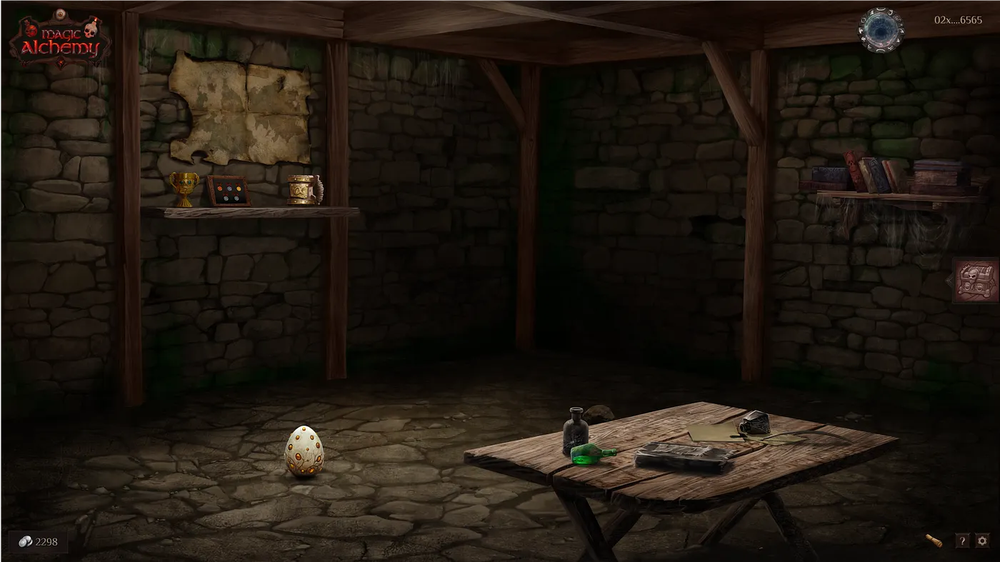
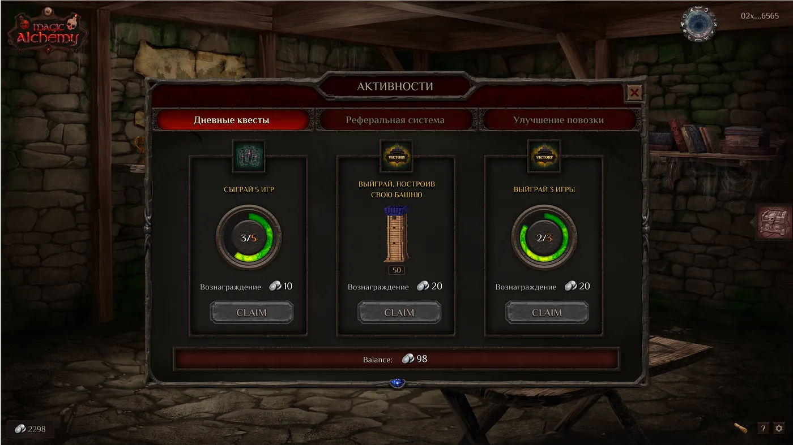
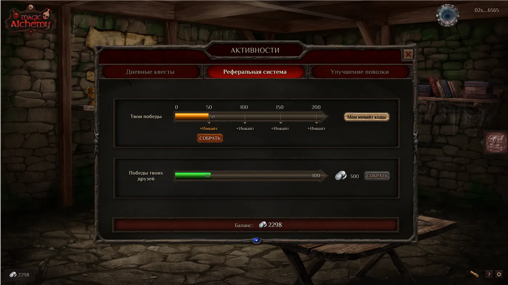
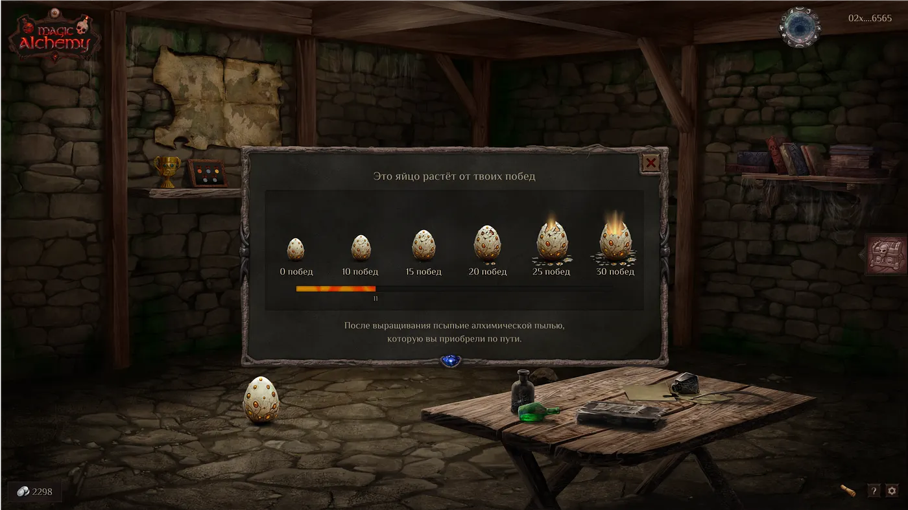

**Magic Alchemy Homecoming**
============================

1

Рады снова приветствовать всех, кто интересуется новостями нашего проекта. Мы завершили очередной этап, Бету, который показал просто замечательные результаты в плане заинтересованности и ретеншена. Естественно, это послужило прекрасной мотивацией трудиться дальше с двойным упорством, чтобы выкатить следующую стадию — Homecoming!

**Ремонтники**
--------------

Итак, отличительной особенностью данного этапа является шанс получить в свое распоряжение NFT Ремонтника из племени Одинокая Луна или Вала’ас Хина, которые прибывают в долину Эхорон, где расположена таверна Fallen Moon.

F2P — это P2E в Magic Alchemy. Ваше время и затраченные усилия конвертируются в серебряные монеты. Вы можете выигрывать их в карты, а ваш NFT гоблин-ремонтник помогает вам получать больше монет за победы. В фазе Homecoming игроки разделятся на 4 категории:

* Игрок без инвайта
* Игрок с инвайтом
* Игрок с коммон Ремонтником
* Игрок с редким Ремонтником

Ваша категория напрямую повлияет на то, сколько серебра вы будете зарабатывать в карточных победах. Также некоторые функции будут недоступны игрокам без инвайтов, например, дейлики и лидерборд. Давайте подробнее об инвайтах и категориях.

Даже если вы новичок, не принимавший участия в Бете и не обладающий инвайтом, вы можете получить его, сделав 50 побед в карты (или попросив в чате — у нас очень отзывчивое комьюнити). Вы также сможете ваши инвайты раздавать.

Все участники Беты автоматически имеют категорию игрока с инвайтом и далее за каждые 50 побед они получают +1 инвайт с максимальным количеством 5, которыми могут поделиться. Если вы пришли по чьему-то инвайту, то раздать сможете 4. Если ваш первый инвайт вы выиграли, то раздать сможете 3.

*Важное уточнение: вы должны переместить вашего Ремонтника из любого племени в вашу повозку, чтобы зарабатывать больше серебра.*

**Как получить Ремонтника?**
----------------------------

Для того, чтобы получить шанс стать обладателем NFT Ремонтника и принять участие в раффле, вам необходимо законнектить кошелек, а также сделать кое-что для вождя Казара, который будет ожидать вас в Зале Старейшин. Он потребует от вас принести ему золотой слиток, который, в свою очередь, можно найти у мастера Дазара, обитающего на Базаре. Великий дархан, впрочем, тоже просто так вам его не отдаст, а предложит сперва победить в карты 5 раз.

*Важное уточнение: как только игрок получает золотой слиток от Дазара, он может выигрывать серебряные монеты в карты. То есть, до получения золотого слитка ваши победы просто копятся. Если вы придете к Дазару с 95 победами, вас все равно поздравят с 5 победами и вручат слиток. За остальные 90 вы ничего не получите. Таким образом, как только выиграете 5 раз, сразу же спешите к Дазару за слитком.*

Как только вернетесь к кузнецу за слитком, он подарит вам еще и магическую пыль, о функции которой мы поговорим позже. Итак, далее вам нужно проследовать к вождю Казару и отдать ему слиток.

Останется только подписаться на соцсети проекта Magic Alchemy и вуаля — задание выполнено, вы участвуете в раффле. Теперь у вас есть шанс получить бесплатного Ремонтника-гоблина, чье племя скоро прибудет в Долину Эхорон.

Всего будет 2 племени и, соответственно, 2 этапа раффла. В обоих племенах будет по 222 NFT гоблина. Если вы выполнили все задания, но вам не повезло с первым племенем, вы автоматически попадете во второй этап. Однако, если вы получили NFT Ремонтника в первый раз, принять участие во втором этапе не сможете.

**Повозки**
-----------

Вы уже знаете, что серебряные монеты будут нужны для покупки различных материалов и изготовления Запчастей Инвентаря. Эти Запчасти создаются в Повозках-мастерских, где денно и нощно будет трудиться ваш NFT ремонтник.

Всего Повозок будет 333. 300 сминтят первые 300 человек, собравшие инструменты на квесте, а оставшиеся 33 мы разыграем среди тех, кто соберет все инструменты, но не успеет войти в первые 300.

От вида Повозки будет зависеть время создания Запчасти. Пример:

* НФТ повозка — 2 часа
* Повозка со всеми инструментами — 6 часов
* Повозка без инструментов — 72 часа

**Комната Гоблина**
-------------------

Первое нововведение, которое сразу бросится в глаза — это наличие у вас собственного хаба. Вы окажетесь там сразу же, как только отправитесь пробовать возможности нового этапа. Теперь это ваша стартовая страница. Конечно, пока что до шикарного пентхауса с видом на всю Долину Эхорон далеко, однако в комнате будет находиться:

1. Полка для NFT кружки
2. Карта мира Джи’Да
3. Библиотека
4. Письменный стол с листами пергамента
5. Некое яйцо
6. Кубок
7. Доска с медалями

У некоторых из этих предметов есть свой функционал, о котором мы поговорим далее.

**Функционал Комнаты Гоблина**
------------------------------

Чем заняться в комнате, пока ждете своего Ремонтника или отдыхаете между партиями в карты? Во-первых, есть письменный стол с пергаментом, где можно посмотреть ежедневные квесты. Их будет три штуки и за их выполнение будут начисляться серебряные монеты.

Во-вторых, в ящиках письменного стола можно найти вкладку с рефералами, где содержится информация о количестве побед и новых инвайт кодах, а также о победах ваших рефералов (в частности, сколько серебра и когда они для вас нафармят).

*Важное уточнение: на новом этапе Homecoming система рефералов была обновлена. Все предыдущие рефералы были сброшены.*

Если у вас нет инвайта, то вкладка с рефералами будет затемнена. Вместо нее будет подсказка шепнуть ваш код приглашения Лилит в Таверне. Все победы рефералов складываются. За каждые 100 побед, сделанных рефералами, вам начисляется 300 серебряных монет.

*Важное уточнение: пока вы не заклеймите монеты, следующие победы не засчитываются.*

Помимо этого, в письменном столе есть вкладка с вашей повозкой и инструментами. При нажатии на кубок вы попадаете в лидерборд, а, взаимодействуя с доской с медалями, можно посмотреть свои достижения.

Пожалуй, самое интересное, что есть на данный момент в комнате — это таинственное яйцо, которое будет требовать вливать в него магическую пыль каждый раз, когда вы будете на него нажимать. После этого, чтобы яйцо росло и развивалось, вам будет необходимо выигрывать в карты. Как только вы выиграете 30 партий, появится опция посыпать яйцо определенным количеством пыли и, когда вы выполните это условие, на свет вылупится ваш питомец.

*Важное уточнение: магическую пыль можно заработать ТОЛЬКО в Колесе Фортуны, которое будет доступно всем игрокам, в том числе тем, у кого нет инвайта. Помимо пыли, в Колесе можно будет выиграть инвайты и серебряные монеты*. *Прокруты Колеса теперь осуществляются за серебро, так что крутите, сколько хотите, пока есть на это деньги.*

**Для чего нужен Питомец?**
---------------------------

Пожалуй, для питомцев даже хочется выделить отдельный пункт. Итак, разумеется, как и любое другое домашнее животное, магического питомца надо кормить и заботиться о нем. Баловать вашего любимца магической пылью необходимо будет беспрерывно на протяжении 5 дней, раз в день, иначе прогресс собьется.

*Важное уточнение: если не кормить питомца 7 дней подряд, то на 8 день он заболевает, а на 15 — умирает. Вылечить питомца можно будет с помощью пыли, однако в случае если он умер, возможно будет лишь купить новое яйцо.*

Как только вы покормите питомца, он осчастливит вас несколькими серебряными монетами, которые выдаст на пол через рандомный период времени. Если вы не заберете монеты в течение 12 часов, они магическим образом исчезнут.

А вот если вы ответственно кормили и заботились о животном 5 дней подряд, он подарит вам яйцо с косметическим предметом интерьера для вашей комнаты и определенным количеством серебра. Всего будет 5 видов магических фамильяров, о каждом из которых мы расскажем в нескольких больших художественных статьях.

**Итоги**
---------

Высокие результаты Беты показали, что очень многим нравится как задумка, так и реализация этапов нашего проекта. Freemint — это очередной важный шаг, который мы рады делать вместе с вами, нашим сплоченным и замечательным комьюнити. Так что мы продолжаем вводить новые механики, улучшать уже имеющиеся и радовать вас только положительными изменениями!

Не забывайте подписываться на соцсети проекта Magic Alchemy: [Twitter](https://twitter.com/magicalchemydao) | [Discord](https://discord.gg/MMdJ9zw6cc) | [Telegram](https://t.me/btcbabytrader)
