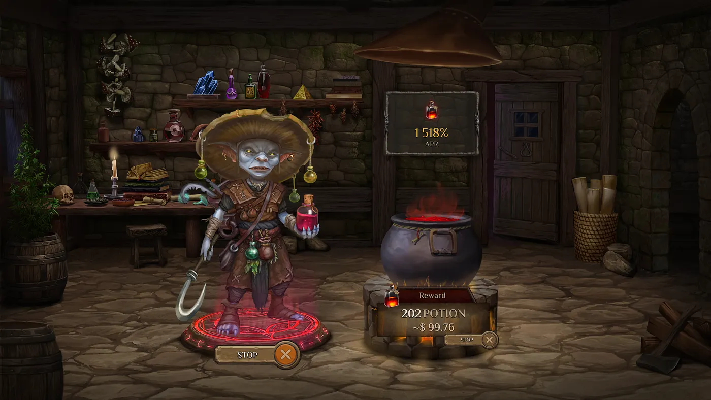
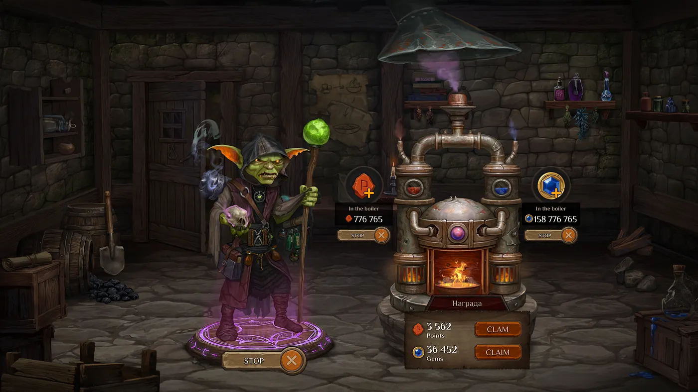

New mechanics of farming Gems and Points
========================================

Greetings, Alchemists!

As the marathon approaches, our team has decided to reveal new game mechanics that will be introduced after the marathon. One of the first, along with the already known event “Ready Alchemist One!” will be the ability to increase your number of Gems and Points (Red Runes). Let’s take a closer look at this.

During the RAO (Ready Alchemist One) event, your main location will be the Workshop. You can learn more about the FAGR stage in our dedicated [article](../Post-Token_and_NFT_Marathon_Stages/Post-Token_and_NFT_Marathon_Stages_en.md) on the post-marathon stages.

In short, in the Workshop, you will be able to stake your Alchemist, and in return, you will receive rewards in the form of POTION tokens. These tokens will come from the DAO reward pool and can only be used after the game ends. All information about the amount of POTION earned by the player during the RAO stage will be recorded in the NFT Alchemist’s metadata.

We’ve repeatedly mentioned that it’s more beneficial to withdraw deposits from the Goblin Bank and use them during the marathon. This will allow you to receive more rewards in the form of Essences, Gems, and Points compared to keeping funds in the bank.

However, receiving Gems and Points regularly is also an attractive opportunity. Therefore, we’ve found a solution to this dilemma, even after your deposits have been used during the marathon. And we think it’s a very interesting one.

Farming Gems & Points
=====================

In the Workshop during the RAO stage, two additional sub-locations will appear: the Small Workshop and the Experimental Lab. The Small Workshop will feature the new game mechanic for increasing Gems and Points. We will discuss the functionality of the Experimental Lab later.

In the Small Workshop, players with an NFT Alchemist can stake it, and by adding Gems and Points to the Alchemical Generator, they can begin to receive additional Gems and Points. The amount of Gems and Points received in this way will be quite generous. We are confident that players who take advantage of this mechanic will significantly improve their positions on the **Alchemania** and **Brew or Die** leaderboards.

With the introduction of this new mechanic, we are giving players the opportunity to decide how to best utilize their Alchemist:

* Stake it to receive POTION tokens, which can be used only after the game ends.
* Increase the number of Gems and Points, thereby improving their chances of earning a larger share of the airdrop, which will be available immediately upon the game’s release.

**P.S.** As we initially mentioned in the article about the post-marathon stages, where the possibility of adjusting NFT Alchemist staking coefficients was discussed, we are making a small adjustment. The staking coefficient for the Epic Alchemist during the RAO stage will be reduced from 5 to 4.

FAQ
===

At the end of the article, we would like to answer some questions that you are likely to ask.

**Can I stake two NFT Alchemists in the Workshop and the Small Workshop at the same time if I have two of them in my wallet?** Yes, you can take advantage of all the staking benefits of both Alchemists.

**How many Gems and Points do I need to add to the Alchemical Generator to start receiving rewards?** Players can add **any amount** of Gems and Points. The more you add, the greater your rewards will be.

**Can I add more Gems and Points if I already have some in the Alchemical Generator?** Yes, players can add additional Gems and Points at any time.

**Does the rarity of my Alchemist affect the number of rewards when staking in the Small Workshop?** No, the rarity of the Alchemist does not affect the rewards. The number of rewards only depends on how many Gems and Points you add to the Alchemical Generator. However, the rarity of the Alchemist will influence the RAO event and the reward [coefficients](https://miro.medium.com/v2/resize:fit:1400/format:webp/1*NeaeY-NG80wso10WnCMhpw.jpeg) in POTION tokens.

**Is it necessary to add both Gems and Points to the Alchemical Generator to receive rewards?** No, you can add only one type of resource — either Gems or Points. In this case, rewards will only be accrued in the selected resource.

**Can I use the Alchemical Generator without an Alchemist?** No, the generator will only work if you have a staked Alchemist.
