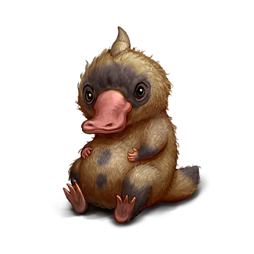

О существах магических
======================

Данная информация по вновь обретенным магическим существам составлена на основе немногочисленных сохранившихся древних записей и дополнена исследованиями члена Верховного Магического Совета Академии Анкорлана, Виталиусом, а также ученых Ордена Ищущих Истину. В древних хрониках не указано, для каких целей содержали магических существ. Тем не менее, неоспоримым фактом является то, что все они были ручными фамильярами магов и алхимиков прошлого.

Магидак
-------

Это удивительное животное жило в лесах ныне исчезнувшего острова в южной части Моря Забвения. Доподлинно не известно, птица это или млекопитающее. Кто-то склонен считать магидаков результатом экспериментов великих алхимиков прошлого.

Магидаки обладают сверхъестественным чутьем на драгоценные металлы и камни. Возможно, в прошлом их использовали в этих целях, так как были найдены древние свитки с изображением магидаков и гномов, трудящихся в шахтах. Все обнаруженные драгоценности магидаки сразу же пытаются спрятать в своем жилище. Поэтому не удивляйтесь, если из вашего дома вдруг начнут пропадать столовое серебро или фамильные драгоценности. Вы знаете, где их нужно искать.

Магидаки обладают крайне любопытным характером. Они прям как дети — любят совать свой клюв куда не следует и обожают воду. Будущий владелец должен оборудовать дом, в котором планирует содержать Магидака, открытым бассейном. На худой конец сойдет и крупная ванна. Единственное, скорее всего, вам самому придется искать новое место для мытья. Тому есть несколько причин, перечисленных далее.

Магидак предпочитает жить один. Попытки держать вместе нескольких особей приводили к постоянным дракам. Рьяно отстаивает территорию, которую считает своей. Вас не должны ввести в заблуждение его милая внешность и миролюбивые повадки. В обращении с Магидаком нужно быть предельно аккуратным, так как небольшие когти на его милых лапках содержат смертельный яд.

Достопочтенным гоблинам-алхимикам с трудом удалось подобрать противоядие к яду Магидака. В процессе, к сожалению, погибло несколько гоблинов-добровольцев, вызвавшихся послужить делу великого искусства алхимии.

Даже я, Легендарный Виталиус пал жертвой очарования данного существа. Из-за своей невнимательности мне пришлось проваляться несколько дней с сильной лихорадкой от пореза, оставленным его коготками.

После этого инцидента мне приходится более внимательно относиться к своей защитной экипировке и следить, чтобы при посещении вольера мое тело было полностью закрыто. Увы, как бы мне ни хотелось погладить Магидака по удивительно шелковистой шерстке, отныне делаю я это исключительно в защитных перчатках.
