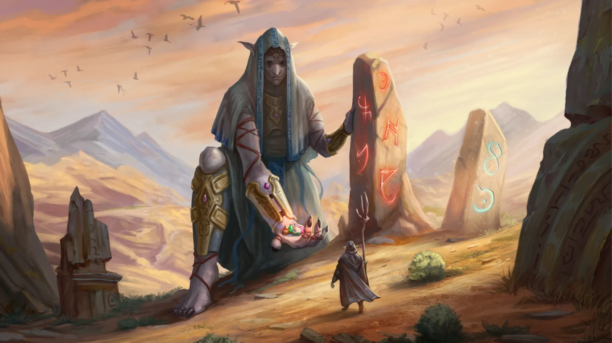

# History of the alchemical elements. Part I

### Aurorite — the element representing light and colors.
When the world of Djii’Da was created, Yueve was the one who gave it the most important thing — light. Then, all the Tara saw the beauty of the heaven they had created. They laughed and felt the happiness of the moment of the world’s birth. Driven by sincere and warm feelings, Yuewe wanted to express this moment.

He directed the beam of light to the earth, and when it touched the surface, it shattered into myriad fragments, which were scattered all over the world. The shards reminded all the children of Dji’Da of the importance of giving light to others.

### Huseluit — the element that binds mind and thoughts.
After the defeat of the god Adomion, multiple cataclysms struck the world of Dji’Da. Survivors recalled with primal fear the days of the Celestial Rains, when thousands of meteorites fell from the heavens, bringing death and destruction. Years later, the dwarves discovered a new element in the meteors and named it Huseluit. This element carries the bitterness of loss and hope for the future.

### Yuevius — the element that embodies the infinity and scope of the cosmos.
The foundation of the world, laid by Yueve and stored under the deep waters of the oceans, was inaccessible to the children of the gods. But terrible cataclysms after the war with the Mad God changed the shape of the continents, and a part of the world’s core rose from the seabed. So, the once-inaccessible element was revealed to the people of Dji’Da.

### Atano — the element symbolizing the connection to flora and fauna.
When Liere gave time to the children of Dji’Da and made them mortal, Atanoel tearfully begged her sister to preserve the eternal life of her elf children. The goddess’s tears rained down on the continent, merging with nature and giving the world a new element.

### Gazarium — the element of earth and stability.
Gazarium is a fundamental earth element sent down by Gazar to his children, the dwarves. “The mountains are your home, your defense, and your treasure. Descend into the depths and reveal your skills to the world through the heart of the mountain,” the god of solid earth and metal bequeathed to his children. In alchemy, Gazarium stabilizes the other elements and gives longevity to the results of alchemical research.

### Mendelefit — symbolizes secret knowledge and magical wisdom.
Tara Mendelef, as guardian of knowledge, saw to it that the goblins pursued wisdom and learned the world of alchemy. One of the last gifts Mendelef made for his children was Mendelefit, an alchemical element that grants insight. No one knows exactly what lies behind the inner light of each stone, as the result of insight is always individual.

### Lierius — symbolizes the depths and mysteries of water.
Although Liere did not create children for herself on the continent, being the ruler of the seas and oceans, she still gave life to all sea creatures. Though they may not be endowed with reason, they still, like the world, carry within them a divine origin. Lierius is an element derived from the bone skeletons of ancient sea creatures.

### Mundonite — the element of wind, storms and elemental power.
When Mundo proclaimed the Orcs as his children and instructed them to respect and honor strength, one of his descendants shouted into the sky, “How should we worship strength if our father is a coward who does not show his face?”. At that moment, outer space was nearly torn apart by the loud laughter of the warrior god. Turning his fist into physical form, he struck the ground beside his children. The vast area of impact became the primary source of the Mundonite element, and the orcs no longer dared to doubt their creator but secretly longed to match his strength someday.

### Levitas — the element of illusion and deception.
The discovery of a new element of the Mendelef table belongs to Levi, an ancient magician who lived at the dawn of the New Age. In the ancient chronicles, there are practically no records of his experiments. The few that have survived were encrypted by Levi himself. For many millennia, no one could decipher them until alchemists from the Zuun Mercat tribe found the key to his cipher and repeated his magical experiment.

### Arcanum — the mysterious element associated with magic and secrets.
Mages from the Academy of Bizaria, while researching a tablet written in the language of ancient runes, came across a mention of magical stones that enhanced the power of the mage who used them. Scientists spent many years searching for these stones until a research expedition in the north of the Zayan Mountains discovered them. It was in experimenting with these stones that Arcanum, an element associated with magic and riddles, was found.

### Crystalline — the element symbolizes the purity and perfection of crystals.
Back in the Golden Age, the best alchemists of the Goblin people and dwarven masters of rune magic decided to combine the radiance of Aurorite with the hardness of Gazarium in their experiments. This is how they obtained Crystalline. The great dwarven masters of the past, using Crystalline, were able to create a metal that would later be called Mithril.

### Seraphine — the element of air, symbolizing its pervasive nature.
Seraphine is an alchemical element that the past alchemists learned to extract from the air. In their records, they believed it to be a direct manifestation of Tara’s will and named it Tara’s Breath. It hovered everywhere in the airy realms of the world of Dji’Da. The alchemists of ancient times believed that the air of the mountain peaks was particularly charged with the energy of the original Mana Flame of the Great Tara.