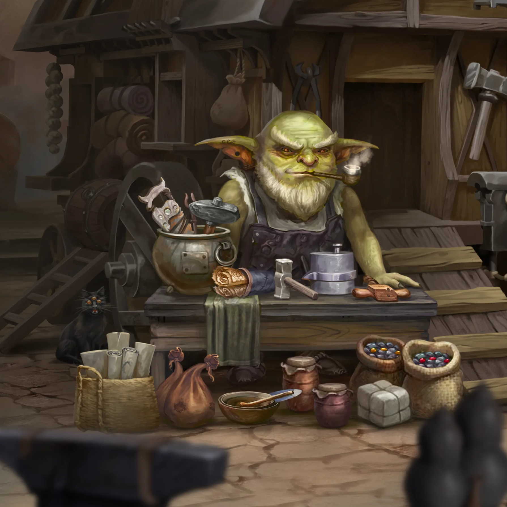
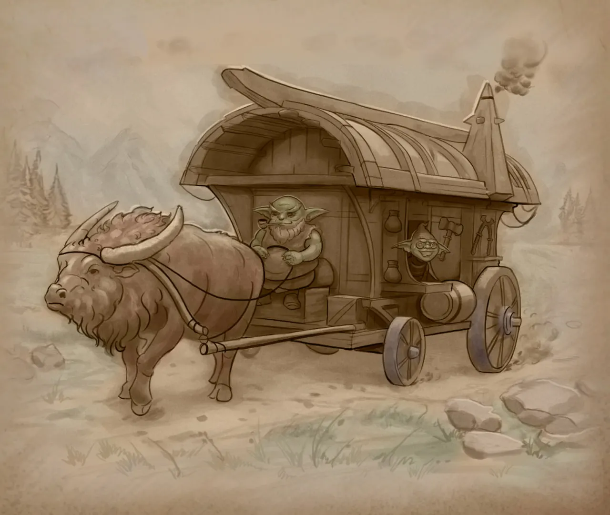

# Dazar and Ulzar’s story
## Dazar master-darhan

Dazar is a goblin craftsman from the Zuun Merkat tribe. In his youth, he traveled with other tribe members across the continent of Khela in trade caravans.

Once, while wandering in the mountains of Caldania, Dazar met the dwarf smith Hirgad, who was one of the master smiths of the Iron Throne Artel. He recognized the goblin’s talent for crafts, including blacksmithing, and agreed to take him on as his apprentice.

Every year for seven years, Dazar visited Hirgad with his caravan and continued training. The knowledge and skill he gained made the goblin one of the most capable darhans of the tribe.

Dazar traveled the world for years, offering his services to all the goblin tribes. Alchemists lined up for him, needing to repair and craft various instruments.

And now, in his old age, he rides his workshop wagon through all the continent’s lands. Dazar trains talented young goblins in blacksmithing and looks for someone who could be a worthy darhan to replace him.

## Ulzar — a young goblin apprentice

Ulzar is a goblin of the Lonely Moon tribe. As a child, Ulzar lost his entire family. The Orcs of the Northern Horde slaughtered the settlement they lived in during another military raid on the lands of the Sandorn Kingdom.

Ulzar is the only one to have miraculously survived this tragedy. He was wandering in the crowd of refugees along the Northern Tract when a passing goblin happened to see him.

The hungry and ragged child was rescued and sheltered by Dazar, the darhan of the Zuun Merkat tribe. Like all other refugees, he was eager to get to the nearest town, Pordford, hoping to escape the onslaught of the orcs.

While waiting outside the city walls for the orcs to attack, Dazzar, to distract Ulzar from his troubled thoughts, had him help with smithing. After a while, the young goblin showed genuine interest in blacksmithing.

So when the time came for the old darhan to return to his homeland in the Seleng mountains, he invited the young Ulzar to go with him. He agreed, for nothing and no one else had kept him in these northern lands.

After many years, Ulzar is the master-darhan’s most able apprentice.

Dazar has become a true father figure to the young man, and Ulzar dreams of becoming a great darhan like his teacher.
