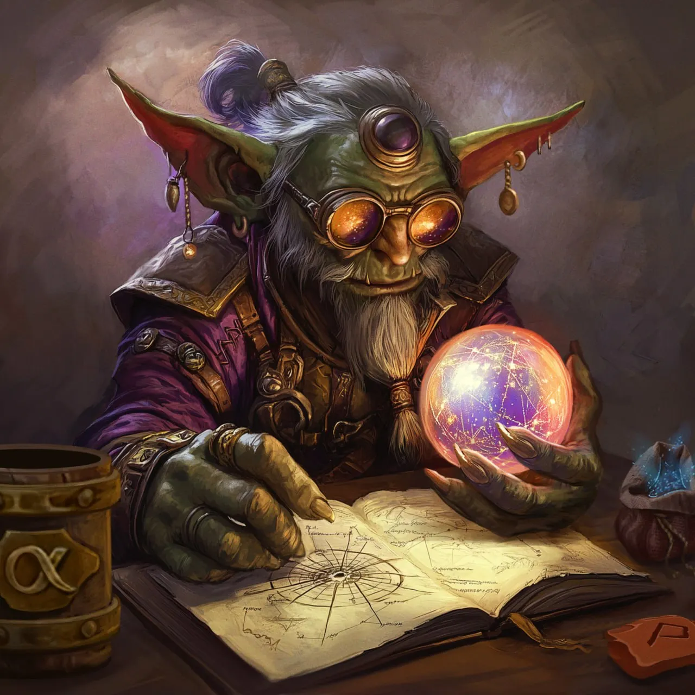

# История Глоба

Глоб – это гоблин из булэга Алхимиков, который посвятил всю свою жизнь изучению мистического магического искусства, астрологии. Древние маги и ученые давно предположили, что существует прямая связь между движением небесных тел и многими событиями мира Джи`Да.

На основании древних магических трудов и собственных наблюдений, Глоб вывел, как он утверждал, универсальную магическую формулу, которая по положению звезд на небосводе позволяла предвидеть будущее. Глоб решил, что раз лишь ему доступны эти знания, то он сможет обогатиться, поэтому он открыл лавку по продаже предсказаний и прогнозов недалеко от таверны “Fallen Moon”.

Теперь каждый мог узнать свою судьбу, но почему-то очередь из желающих воспользоваться услугами Глоба не появилась ни на первый день открытия, ни через месяц. Редкие клиенты, которые посещали его лавку, были в основном молодыми парочками. Все, что их интересовало, это сколько у них будет детей и когда им стоит сыграть свадьбу. И все в таком духе.

Глоб не мог понять, почему он должен предсказывать такие ничтожные, по его мнению, вещи. Где великие мира сего, просящие узнать, чем закончится очередной их военный поход? Где известные торговые магнаты, просящие узнать цену на шерсть или зерно, которая будет через год? Где все эти люди?

Вот с такими переживаниями и мыслями Глоб часто стал заходить в таверну “Fallen Moon”. Видимо, ответ он решил искать на дне стакана, а не вопрошая у звезд.