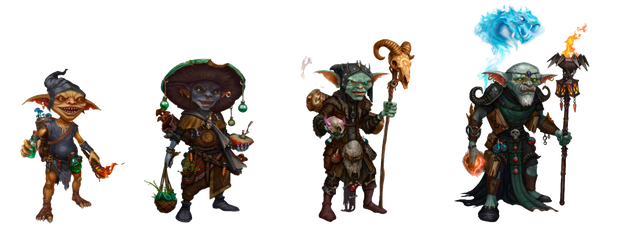
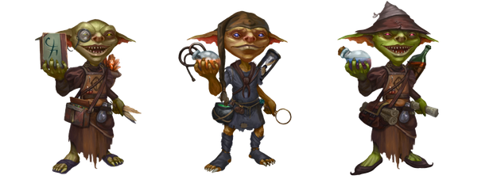
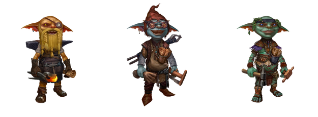
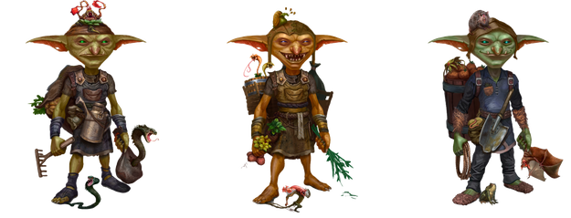

# Characters

## Genesis Alchemist

- Core Gameplay (DeFi )
- Main Character.
- A limited supply.

## Basic Alchemist

- Core Gameplay (DeFi ) Main Character.
- An unlimited supply (quantity depends on New Players).
- Is sold during the game at auctions.

## RepairMan

- F2P gameplay Main Character.
- Free NFT Character.
- Genesis RepairMan has a limited supply.
- Freemint Genesis RepairMan receives more Silver Coins for winning the card game (differently for common and rare).
- Basic RepairMan has an unlimited supply.

## Plodder

- Core Gameplay Subsidiary Character.
- An unlimited supply.
- Allows the Alchemist to enter the game less often by performing actions for the player.
