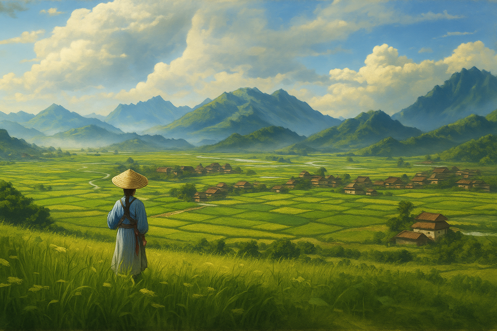

# Countries of the Khela continent
## The Dudzhun Empire
Its convenient geographical location, climate, and abundant nature created favorable conditions for the development of the largest and strongest state on the continent. Dudzhun abounds with vast plains of rice paddies and endless steppes where countless herds of horses and sheep graze. People settled freely over vast areas of the Great Southern Plain.

The country is renowned for its skilled jewelers and cabinetmakers, and silk products from the capital’s weavers are worth their weight in gold.

The history of the Dudzhun Empire is full of controversy, military conflicts, palace intrigue, and colorful personalities. The ruling dynasties of emperors succeeded each other incessantly.

Only the current Dao dynasty has managed to keep power in its hands for over six hundred years. The reigning Emperor Leo Paul the Seventh rules the state with an iron hand from his Amber Palace. His authority extends unchallenged throughout the Empire.

## The Kingdom of Erteland
It is a kingdom in the east of the Khela continent. As the chronicles indicate, the first people to discover the continent of Khela at the dawn of the New Age landed on these lands. The kingdom’s nobles consider themselves direct descendants of those early settlers, and the Merakith royal dynasty is the oldest on the continent.

To the north of the kingdom are the mountain ranges of Nornia, rich in gold and silver, and to the east, in the mountains of Coldania, are iron and gemstone mines. But even before the first humans, these mountains were inhabited by dwarves, who were not thrilled with the arrival of new inhabitants.

Much blood was spilled on both sides at that time for the right to possess the riches of the mountains. Some of the foothills of the Nornia Range have gone to humans after all, but the dwarves of the Iron Throne hold sway in the mines of Coldania, which suits both sides just fine.

As the famous saying goes: “A poor peace is better than a good war.” Following this, people and dwarves try to maintain this poor peace. Through trade with the dwarves of the Iron Throne, the Kingdom of Erteland has become one of the wealthiest nations on the entire continent.

## The Theocracy of Leria
The Holy See rules the state — the Church of the One Sun God — from a capital city called Whitesteel. This religion emerged at the end of the second millennium of the New Age, when belief in the ancient gods had become forgotten, and their names and deeds were remembered only by the dusty pages of old chronicles.

The Church of the One Sun God said that the ancient gods were not divine entities but served as apostles of the One Sun God. All nations are his design and creation, and he has prepared a mission and a test for each of his children. The Church’s primary mission is to convert all sentient races to believe in One Sun God, as the sun shines for everyone.

The Church was widespread and influential in many countries but had real power only on the territory of Leria. This power was vested in the Church by the ancient ruling dynasty of the Lerian kings over three hundred years ago.

The then King Piyen the Third, later consecrated a saint, was always a very devout man. After the death of his wife, he was mentally troubled and withdrew entirely from governing the country. He resigned from his governor duties and gave all of Leria’s power to the Holy See.

Piyen stripped all his children of their titles and became a novice in the Monastery of the Sun God. After that, the country was shaken by a civil war for over twenty years, in which the Holy See emerged victorious.

All people can get along peacefully in Leria. The main condition is to be an obedient follower of the Church and to believe in the One Sun God. And for those who do not share the ideas of the Church, there is always room in the dungeons of the Order of the Inquisition.

## Ankorlan
The country is named after its capital. In the northern part of the continent is the oldest and greatest fortress, the Ankorlan Fortress.

The imposing and impregnable citadel, which has withstood nearly a hundred sieges, was built with the help of magic in pre-New Age times, that is, over four thousand years ago. It rightly makes Ankorlan the oldest human city in existence today.

The first people to arrive here during the migrations and conquest of the Khela continent found the fortress almost intact but abandoned by its former inhabitants.

Ankorlan is rich in forests. Here grow the ship pines from which the world’s most vital ships are built. This region is also the source of the Earth’s Tears, which surface in the northern provinces and serve as the material for lamp oil.

A Council of High Lords governs the state. Ankorlan is also home to a magical order with its academy. It was created just after the first state was established in the territory. This order is not as old as the one in Bizaria but has as many mages and sorcerers.

## The Union of Invia
The Union of Free Lands. Each Land is governed by its burgomaster and council of heads of municipalities and has independent economic and commercial activities. Only in times of war does control pass to a chosen warlord among the captains of the freelance teams.

The Invia Union has long been covertly called the Country of Mercenaries. Invia’s freelance mercenary teams have earned a reputation as desperate fighters and true professionals on the battlefields all over the Dji’Da world.

It is up to each team to decide how to replenish their ranks. The Golden Lions, for example, only recruit residents of Barolya Land. The mercenaries of Papa Hoffman’s Team take on anyone. The main thing is to survive three rounds of combat against a veteran teammate.

Freelance team rates are the highest on the continent. However, if you need to raise an army of veterans ready to give you instant victory on the battlefield, you know where to find them. They are fearless in standing on the foot in the field under cavalry attack. They hold the line as well as the dwarven Iron Hird. They can endure a march through impenetrable forests for several days. True, mercenary teams are pretty expensive, but they are effective.

The main thing is that you should always have a ringing coin with you to pay for their services. Everyone knows there is nothing less permanent in this world than a freelance team not getting paid on time.

## The Kingdom of Aferia
The Kingdom of Aferia looks out over the Sea of Storms, wedged between the states of Invia and Mitremar, and shares southern borders with the Balkh Khanate. In the whole continent, only the royal house of Aferia is allowed to trade with the elves of Mitremar. The fact is that a distant ancestor of the reigning Queen Taishet don Parlank the Fifth helped the elves during the Great Drought.

In gratitude, the elves granted the descendants of the King of Aferia the right to trade with them. This unique opportunity has allowed the kingdom to increase its wealth.

The capital of Oulet covers both banks of the River Fenfri. The bustling and lively trade continues daily in its enormous bay, always full of foreign ships.

For the last hundred years, Aferia has been engaged in border wars with its assertive and belligerent neighbor, the Balkh Khanate. For Balkh, Aferia and its riches have always been a tidbit. The khans of Balkh have long openly declared that they want to make the royal dynasty of Parlank their vassals.

However, the gold earned from trade with the elves allowed the rulers of Aferia to hire free teams from the neighboring state of Invia. These mercenaries have consistently earned wages, so Balkh’s military campaigns have never resulted in victory.

## The Kingdom of Mitremar
The kingdom of the wood elves. The country is ruled by Queen Merael Nieuwen, the Bright-eyed daughter of Filvendor the Pious, Keeper of the Tree, whose beauty and wisdom are admired by the bards of the entire continent of Khela. The ballads compare her beauty with the sunrise on the shores of the Etrean Sea, and her wit and wisdom with the sharpness and grandeur of the old Mountains peaks.

Like the elves of Adriennel, the forest elves are strict about maintaining their forests and territories. In ancient times, humans attempted to take over Mitremar, but the power of elven warriors and magic defeated them.

For its part, the kingdom of Mitremar has never attempted to invade neighboring lands, always remaining only within the boundaries of its forests. Over many generations, people have become accustomed to this way of life, so nowadays, they only send trade and diplomatic missions to the evergreen forests of Mitremar.

## The Kingdom of Hada-Nor
During the Wars of the Survivors, the dwarves of the Khela continent took refuge in the mountains of Koldania. In this impregnable chain of mountains, they created an underground kingdom with Cormard as its capital. Their subterranean domain extends many miles into the depths of the mountains.

The dwarves of Hada-Nor do not like to leave their domain and have little interest in the affairs that take place in the world on the surface. Only during the war with humans over the lands of the Nornia Ranges in the first millennium did an army of dwarves leave the confines of the Koldania Mountains.

After the end of those wars, the dwarves established peaceful trading relations with the people of the Kingdom of Erteland — to the mutual benefit of both sides. And it is mainly due to trade with Hada-Nor that the kingdom of Earteland has become so prosperous.

The products of Hada-Nor mountain masters are highly valued all over the world. And while the quality and durability of the products of Bayan’Gol dwarves are not inferior to their eastern brothers, the dwarves of Hada-Nor surpass the dwarves of Bayan’Gol by a head. Even the simplest kitchen knife created by the smiths of the Iron Throne looks like a real work of art.
Now, on the Iron Throne sits and rules King Ganund the Wide, a member of the ancient royal dwarven family of Hada-Nor.

## The Balkh Khanate
These lands’ mountains were rich in minerals, and the valleys were fertile. Since ancient times, the first settlers who came to Balkh were provided with clay, stone, metals, and other living necessities.

All this allowed many ancient and rich cultures of the Khela continent to grow and develop rapidly in these lands. Many kingdoms and empires were born and perished on the vast plains and highlands of Balkh, but eight hundred years ago, an alliance of tribes was formed, which later became a single state — Great Balkh.

After surviving for six hundred years, Great Balkh disintegrated into two states in a noble rebellion: Balkh and the Emirate of Eastern Balkh. These events are detailed in “The History of the State of Balkh. Dawn and Dusk” by the historian Varenius of Asek.

Regular wars between countries that were once one state have been going on for two hundred years, with varying success on both sides.

## The Emirate of Eastern Balkh
A country formed during the rebellion of a group of noblemen from the eastern provinces of Balkh. The conflict arose over two hundred years ago over the refusal of Khan Osman the Fifth to recognize his eldest son by his first wife, the daughter of the great Emir of Lani. The Emir was the wealthiest nobleman in Balkh, with an ego as big as his fortune.

This incident and higher taxes on goods from the eastern provinces triggered a palace coup. An internecine war broke out, leading to the division of the Khanate into two separate states.

The wealth of Eastern Balkh has long been based on agriculture, horse breeding, and trade. The most important trade route between the Dudzhun Empire and the Great Balkh passed through its territory.

Trade caravans crossed the sands of the hot deserts to bring spices, precious timber, silk, amber, and other goods from the Dudzhun Empire to Balkh. From the Emirate, the best horse breeds in Khela were herded into the Empire, and the most valuable Lanian marble, jade, lapis lazuli, alabaster, and carpets known far beyond the borders of Balkh were also exported.

## The Hidden Valley of Echoron
The land that was in the valley hidden by the Castle Mountains. For thousands of years, no mortal knew of Echoron’s existence.

The mountains rise for miles in the air. Bottomless abysses, endless labyrinths of caves from which even dwarves could not find their way out. The fogs that hung thickly in the mountains, never dissipating, made it impossible for travelers to find their way among the mountains.

Only recently, one of the goblin search parties found a way into this valley among the underground caves. They discovered the abandoned ruins of an ancient Golden Age goblin city there.

