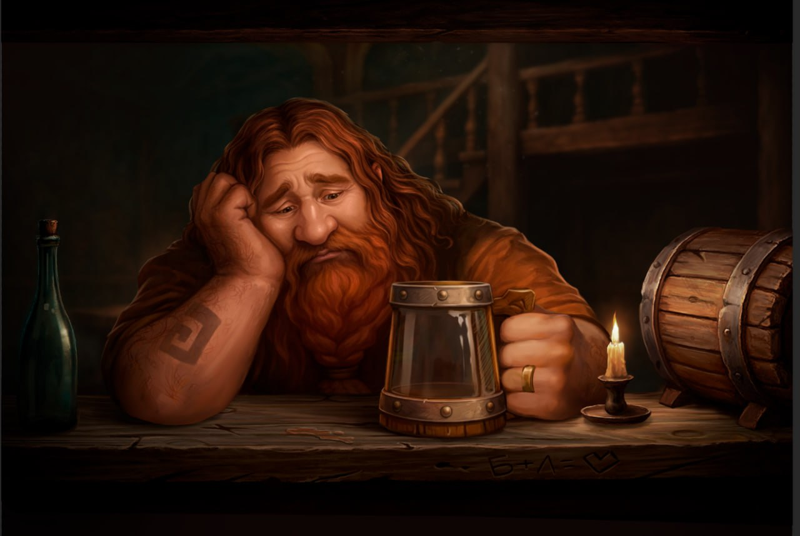
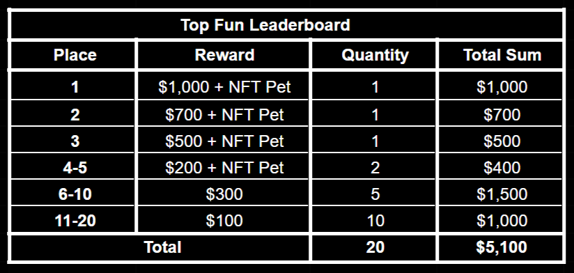

# PvE Event: "The Drunken Master"

*Tormin, Tormin Bayeshall has come through our door,  
With goblin caravans he crossed lands and shore.  
From beyond the blue waves where Bayan’Gol stands tall,  
The call of long wanderings led him to Echorn’s vale,  
Where moonlight on FallenMoon softly shimmers and pales.*  

*Weary from the road, dust clings to his boots,  
Yet fire lives in his eyes – the thrill of chance and loot.  
Come closer, say “hello”, take a seat at his table slow – 
Sometimes something great begins with words spoken low.*  

Greetings, Seekers of Truth and alchemists of the people of Mendeleph!

Recently, an unusual guest appeared in the Fallen Moon tavern – the dwarf Tormin Bayes-Hall. He calls himself a master of dice games and is very saddened that no one in Echoron plays this game, which is so popular among his people. Therefore, he sat at the bar counter with Bugbear, sharing his annoyance and sorrow with him.

After holding the "Dusty King" event, we received extensive feedback from our community, so we decided to refine the PvE event mechanics.  We want to end up with a more understandable and dynamic game mode that we can use in the release of Magic Alchemy and in subsequent games.

Therefore, we announce a new event – **"The Drunken Master.**" This is a cooperative competitive PvE event where our entire gaming community must unite to help Tormin Bayes-Hall, the Dice Master. We need to urgently cheer up our dear guest, for goblins have always been famous for their hospitality!

## Mechanics
You will have to buy drinks for our Dice Master to cheer him up. To do this, you need to find him at the bar counter and treat him to a drink.

You can choose to treat Tormin to **Mead, Pale Ale, or Stout** brewed according to Bugbear’s special recipe.

All these drinks must be purchased with USDT. For each use, players will receive an instant reward – a guaranteed ticket to the Final Draw.

You can also buy an **"Intoxication Boost"** for 20,000 $RUSK. It lasts for 24 hours and gives **+20% to Fun Points.** Accordingly, the player will be able to receive more rewards for treating him.

## Individual Fun Scale and Mystery Box

For every PvE event participant, upon the first treat given to the Dice Master, an individual fun scale will open. It reflects the total Fun Points of the player and their referrals at the current moment. The point accumulation progress does not reset daily but accumulates until a certain amount is reached.
When filling the scale to **5000 Fun Points**, the player receives a **Mystery Box**. Upon issuance, the scale resets, and the player can fill it again. We have removed the daily limit on receiving them. Players can now receive an unlimited number of Mystery Boxes.
In this event, there will be only one type of Mystery Box containing the following rewards:

**Mystery Box (5000 Fun Points mark)**
* 🎟️ Guaranteed: 5 Tickets
* ✨ Guaranteed: 3 Essences
* 🎲 Can contain: RUSK 10,000 / RUSK 50,000 / RUSK 250,000 or Rare Repairman / NFT Pet / Rare Mystery Bag

We also kept the *Starter Mystery Box.* Every new player is guaranteed to receive it upon dealing their first "damage" (scoring points). It contains:
* Guaranteed: 1000 Silver.
* Additionally (Random): 10,000 / 25,000 / 100,000 Rusks (RUSK).
## Referral System

During the PvE event, players can increase their individual fun scale using referrals. All players who previously registered in Magic Alchemy using your link, as well as all new ones, will add +10% points to you from every treat they give Tormin Bayes-Hall.

Also, upon accumulating **100 Fun Points** from referrals, you will receive **1 ticket** to the Final Draw.

## Fun Stages, Cashback, and Last Hit Reward

Along with changing the Mystery Box mechanics, we are introducing a new **cashback mechanic.** It is tied to the total number of Fun Points earned by all players combined.

In total, all players need to reach **5,555,550 points** for the "Drunken Master" event to end. Throughout the event, the dwarf Tormin will go through various states of "merriment." There will be ten states in total, each reached at a specific amount of Fun Points:
* ≤ 555,555 FP → Exhausted
* ≤ 1,111,110 FP → Tired
* ≤ 1,666,665 FP → Warmed up
* ≤ 2,222,220 FP → Relaxed
* ≤ 2,777,775 FP → Interested
* ≤ 3,333,330 FP → Inspired
* ≤ 3,888,885 FP → Trusting
* ≤ 4,444,440 FP → Merry
* ≤ 4,999,995 FP → Pleased
* ≤ 5,555,550 FP → Blissful
* More than 5,555,550 FP → Fully Happy

Upon reaching each state, an **instant cashback lottery** will be held among all players who treated the gnome while that specific stage was active. We collect data on the USDT spent by each player during this period. At the moment of the cashback lottery, a percentage of the return on spent USDT will be randomly selected for each player. In total, you can get back from **10% to 90%** (in increments of 10%) of your funds.

Each player can use the opportunity to get a refund on their spent funds up to ten times during the entire event.

Another innovation will be the reward for the **decisive (last) treat** before the Drunken Master's state changes. The specific player who treated him will be determined, and as a reward, this lucky person will receive an **NFT Pet** (from those we promised to release additionally before the game launch). In total, ten pets will be distributed this way.

## Final Draw and Fun Points Leaderboard
At the end of our PvE event, when all players together manage to raise Tormin's degree of fun to the maximum, he will open a treasure chest as a reward for your treats.

The **Final Draw** will take place using tickets that players received for every 100 points of their own Fun Points, as well as for every **1000 Fun Points** obtained totally by their referrals.

The prizes in the new Final Draw will be monetary rewards in USDT. The approximate total value of the entire prize pool for the "Drunken Master" event will be **$40,000 USDT.** This time we decided not to highlight only the top places in the draw, but to increase the total number of winners. There will be **330 prize places of $30 each.**

We will conduct the Final Draw on one of Sasha Lore's streams. Winners will be determined via a randomizer.

During the event, there will also be a **Leaderboard for the total Fun Points** delivered to the Drunken Master by a single participant. All top players who delivered maximum pleasure to the Master will receive a reward in USDT. Players who take **1st to 5th place** will receive an **NFT Pet** in addition to the monetary rewards.

Also, part of the general prize pool will be distributed to players in the form of rewards in $RUSK tokens and in-game NFTs.

As you can see, we have made major changes to the PvE mode mechanics. We tried to make it more fun and engaging, and we hope you like all the innovations. We are waiting for you all at the "Drunken Master" event.

May luck accompany you, and may the blessing of Mendeleph lead to victory! ✨

### FAQ
**Will Fun Points from the individual scale for the Mystery Box carry over to the next day?**

Yes, all points carry over to all subsequent days. Points reset only under one condition: when the scale fills up to 5000 points.

**Can I buy multiple boost items at once?**

No, you can only buy one boost within a 24-hour period.

**How long will the "Drunken Master" event last?**

The event is not limited by time. It will end when Tormin Bayes-Hall completely fills the entire Fun Points bar.

**Where can I check the number of my tickets?**

All tickets will be stored in your inventory. Just like in the previous Big Draw dedicated to the Magic Alchemy anniversary.

**Where will the USDT for buying Mead, Ale, and Stout be deducted from?**

USDT will be deducted from your in-game balance. Players will need to transfer funds from their game wallet to it, similar to buying Rusks (Croutons) for paid games.

**Will the new NFT Pets obtained in this event also contain 500 POTION?**

No, none of these pets will contain embedded POTION tokens.
