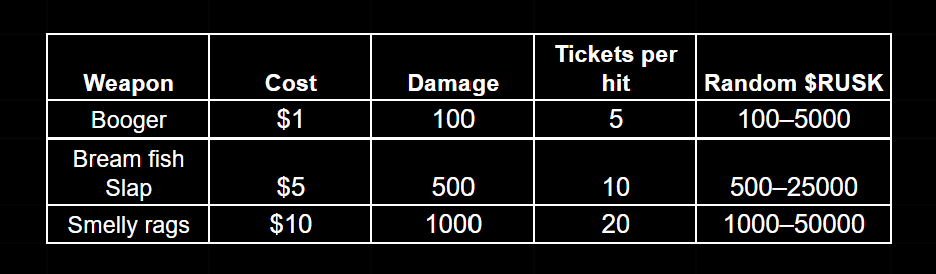

# PvE Event: “The Dusty King”

*“Dark times are coming. The mad god Adomion, enemy of all living things, seeks once again to return to this world. His servants, those who survived have been hiding for millennia in the most distant and shadowed corners of Dji’Da, ever since their master fell into slumber under the power of the Divine Elixir. But his strength is awakening, and his followers have already emerged from their hiding places. For now, they are but formless wraiths, yet they already hunt mortals, stealing their souls to regain their power.*

*One of their vessels became the Dust King. His greed made him an easy prey. Madness took hold of him the King attacked everyone nearby, muttering strange words. At first, everyone thought he had simply overused magic dust, but soon it became clear: darkness had taken root within him. And only a sacred goblin ritual can drive it out.*

*The goblins know the ancient way of exorcism. Their weapons may seem absurd – slimy boogers, bream fish, and smelly rags yet only they can subdue the evil spirit and purify the King’s heart. When the Dust King regains his senses, he will, in gratitude, open his Chest and every hero will receive a generous reward for taking part in his salvation…”*
– “Chronicles of Echoron” by Gorl Da’Narga.

Greetings, Seekers of Truth and Alchemists, children of Mendelef’s kin!

We are introducing a new activity for you a cooperative competitive PvE event. event. The entire Magic Alchemy community must unite to help the Dusty King by performing the ancient goblin ritual of exorcism to drive out the evil spirit that has taken over his body.

## Mechanics

All players will have to work together to perform the ritual of banishing the demon from the Dust King so that he can regain control of himself. To do this, you’ll need to find him on the second floor of the “Fallen Moon” tavern and engage in battle with the evil spirit.

The Dusty King has a shared HP bar for all participants, and every player’s damage will be counted. That’s why we call this event cooperative yet competitive PvE.

You’ll have to strike him using special exorcism tools: boogers, bream fish, and smelly rags.
These are ancient and time-tested goblin remedies, proven effective over centuries of use!

All these items can be purchased with USDT. Each use grants instant rewards **a guaranteed ticket to the Grand Raffle**, as well as Croutons dropped randomly per hit.

Additionally, you can purchase a damage boost for **10,000 $RUSK**, active for **24 hours**, providing **+20% extra damage**. 

For example, a player activates a damage boost. If they deal 8,500 damage, the boost adds an additional 1,700 damage. As a result, the total damage equals 10,200. Thus, with the boost, the player can earn more rewards while actually dealing less damage.

## Daily Damage Meter & Mystery Boxes

Each participant of the PvE event will receive their own **daily damage meter** once they deal their first damage to the Dust King.
This meter shows the total damage dealt by the player and their referees (more about them later) within a 24-hour period. All progress resets every 24 hours.

There will be three damage tiers in total, and upon reaching each one, the player will receive a Mystery Box.Thus, every player can earn up **to three Mystery Boxes per day**.

1,000 damage → Rare Mystery Box
3,000 damage → Epic Mystery Box
10,000 damage → Legendary Mystery Box

**Rare Mystery Box (1,000 damage)**

🎟️ Guaranteed: 5 tickets           
✨ Guaranteed: 3 essence             
🎲 May contain: Potion ×10 / Potion ×25 / Potion ×60 OR a Common / Rare / Epic / Legendary embryo

**Epic Mystery Box (3,000 damage)**
🎟️ Guaranteed: 10 tickets       
 ✨ Guaranteed: 6 essences             
 🎲 May contain: Potion ×20 / Potion ×60 / Potion ×150 OR a Common / Rare / Epic / Legendary embryo
 
**Legendary Mystery Box (10,000 damage)**

🎟️ Guaranteed: 20 tickets              
 ✨ Guaranteed: 18 essences               
 🎲 May contain: Potion ×50 / Potion ×150 / Potion ×500 OR a Common / Rare / Epic / Legendary embryo

The higher the rarity of the Mystery Box,
 the higher the chance of receiving an **alchemist embryo**.

## Referral System
During the PvE event, players can increase their individual damage meter through their referees.
 All players who previously registered through your referral link as well as all newcomers who join using it will contribute **+10% of the damage they deal** to the Dust King each day **to your daily damage meter**.
 
Additionally, for **every 1,000 total damage** dealt to the Dust King by your referees, you will receive **1 ticket for the Grand Raffle**.

So the goblin proverb “Don’t seek a hundred silver coins — seek a hundred tribesmen” has never been more accurate!

Every new or returning player who joins the game via your referral link receives a **Starter Mystery Box** upon dealing their first damage.

**Starter Mystery Box**
Guaranteed: 1,000 silver              
🎲 May contain: 100 / 500 / 1,000 crackers OR a Common / Rare / Epic / Legendary embryo.

## Grand Raffle & Damage Leaderboard

At the end of the PvE event, after all players unite to defeat the possessed Dust King, he will open a chest of treasures as a reward for his salvation.
A Grand Raffle will take place using the tickets players earned:
* for every **100 points of personal damage** they dealt

* for every **1,000 points of cumulative damage** dealt by their referees.

The prizes in the new Grand Raffle will be monetary rewards in USDT.
The estimated total value of the entire prize pool for the “Dust King” event will exceed an **impressive $50,000+ USDT**. It will be formed from an initial **$10,000 USDT** provided by our team.

The remaining portion of the prize pool will accumulate thanks to every player: **50% of the cost of each purchased tool will go directly into the shared prize fund**. In this way, all participants will collectively increase its size throughout the event.

The other 50% of the funds from the purchase of tools used to banish the evil spirit possessing the Dust King will be directed toward future marketing activities and additional rewards for upcoming events.

The Grand Raffle finale will be held during a live stream with INKa and Sasha Lor, and winners will be chosen via a randomizer.
The full list of rewards and the number of winning slots in the Grand Raffle are presented below.

### Damage Leaderboard Rewards
In addition to the raffle, a separate Damage Leaderboard will run throughout the event.
Players who deal the most damage will receive direct USDT rewards.

Additionally, a portion of the overall prize pool will be distributed to players with every hit they deal, awarded in $RUSK tokens.

Being an active participant of the event brings not only honor and respect within the community but also direct, tangible rewards.
Everything depends on you and your desire to contribute to our shared cause.

✨ May fortune favor you, and may Mendeléf’s blessing guide you to victory!

### FAQ
**If I deal more than 10,000 damage and fill the entire daily damage bar, will the excess carry over to the next day?**

No, the extra damage will not carry over.
You’ll have to wait for the daily reset to begin filling the bar again.

**Can I buy multiple damage boosts at once?**

No. Only one boost per 24 hours may be purchased.

**How long will the “Dusty King” event last?**

The event has no set time limit.
It will continue until the possessed King is defeated, that is, until his HP reaches zero.

**Where can I check my number of tickets?**

All tickets will be stored in your inventory, just like during the previous Magic Alchemy Anniversary Grand Raffle.

**From where will USDT be deducted when buying Boogers, Fish Slaps, or Filthy Rags?**

USDT will be deducted from your in-game balance.
Players must transfer funds from their game wallet beforehand, the same way as when purchasing Rusk for paid matches.

**How often can purchased weapons be used?**

Each weapon can be used only once. After it is used, you will need to purchase it again if you want to deal damage to the Dust King once more.
