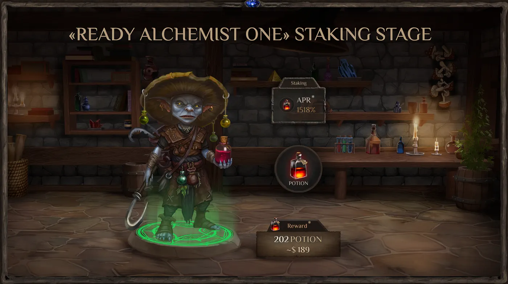
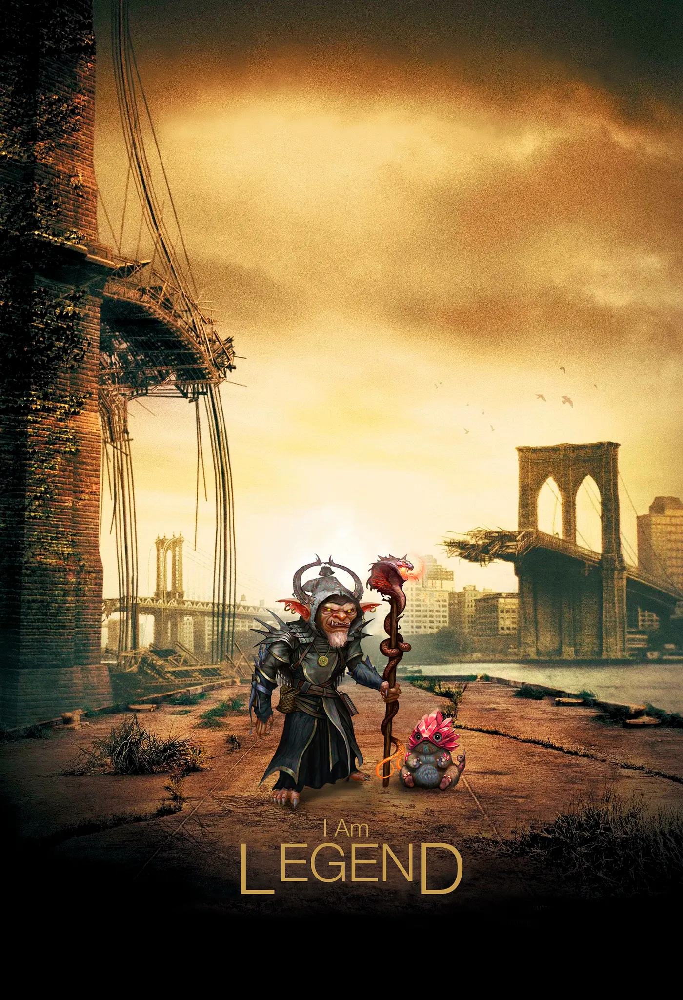

# Example 1 — Full coverage (EN) {#top}

Short description. This document demonstrates core Markdown features, links, anchors and images.

---

## Table of contents {#toc}

- [Headings and text](#headings)
- [Lists](#lists)
- [Links](#links)
- [Images](#images)
- [Code and quotes](#code-quotes)
- [Table](#table)

---

## Headings and text {#headings}

Regular text with `inline code` and styles: **bold**, *italic*, ~~strikethrough~~.

### Subheading H3

#### Subheading H4

---

## Lists {#lists}

- Bullet 1
- Bullet 2
  - Nested

1. Numbered 1
2. Numbered 2

- [x] Done
- [ ] Todo

---

## Links {#links}

- Inside the article: [to TOC](#toc)
- Game route: [/world/tavern](/world/tavern)
- To another article (RU): [Example 2 — RU](../../articles/example_2/example_2_ru.md)
- To heading in another article (EN): [Example 3 — Links](../../articles/example_3/example_3_en.md#links)
- Absolute: [Magic Alchemy](https://magic-alchemy.example)

---

## Images {#images}



Caption and the second image:


Real images from backup:




---

## Code and quotes {#code-quotes}

> A quote to emphasize something important.

```bash
# Shell snippet
make build && make run
```

```json
{
  "hello": "world"
}
```

---

## Table {#table}

| Column | Value |
|---|---|
| A | 1 |
| B | 2 |

The end. Go [top](#top).
