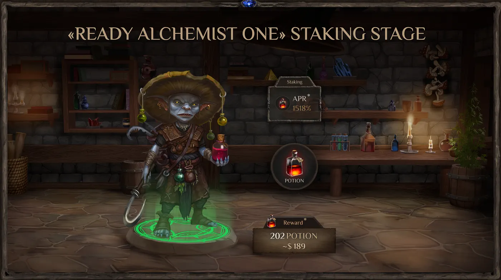
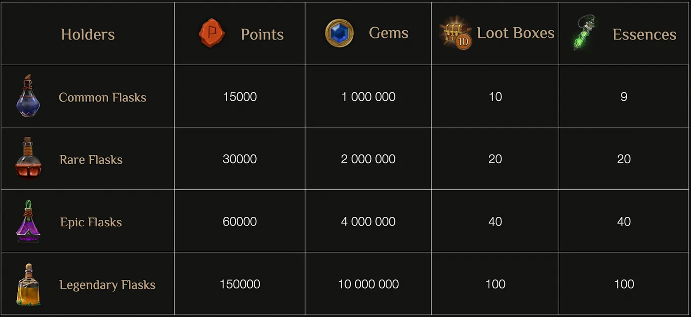

# Пример 1 — Полное покрытие (RU) {#top}

Короткое описание. В этом документе показаны основные элементы Markdown, ссылки, якоря и картинки.

---

## Содержание {#toc}

- [Заголовки и текст](#headings)
- [Списки](#lists)
- [Ссылки](#links)
- [Картинки](#images)
- [Код и цитаты](#code-quotes)
- [Таблица](#table)

---

## Заголовки и текст {#headings}

Обычный текст с `inline code` и выделениями: **жирный**, *курсив*, ~~зачёркнутый~~.

### Подзаголовок H3

#### Подзаголовок H4

---

## Списки {#lists}

- Маркированный 1
- Маркированный 2
  - Вложенный

1. Нумерованный 1
2. Нумерованный 2

- [x] Готово
- [ ] Не готово

---

## Ссылки {#links}

- Внутри статьи: [к содержанию](#toc)
- Игровой маршрут: [/world/tavern](/world/tavern)
- На другую статью (RU): [Пример 2 — RU](../../articles/example_2/example_2_ru.md)
- На заголовок в другой статье (EN): [Пример 3 — секция Links](../../articles/example_3/example_3_en.md#links)
- Абсолютная ссылка: [Magic Alchemy](https://magic-alchemy.example)

---

## Картинки {#images}



Подпись и вторая картинка:



Реальные изображения из бэкапа:


---

## Код и цитаты {#code-quotes}

> Это цитата, подчёркивающая важное.

```bash
# Пример кода shell
make build && make run
```

```json
{
  "hello": "world"
}
```

---

## Таблица {#table}

| Колонка | Значение |
|---|---|
| A | 1 |
| B | 2 |

Конец. Вернуться [наверх](#top).
