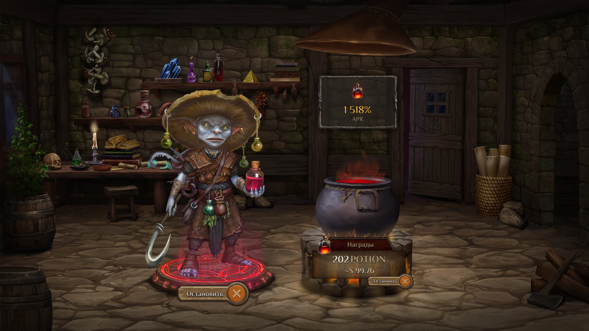
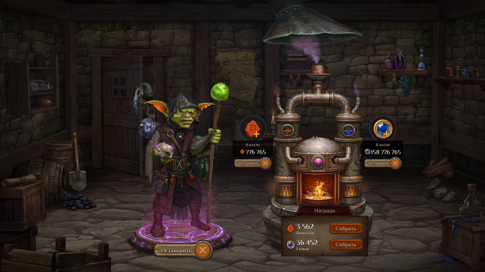

## Новая механика фарминга Гемов и Поинтов
Приветствуем вас алхимики!

В преддверии марафона мы с командой решили раскрыть новые игровые механики, которые будут введены после проведения марафона. И одной из первых, наряду с уже известной во время ивента «Первому Алхимику Приготовиться», станет возможность увеличить свое количество Гемов и Поинтов (красные руны). И сейчас мы подробно остановимся на этом.

Во время ивента ПАП (Первому Алхимику Приготовиться) вашей главной локацией станет Мастерская. Более подробно о самом этапе ПАП вы можете узнать в нашей [отдельной статье](../pap_2/pap_ru.md), посвященной этапам после марафона.

Если кратко, в Мастерской вы сможете застейкать своего алхимика, и за это вам начнут поступать награды в виде токенов POTION. Эти токены будут поступать из пула наград DAO. Соответственно, распоряжаться ими вы сможете только после окончания игры. Вся информация о количестве POTION, полученном игроком за весь этап ПАП, будет записана в мета-данные NFT-алхимика.

Мы уже не раз говорили, что выгоднее снять депозиты из Гоблин Банка и использовать их во время марафона. Это позволит получить больше наград в виде эссенций, Гемов и Поинтов, чем если бы средства оставались в банке.

Однако регулярное получение Гемов и Поинтов – это тоже привлекательная возможность. Поэтому мы придумали, как решить эту дилемму даже после того, как ваши депозиты уже были использованы на марафоне. И, как нам кажется, это будет очень интересное решение.

## Фарминг Гемов И Поинтов
В Мастерской на этапе ПАП появятся дополнительно две суб-локации: Малая мастерская и Экспериментальный цех (О функционале Экспериментального цеха мы расскажем позже). Как раз в Малой мастерской будет реализована новая игровая механика по увеличению количества Гемов и Поинтов.

В Малой мастерской игроки, имеющие NFT-алхимика, могут его застейкать, а также, добавив Гемы и Поинты в Алхимический генератор, начать дополнительно получать Гемы и Поинты. Количество Гемов и Поинтов, которые получает игрок в таком случае, будет весьма щедрым. Мы уверены, что те игроки, которые воспользуются этой механикой, смогут качественно улучшить свое положение в лидербордах **Alchemania и Brew or Die**.

С введением этой новой механики мы даем возможность игрокам самим определить, как им будет выгоднее распорядиться своим алхимиком:

* Застейкать его и получать токены POTION, распоряжаться которыми можно будет только после окончания игры.

* Увеличить количество Гемов и Поинтов, тем самым повысив свои шансы на получение большей доли в аирдропе, который будет доступен сразу на релизе игры.

P.S. Как мы изначально указывали в статье о этапах после марафона, где упоминалась возможность изменения коэффициентов стейкинга NFT-алхимиков, мы вносим небольшую правку. Коэффициент за стейкинг эпического алхимика на этапе ПАП будет снижен с 5 до 4.