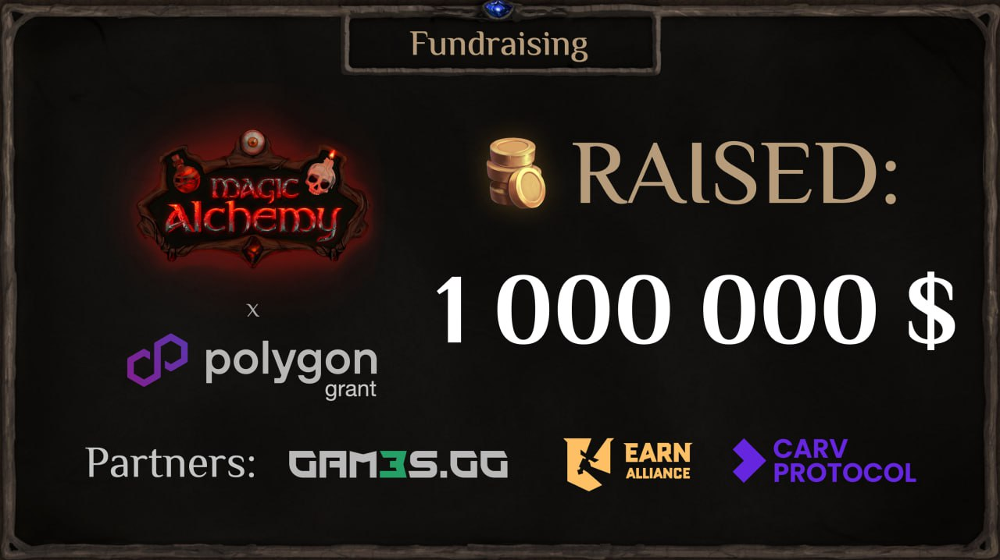

# MA Labs привлекла $1 000 000 инвестиций - важный шаг на пути Magic Alchemy 

MA Labs, инди-студия, стоящая за разработкой Web3-игры Magic Alchemy, успешно закрыла раунд привлечения на сумму $1 030 920. Это важная веха в развитии проекта и ещё одно подтверждение силы идеи, вовлечённого сообщества и нового подхода к запуску Web3-продуктов.

Структура привлечённых средств:

$650 000 - на стадии Pre-Seed
$380 920 - в рамках открытого Public Sale: NFT-марафона и токенов $POTION

Проект стартовал как независимая инди-студия. Всё, что достигнуто - результат доверия и участия комьюнити.

Почему это важно:
- Прозрачная, игровая модель фандрайзинга показала свою эффективность
- Сообщество стало основой устойчивости и роста
- Magic Alchemy - это не только игра, но и эксперимент в области распределённых моделей участия

Благодарим каждого, кто поверил и поддержал. Этот первый миллион - только начало. Впереди: развитие полноценной DeFi-игры, запуск новых игр, расширение вселенной и международный рост.

Magic Alchemy продолжает развитие как community-first проект, где каждый участник не просто игрок, а соавтор мира.