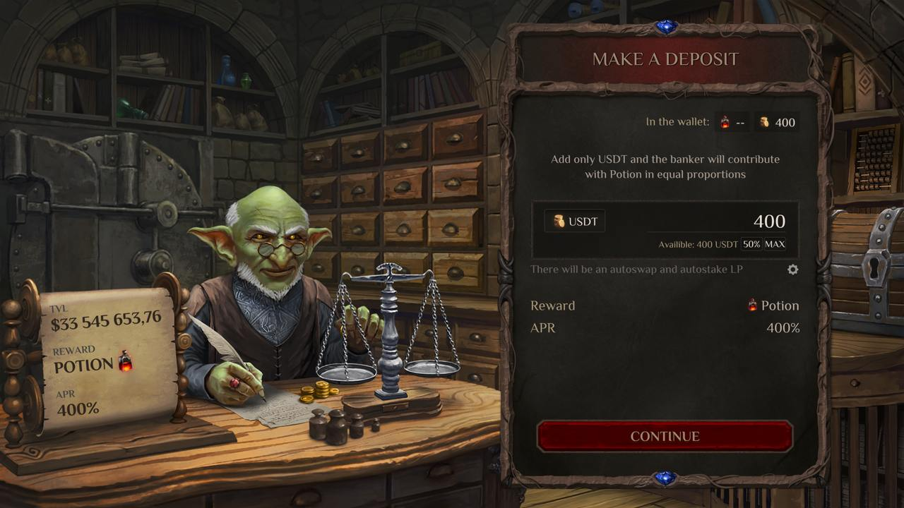

# Банк Гоблинов 

Банк Гоблинов был создан гоблинской Торговой Гильдией, что располагается в королевстве Анкорлан, и известен далеко за его пределами. Если же говорить про игровые механики, то Банк Гоблинов является главным Пулом Ликвидности. 

Если, допустим, вы не хотите играть, вы можете предоставить свою ликвидность в Банк Гоблинов и заработать на этом. Внешняя ликвидность заливается в Банк двумя способами: автоматическим и ручным. 

*“Банк гоблинов — это самое надежное место для хранения вашего золота. Мы используем только охранные заклинания, разработанные магистрами Анкорланской  академии, а мастера-дарханы оборудовали все наши офисы самыми опасными и смертоносными ловушками…”*
 — из рекламного проспекта Торговой Гильдии гоблинов.
