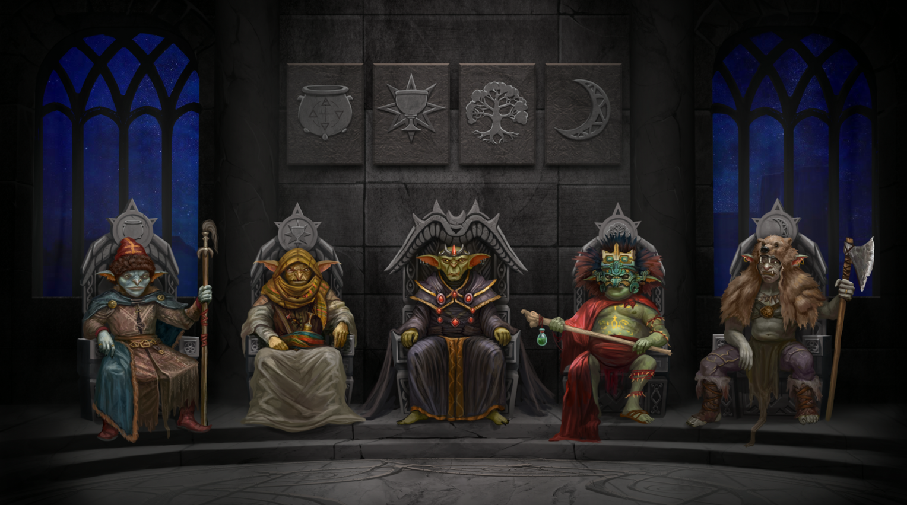

# The Hall of Elders

*"The surviving Capitol building in the central square of the ancient capital of Echoron had been chosen as a meeting place for the elders of all the goblin tribes. The Artisans buhlag cleaned up the interior as best they could, and a council of goblin tribes was held there for the first time in millennia..."*

The Hall of Elders is where the leaders of all the tribes of Mendeleev's children hold their council. It is here that the player will hire various goblins to serve them. In the future, it will also be possible to purchase alchemical tools and mysterious mystery boxes here.