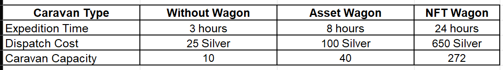
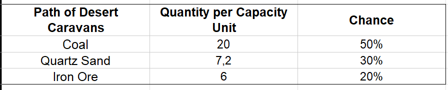
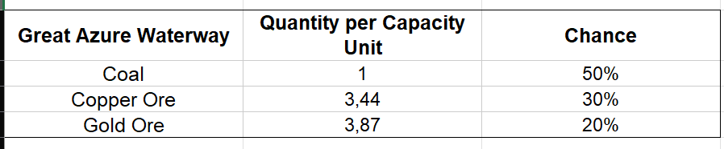
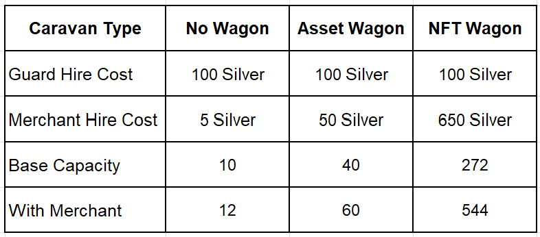
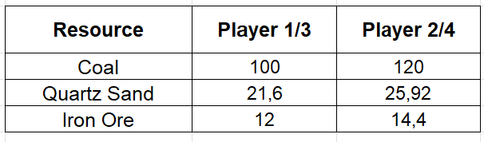
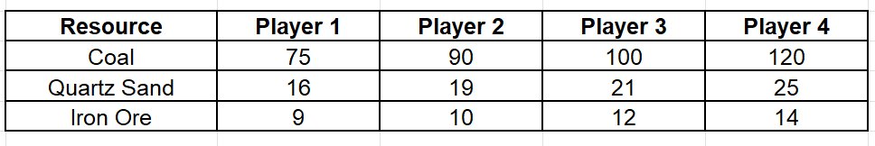

# New game mechanic – Trade Caravans

Greetings, Alchemists!

The time has come to lift the “fog of war” surrounding one of the most pressing questions in our community: how goblin-repairmen will obtain raw materials to craft parts for alchemical boosters.

Currently, the game features several types of in-game resources: Silver Coins, Mana Crystals, Essences, Gems, and Points. The primary resource for crafting these parts will be Silver Coins earned from victories in card battles against Justor.

There will be five types of raw materials used for crafting: Coal, Quartz Sand, Iron Ore, Copper Ore, and Gold Ore. Processing these materials will yield Glass, Steel Ingots, Copper Ingots, and Gold Ingots. These refined materials will then be used by your goblin-repairman to create parts for the Alchemist’s tools (boosters). We'll describe how this happens below, but first let’s explore how to obtain raw materials.
## Trading Caravans
The main way to obtain raw materials in the game will be by equipping and dispatching Trading Caravans. To do this, you’ll spend the Silver Coins you've earned.

Caravans are managed from the in-game location called the **Goblin Room**. Clicking on the map will open a route map with an interface for dispatching your caravan.

There will be two trade routes available:
* **Path of Desert Caravans** – brings back Coal, Quartz Sand, and Iron Ore. It requires Silver Coins to dispatch and is available to all players.

* **Great Azure Waterway** – brings back Coal, Copper Ore, and Gold Ore. Also requires Silver Coins to dispatch, but access is only granted while the **Trading Guild Amulet is active**.

The Trading Guild Amulet lasts for 30 days and can be **purchased for 10 USDT in the caravan dispatch menu**.

**Wagon-Workshops in Caravans**

Your Wagon-Workshop can participate in a Trading Caravan, and the type of wagon you own will greatly influence your outcomes. But don’t worry, players without a wagon can still send out caravans!
Let’s break down the types of caravans players can equip:

As you can see, NFT Wagon owners only need to log in once per day to use their caravans efficiently. Their wagons also yield significantly more resources per expedition. A player without a wagon would need over three days of nonstop dispatching to match the raw materials gathered by an NFT Wagon and would spend roughly the same amount of Silver.
  
When a caravan returns from its trade expedition, players receive a randomized batch of resources. Each unit of capacity has a chance to return a specific resource:

## Guards and Merchants

When equipping a caravan, you can also hire a Guard for protection and a Merchant for better trade efficiency.

Caravans are vulnerable to bandit attacks. If you hire a guard, all goods will arrive safely. If not, a random portion of the resources will be lost.

Hiring a guard always costs 100 Silver Coins, making it a worthy investment for players with asset or NFT Wagon. 

**The same players who are lucky enough to own an NFT pet do not need to pay for security. The trading guild has given you a 100% discount on this service.** 
  
  Hiring a merchant increases your caravan’s capacity. Without a wagon, the bonus is +20%. With an NFT Wagon, it’s +100%.

Caravan Yield Example

Let’s say 4 players (without wagon) send out caravans:
* Player 1: Basic Caravan
* Player 2: Caravan + Merchant
* Player 3: Caravan + Guard
* Player 4: Caravan + Merchant + Guard

Capacities: 10, 12, 10, 12 respectively.
Expected resources:

But Players 1 and 2 didn’t hire guards, so apply a 25% loss:

As can be seen from the example, hiring guards and a merchant provides approximately +57% to the final amount of resources obtained, compared to a caravan without them. Players who have already assembled asset wagons, and especially those who own NFT workshop wagons, will have a significant advantage at all stages of spare parts production. This should increase their earnings in the free-to-play part of our game. The most effective combination in free-to-play mode becomes owning a rare goblin repairman and an NFT workshop wagon.

And as you all know, all of these NFTs could be obtained completely for free during the early stages of the game. We have always said that all the “early birds” will be properly rewarded at the game’s release.

May the blessing of Mendeleev be with you!

## FAQ

**Does expedition time vary by route?**

 No. Duration depends only on whether and what kind of wagon is used.

**What parts can I make using only the first route?**

 You’ll get Coal, Quartz Sand, and Iron Ore — enough to craft Retorts and Bellows.

**Can I get Copper and Gold Ore without the second route?**

 Yes, via Dazar’s exchange—but it’s expensive.

**Will the parts be NFTs?**
 
 No, they are in-game assets, but tradeable like NFTs on our internal marketplace.
Won’t rare repairmen and NFT wagon-workshop monopolize the parts market?
 No. There are only 266 NFT wagons and ~120 rare repairmen, versus 4,444 genesis Alchemists—and more basic ones are coming. Demand will outpace supply.

**Isn’t this “pay-to-win”?**

 Not at all. Everyone had a chance to earn NFTs for free. The f2p route is viable—it just takes more time.