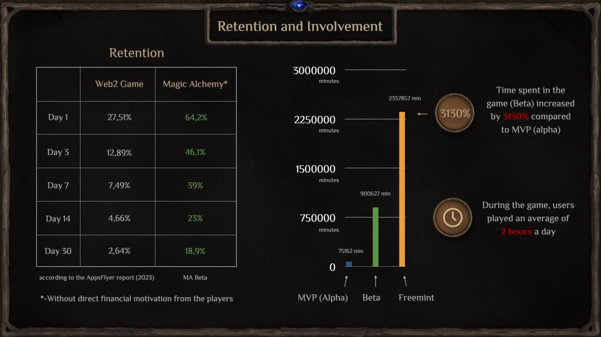
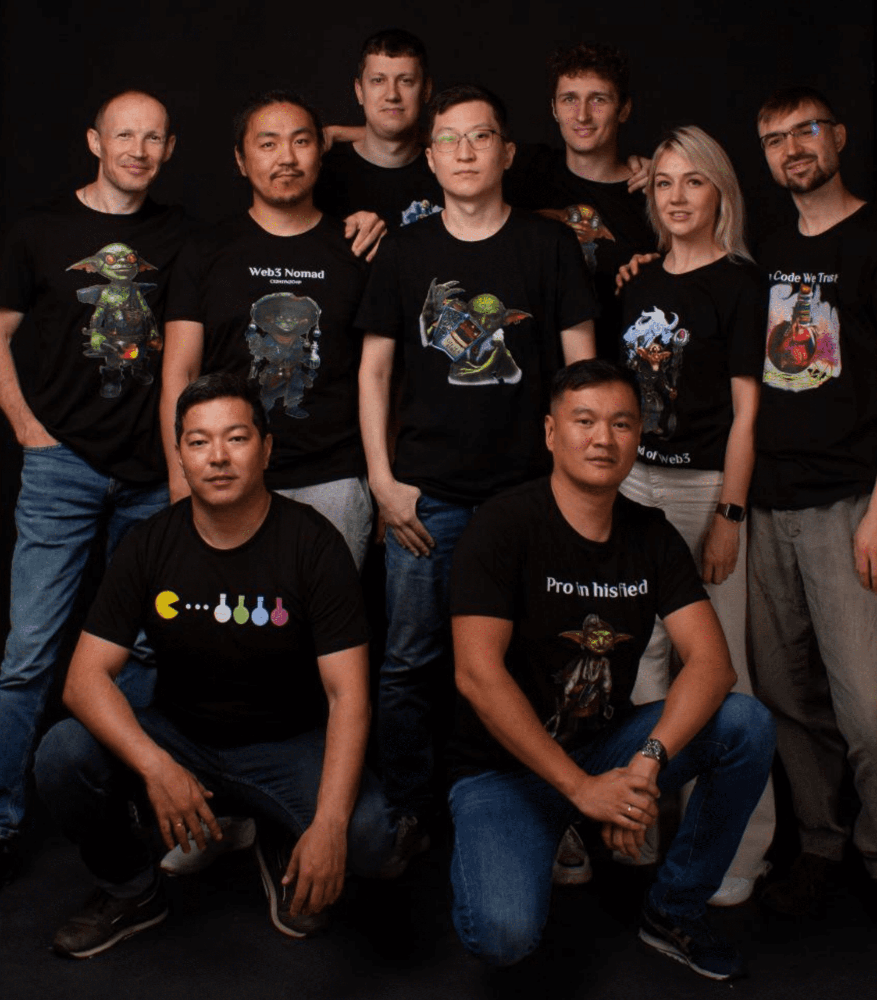

# Внутренняя кухня Magic Alchemy (май 2024 года)

Вам любопытно заглянуть за кулисы проекта, который вам интересен, и узнать больше о его внутрянке? Тогда ловите самые важные моменты и изменения, которые произошли с Magic Alchemy за последние несколько месяцев!

### Freemint
В мае мы завершили очередной важный для нас этап – Freemint.

Показатели отличные:

**Собрали и подготовили статистику по игре**

- Кол-во уникальных игроков — 8170
- Кол-во сыгранных партий — 355801
- Кол-во сыгранных минут — 2357857
- Среднее время партии — 06:32
- Кол-во прокрутов Колеса — 35001
- Победы. Отстройка Башни — 48%. Разрушение Башни — 38%. Ресурсы — 14%.

Кол-во игроков увеличилось более чем на 330%, если сравнивать с Альфой, которая вышла в декабре прошлого года.

### Поговорим немного про вовлечение и удержание игроков

Высокие показатели ретеншена в нашей игре говорят о том, что игрокам нравятся карты и многие вовлекаются и остаются. А если учесть, что у нас пока нет прямой финансовой мотивации, так как в игре нет токена, то такие цифры очень радуют.

Также, по сравнению с Альфой, итоговое время, проведенное в игре, увеличилось на 3130%. В среднем игроки проводят в игре по 2 часа в день.

Еще мы провели второй крупный лидерборд-чемпионат с призовым фондом в 5000$. Чемпионат длился 4 недели.

В этот раз было на 30% больше участников, чем в первом лидерборде. Стоит отметить, что в лидерборде могли участвовать только игроки с инвайтом, то есть, это был условно-закрытый тип соревнования. В будущих этапах мы сделаем турниры доступными каждому.

### На что мы делали упор в геймдизайне?
1. Лидерборд. Многим игрокам важно чувство соперничества и возможность показать свои навыки. Лидерборд помог нам добиться соревновательного эффекта в игре.
2. Колесо Фортуны. Во время этапа Freemint Колесо крутили 35000 (!) раз. Многие игроки испытывают чувство азарта, и вращение Колеса для них – это такой способ получить небольшую порцию дофамина в ожидании щедрой награды.
3. Для игроков-коллекционеров-достигаторов мы подготовили различные ачивки и бейджики, которые выдаются за те или иные достижения.
4. Питомец. Это Тамагочи, скрещенный с check-in механикой. Питомец может заболеть и умереть при недостаточной заботе, а за своевременное кормление благодарит игрока серебряными монетами, что увеличивает ретеншн.
5. Карточные дейли квесты. Эта механика тоже способствует увеличению ретеншена, так как у игрока всегда есть конкретная ежедневная цель, за выполнение которой он получит награду.

Говоря о целях: для игрока невероятно важно иметь масштабную задачу, которая будет вести его как путеводная звезда. В нашей игре это квест с минтом NFT повозки. Для этого нужно собрать все инструменты, и тогда игрок получает NFT повозку, которая в будущем понадобится алхимическим гильдиям. На данный момент флор прайс на вторичном рынке составляет 450 matic (330$).

Все эти механики были внедрены для того, чтобы понять, что интересно игрокам, а что нет. В течение трех этапов мы улучшали некоторые из них и получили самый главный результат – интерес игроков, выраженный в показателе Retention. Создать большую воронку – это уже другая задача, но даже самые заоблачные цифры не работают, если ваш продукт не зацепил пользователей. Это одна из главных ошибок наших коллег по Web3 играм. Я считаю, что в F2P части мы нашли нужные точки соприкосновения с целевой аудиторией.

### Социальные сети
Мы изначально пошли по пути органики, поэтому кому-то наши цифры могут показаться скромными, но нужно учесть, что прирост с прошлого этапа беты составил 200%. На текущий момент (конец мая):

Discord – 3776

Twitter – 3177

Telegram blog – 1061

Tetegram chat – 658

В следующих этапах мы хотим увеличить эти показатели в десятки раз. Но всегда есть риски, мы их называем “мертвые души”. Важны не цифры, а качество подписчиков, просмотры и комментарии. Поэтому органический рост всегда лучше, чем накрученные метрики.

### Фандрайзинг
В мае мы открыли сид-раунд и привлекли от ангела дополнительные 75000$. Итого на данный мы привлекли 435000$. Помимо этого, мы заключили партнерства со всеми ведущими площадками по Web3 играм: Gam3s.GG, Earn Alliance, Carv Protocol.

7-8 июня наш Биздев поедет на крупнейшую в ЮВА конференцию. Его задача там – познакомиться с максимальным кол-вом фондов и фаундеров-коллег, чтобы в дальнейшем с ними продолжить общение.

Так как ЮВА рынок традиционно был основным поставщиком Web3 игр, то на конференции будет присутствовать очень большое кол-во Web3 студий, криптофондов и других представителей этой индустрии.

### Планы и продукт:
В начале июня мы запускаем следующий невероятно важный для нас этап — Brew or Die, открывающий новые возможности для игроков. Технически это фарминг поинтов для будущего дропа токена Potion. Но это не просто квесты, а полноценные новые игровые локации и различные стратегии фарма. Пока без основной дефи механики, но уже появится staking USDT(Локдроп):

По сути, это переходный этап к нашей основной кор-механике DEFI.

Вообще, хотел бы сказать пару слов про мету поинтов. Изначально она появилась в проекте Blur, потом перебралась в Blast. На данный момент это мейнстрим. Поинты используют везде, даже там, где это не нужно, однако в GameFi это идеальный инструмент геймификации. Я убежден, что грамотный и нативный подход использования Play2Airdrop будет использоваться в прелаунче любой Web3 игры.

Мы пошли дальше и сделали не просто тупые однообразные квесты “залей ликвидность, свапни, подпишись на соц.сети”, а внедрили полноценные квесты в игровые механики. Например, выращивание растений, варка эликсира, стейкинг в виде настоящего Банка Гоблинов. Игрокам такой подход должен понравиться.

Пока что это все, что я могу сказать, но совсем скоро выйдет большая статья по Brew or Die. Также в начале июля мы запустим наш секретный продукт, так что обязательно следите за новостями, чтобы его не пропустить.

На этой ноте я завершаю отчет. Наша главная задача – это сформировать сплоченное, сильное, органическое коммьюнити, искренне заинтересованное в проекте Magic Alchemy. Ждем запуска следующего этапа, а также я буду благодарен, если у вас есть интересные мысли, как мы можем прийти к запуску игры с лучшими результатами!

