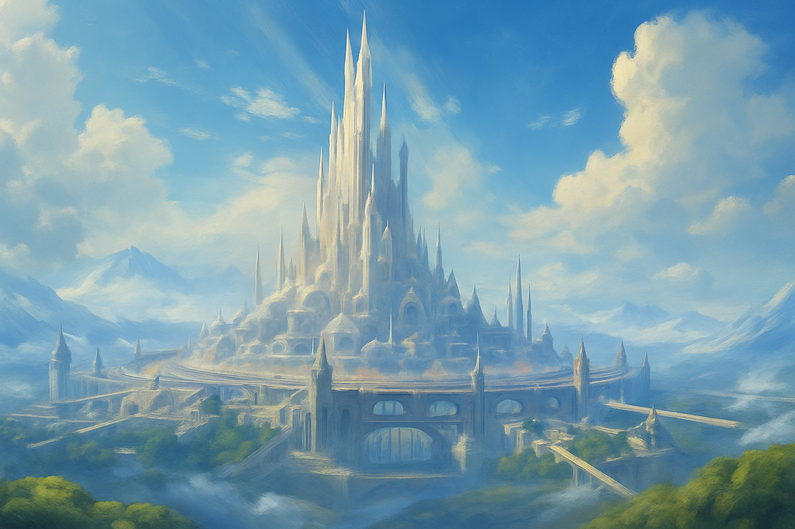
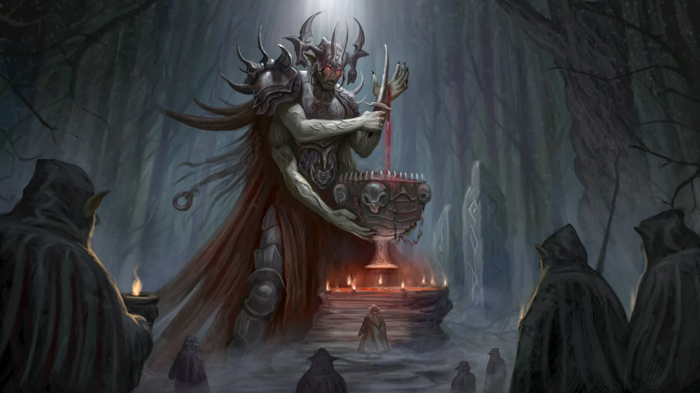

## Adomion’s Rebellion

Thousands of years have passed since the creation of the first generation of the children of the gods. The elves achieved incredible heights in the art of magic, the dwarves created their greatest treasures, and the goblins made their most powerful potions. Humans and Orcs developed and populated all the continents on both sides of the Great Ocean. It was a Golden Era in the history of Dji’Da.

**A city of elves in the Golden Era*

All the nations respected and trusted Adomion because they knew he was the guardian of souls and bore the burden of a critical mission. And so, over thousands of years of cycles, the souls of mortals were born and died, and the elder gods gradually grew weaker and weaker. It was at that moment that Adomion set in motion his plan to exterminate all the children of Tara.

One day, Adomion bet with the great goblin alchemists that they could not make a potion capable of putting a god to sleep. The proud goblin alchemists accepted the challenge with great enthusiasm.

Years of experiments and the rarest magical ingredients were wasted, but the potion could not be created. The magic and matter of Dji’Da’s world could not interact with the nature of the gods. And when the alchemists were already desperate to make it, they suddenly realized that for the potion to work on a god, it must contain their particle — the blood of a god.

*Adomion, guardian of the Horn of Souls*

With this knowledge they came to Adomion. He despised the very idea that a god could spill his own blood for mortals, but he agreed to give the alchemists what they wanted. He filled the chalice with his blood and handed it to the goblins.

This gift was accepted with great reverence, and once again the alchemists plunged into the process of creating a divine sleeping potion. It took a considerable amount of effort and time, but in the end it was ready and given to Adomion.

Taking the potion, Adomion asked if all the blood had been used and the Grand Master Alchemists answered affirmatively. After receiving an answer, the god left the goblins, but this very moment was the main reason for Adomion’s further defeat.

Above all goblins have always valued the knowledge and skill of alchemy. How could they refuse to study the divine blood, the unique material that fell into their hands? The Grand Master Alchemist concealed the chalice with the remnants of Adomion’s blood to scrutinize. This chalice became the greatest relic of the Goblin people, their Holy Grail.

After Adomion got what he wanted, he announced that he realized the great responsibility the elder gods had placed upon him and that he was ready to accept the mission. The brothers and sisters received the news with great joy and came to Adomion’s kingdom with their retinue to celebrate.

No one knew of the trap being prepared: Adomion’s servants had poured the potion into the guests’ drinks beforehand. When all the guests’ cups were empty, the Guardian of the Horn of Souls revealed his plan. He said that he loved his brothers and sisters immensely, but despised their children and did not accept the gods’ choice to give the power of the Flame of Mana to mortals.

He will put his brothers and sisters to sleep so that they cannot prevent him from destroying all living children of the gods. And after the last mortal soul enters his realm, he will desecrate the Horn of Souls.

All souls who have passed through the desecrated Horn will not enter the cycle of rebirth, but will return to the gods, becoming one with their Flame of Mana.

And then the Elder Gods will regain their powers and continue to exist in Dji’Da along with Adomion. Tara listened in horror to the words of their distraught brother, but there was nothing they could do.

And that day was the most tragic in the history of Dji’Da and the last one of the Golden Era.