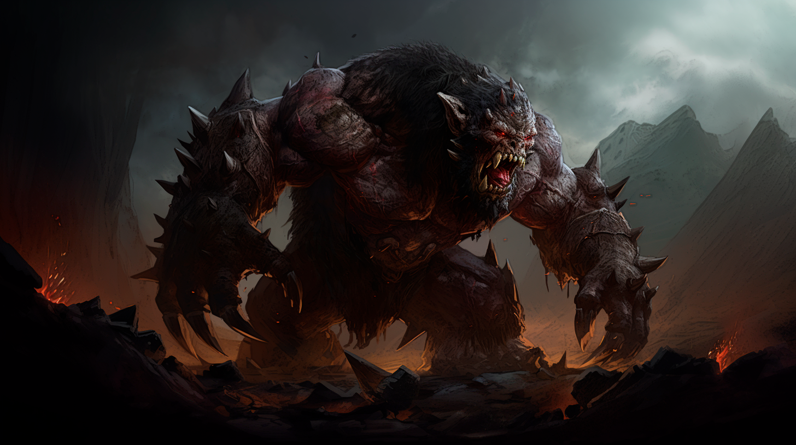
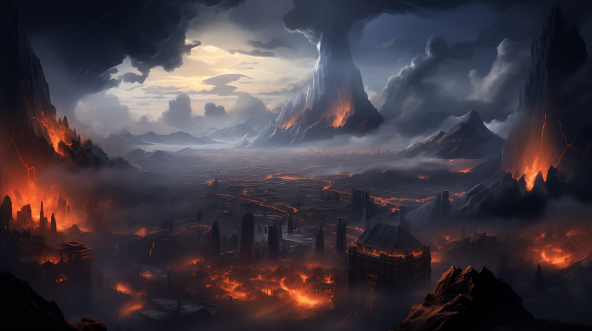

## The War with a Mad God

These were terrible times, later called the War with the Mad God. It was a catastrophe that destroyed all the ancient great empires and kingdoms.

Legions of the undead, the rebellious corpses led by the servants of Adomion, who had taken physical form, poured onto the surface of every continent.

For thousands of years, while the children of the gods inhabited Dji’Da, Adomion conducted experiments on the souls of mortals who fell into his realm. He learned to pervert their essence so they could not be purified in the Horn of Souls and reborn. Instead, the energy of their tainted souls became the source of “life” for the warriors of his legions of undead.

For hundreds of years, Adomion’s servants secretly collected corpses from cemeteries, graveyards, and mausoleums of all the world’s mortal races for the future undead army. And while the bodies of humans and dwarves were used to create the living dead — the backbone of the military, from the dead elves, Adomion made liches — powerful necromages and warlords of undead hordes.

The strongest and most formidable warriors of Adomion’s army were monsters sewn from the mutilated bodies and souls of orcs and animated by the dark magic of a mad god. They inspired disgust and horror in all who encountered them on the battlefield.

*Adomion’s Monster*

The first to fall were the countries on the southernmost continent called Jarah. There was the entrance to Adomion’s underground kingdom, and from there, the first destructive wave of the undead came. Numernia was the last kingdom on Jarah to be destroyed. The mages of the kingdom, realizing that the country could no longer be saved, invoked a firestorm on their lands, turning them into a scorched wasteland.

The children of the gods fought desperately for their very existence because they understood that Adomion had no mercy and the dead did not take prisoners. Fear and despair had shackled the mortals, and it was only a matter of time before the last strongholds of resistance fell.

Adomion was overcome not only by hatred toward mortals but also by endless contempt and pride. The more kingdoms his armies destroyed, the more he was filled with a sense of omnipotence and smugness.

The Mad God relished his moments of triumph and was always personally present in the thick of the battle, watching mortals perish at the hands of his creatures. Adomion led the army while in physical form, with no fear for his life. None of the weapons of mortals could harm his divine nature.

The people of the goblins took Adomion’s deception particularly hard, for their hands created the sleep potion that put the older gods to sleep. They were looking for a way to right what they had done, and the remnants of Adomion’s blood played a crucial role. The Grand Alchemist, along with other skilled masters, created another divine sleeping potion, for only it was capable of stopping the Mad God.

On the day of the great battle, when the armies of the last surviving kingdoms and countless hordes of the undead under Adomion’s command converged on the battlefield, it was decided to take the only chance to win.

A squad of heroes made up of the strongest warriors and skilled mages had to make their way to Adomion and use a divine potion to put him to sleep while he was in his physical form.

History no longer remembers the names of the heroes and the details of what happened, but amid the battle, warriors, and mages, sacrificing their lives and showing incredible courage, were able to bind the body of Adomion and execute the plan.

The mad god fell asleep, and a massive burst of energy incinerated the earth for hundreds of leagues. All the undead in the world have turned to ashes, and the Younger Tara, the servants of Adomion who did not die in the last battle, have scattered and hidden in the farthest corners of Dji’Da. What happened to Adomion and the heroes who put him to sleep is unknown since no one returned from that campaign.

Thus ended the most terrible and tragic period in the history of Dji’Da. The whole old world order was destroyed. All the tremendous ancient states and empires have fallen. Huge territories were devastated by the war and turned into lifeless wastelands.

Terrible cataclysms and earthquakes caused by gigantic amounts of magic during the war shook the world of Dji’Da. The shape of the continents had changed, and where yesterday there was the sea, today there were mountains. And conversely, vast areas of land have sunk to the seabed. Countless pieces of knowledge and art were irrevocably lost.

*Consequences of the war with Adomion*