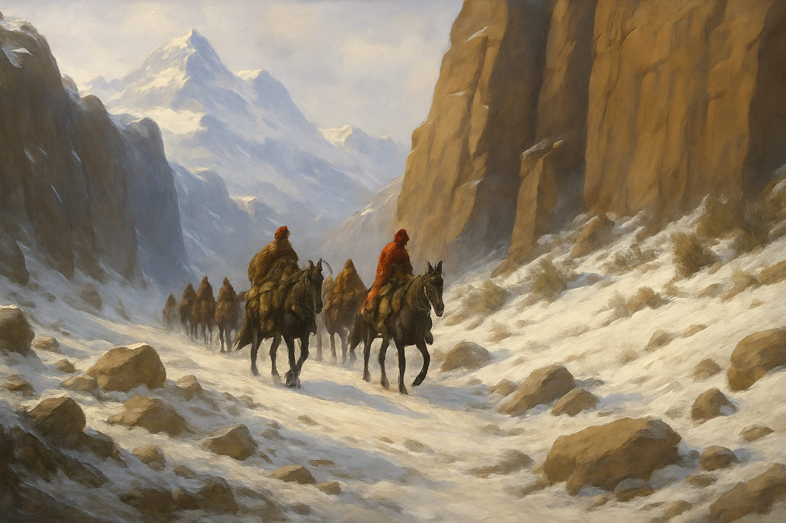

## Тёмные Времена и Войны Выживших

Мир Джи’Да навсегда изменился. На многие сотни лет он погрузился в войны, распри, предательства и интриги. Богов не стало, смертные остались наедине с собой, мир наполнился тьмой и кровью.

Из-за нехватки пригодных для жизни земель и плодородной почвы, среди недавних союзников разгорались конфликты, которые переросли в так называемые Войны Выживших.

Не все дети богов мирно уживались друг с другом в прошлом, но пока за ними присматривали Старшие Тара, эти разногласия не становились чем-то серьезным. Теперь же, когда же боги уснули, ничто не могло помешать смертным убивать друг друга в кровопролитных войнах.

Эльфы укрылись в последних двух уцелевших лесах, где еще росли волшебные деревья, что посадила Атониэль — матерь всех эльфов. Дети богини жизни с фанатичной яростью стали защищать их и убивать любого, кто пытался пересечь их границы.

Гномы ушли в глубокие недра гор и закрылись в своих каменных крепостях. Там они могли не бояться угрозы со стороны других народов.

И если эльфы и гномы отгородились от всего света, то людям досталась роль завоевателей всех старых земель. На руинах древних королевств люди построили новые государства, бесконечно воюющие между собой за власть, могущество и богатства.

*Беженцы в поисках нового дома*

Дети Мундо — орки — были сильнейшими воителями старого мира. Ярость и упрямство всегда горели в их сердцах. Именно эта вера в собственную силу и превосходство стала одной из причин, почему лорды орков решили, что им суждено быть новыми хозяевами мира.

Следуя этим убеждениям, орки начали войну против остальных народов. Множество стран было уничтожено их руками и резня не прекращалась, пока остальные не объединились и не начали бороться с ними сообща. За многие столетия орки из некогда великого народа превратились в дикарей, которых оттеснили на безжизненные северные территории и южный пустынный континент Джарах.

Катаклизм и войны не пощадили и народ гоблинов. Многие древние навыки были утеряны, многие великие алхимики погибли, так и не передав свою мудрость подмастерьям. Могущественные зелья и редкие рецепты затерялись в сложных сплетениях истории.

Народ гоблинов измельчал. Великий талант алхимии стал всё реже встречаться среди новых поколений. Умение создавать легендарные зелья практически исчезло.

Но несмотря на все невзгоды и трудности, из поколения в поколение продолжает передаваться пророчество о том, что однажды один из детей Менделефа спасет этот мир, когда древнее зло вновь придет в Джи`Да…