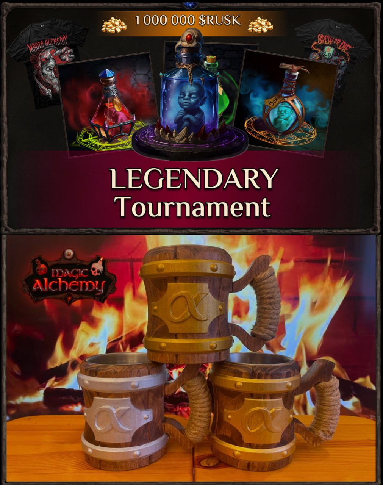

🏆 Legendary Tournament in Magic Towers 🏆

Alchemists, it’s time to make history! 
Our Dwarf from Bayan`Gol is once again crafting exclusive real-life mugs for the champions. Only 3 in the world will ever exist.

Now, prepare for the Legendary Tournament to determine the ultimate Tower Masters.

At stake: 1,000,000 $RUSK, 35 Alchemist NFT Embryos, and even a Legendary + the exclusive champion mugs!

Start Date: September 8, 2025(Now)

🔹 Weekly Leaderboard

For 4 weeks, the Top 3 players in Magic Towers will earn rewards:

- 🥇 1st place — Final ticket + Epic Embryo
- 🥈 2nd place — Final ticket + Rare Embryo
- 🥉 3rd place — Final ticket + Common Embryo

That’s 12 finalists selected via leaderboards.

🔹 Qualifier Tournaments

The remaining 20 finalists will be chosen through 10 qualifying tournaments, each with 16 players.

Format: Double Elimination – everyone gets a second chance

Matches: Best of 3 (BO3), Final is BO5

Entry Fee: Just 10,000 $RUSK (~$10) — a small price for a real shot at a Legendary!

⚔️ Finalists face off: upper vs lower bracket winners.
To win from the lower bracket, you must defeat the upper bracket champ twice.

Qualifier Prizes:
- 🥇 1st — Final ticket + Rare Embryo
- 🥈 2nd — Final ticket + Common Embryo

🔹 Grand Final

This is it: 32 of the best alchemists will clash in an epic showdown for legendary rewards.

Format: Double Elimination

Matches: BO5, Grand Final: BO7

💎 Final Prizes:
- 🥇 1st place — Legendary Embryo + 500,000 $RUSK + unique gold mug + merch
- 🥈 2nd place — Rare Embryo + 300,000 $RUSK + unique silver mug + merch
- 🥉 3rd place — Common Embryo + 200,000 $RUSK + unique bronze mug + merch

 **Tournament Organizer**:
Our legendary alchemist @abobyr88 (https://t.me/abobyr88
) will assist with qualifiers and the final stage.

Register to participate: [@abobyr88](https://t.me/abobyr88)

🕰 Matches begin right after the 16-player bracket is full.
⚔️ Battles are by direct invites.
❌ No-show for 24 hours = automatic disqualification.

